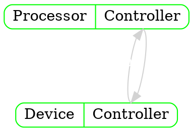
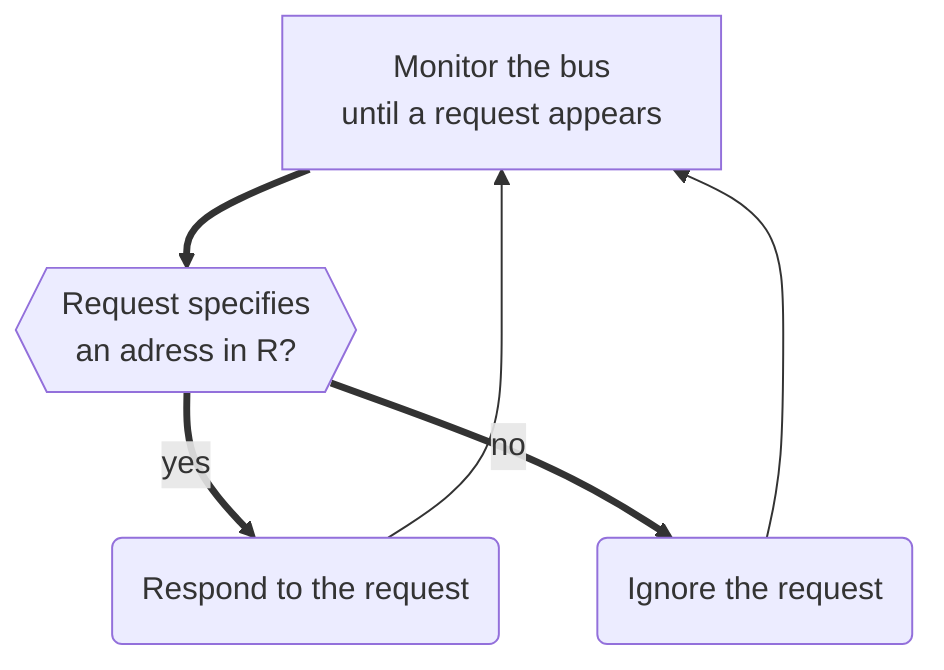

# I/O Devices

> Third *major* component of a computer system

`````col
````col-md
flexGrow=1
===

- ? Types:
	- Keyboards and mice
	- Hard disks
	- Solid state disks
	- Printers
	- Cameras
	- Audio speakers
	- Sensors
	- ...


````
````col-md
flexGrow=1
===


- Controller is placed at each end of *physical connection*
- Allows *arbitrary* voltages and signals to be used

````
`````

`````col 
````col-md 
flexGrow=2
===

```dynamic-svg
---
invert-shade
width:100%
---
[[io_device_external.svg]]
```

```` 
````col-md
flexGrow=1
===

- ? Properties:
	- Operates *independent* of [[Processor|processor]]
	- May have *separate* power supply
	- Digital signals used for control

- & Example: panel lights

````
`````

--- 
<br>

# Interfaces

## Types of interfaces

### Serial interface

- Single signal wire (and ground)
- One [[Data representation#Bit (Binary digit)|bit]] at a time
- $ Less complex hardware with **lower cost**

- & Examples:
	- [SPI](https://en.wikipedia.org/wiki/Serial_Peripheral_Interface)
	- [I2C](https://en.wikipedia.org/wiki/I%C2%B2C)
	- [1-Wire](https://en.wikipedia.org/wiki/PCI_Express)

### Parallel interface

- More than a **single** wire, each one caries one [[Data representation#Bit (Binary digit)|bit]] at a time
- Number of wires - **width** of the interface
- ! More complex hardware with **higher cost**
- Faster than [[#Serial interface|serial interface]]
- ! Limitation: at *high data rates*, *close parallel* wires have potential for *interference*

- & Examples:
	- [[#Memory bus]]
	- [SCSI](https://en.wikipedia.org/wiki/Parallel_SCSI)
	- [PCI](https://en.wikipedia.org/wiki/Peripheral_Component_Interconnect)

## Duplex technology

### Full-duplex

- Simulation, **bidirectional** transfer
- & Example: [[#I/O Devices|disk]] drive supports simultaneous *read* and *write* operations

### Half-duplex

- Transfer in **one direction** at a time
- Interfaces must *negotiate* access before transmitting
- & Example: [[Processor|processor]] can *read* or *write* to [[#I/O Devices|disk]], but can only perform one operation at a time

--- 
<br>

# I/O performance

## Latency

> [!definition] 
> Measure of the *time* required to perform a transfer

> Latencies of input and output may *differ* 

## Throughput

> [!definition] 
> Measure of the *amount* of data that can be transferred per *unit time*
 
> Informally called *speed*

--- 
<br>

# Data multiplexing

> Illustration of the transfer of **64** [[Data representation#Bit (Binary digit)|bits]] of data over a **16**-**bit** interface
> **Multiplexing** hardware *divides* the data into **16**-bit units and *sends* one unit at a time
```dynamic-svg
---
invert-shade
width:100%
---
[[multiplexing.svg]]
```

- Arises from *hardware limits* on parallelism (pins or wires)
- Allows **sharing** of resources
- Hardware **iterates**, transferring *one chunk* at a time

## Multiplexor

- Accepts *multiple* sources
- Sends each item along with an **ID**

> [!seealso] 
> [[Processor#Multiplexer]]

## Demultiplexor

- Receives an **ID** along with *data*
- Uses this **ID** to reassemble items correctly

--- 
<br>

# Buses

## Why use a bus?

- Cannot afford to have a *separate* physical interconnect *per device*
	- ! Too many physical wires
	- ! Not enough pins on a [[Processor|processor]] chip
- Solution is a shared **bus**
	- $ Allows *multiple devices* to use a given interconnection to transfer data
	- & Typical use: connect [[Processor|processor]] to
		- [[Memory]]
		- [[#I/O Devices]]

## Bus characteristics

- *Passive* (does not contain many electronic components)
	- Just a *set of wires* (or traces) ([[#Bus implementation]])
	- Attached devices handle the communication
	- May have **arbiter** that *manages sharing*
- *Shared* my *multiple devices*
	- Each component connects to the **bus** ([[#Unification of memory and devices]])
	- Each device is assigned an *address* ([[#Address configuration and sockets]])
- **Bus** allows the [[Processor|processor]] to specify
	- *Address* for the device
	- *Data* to transfer
	- *Control* (e.g: input or output)
- **Bus** way have many wires (32, 64) ([[#Bus width]])
	- This facilitates *parallel* data transfer ([[#Parallel interface]])
	- Different sets of wires may be used for *different purposes* ([[#Conceptual lines in a bus]])
- $ Needs an access *protocol*
	- Determines which device can use the **bus** at any time
	- All attached devices *follow the protocol*
- $ Controller is *required*
- ~ It is possible to have *multiple* **buses** in one computer
```dynamic-svg
---
invert-shade
---
[[Computer_system_bus.svg]]
```

### Conceptual lines in a bus

- Early [[#Buses|bus]] design did indeed use *separate wires*
- To lower cost, many [[#Buses|bus]] designers now arrange to [[#Multiplexor|multiplex]] **address** and **data** over the save *wires* (in a request, use the wires to send an *address*; in a *response*, use the same wires to *send data*)
- [[#Serial interface|Serial bus]] multiplexes all communication over **one wire**

> Conceptual division of *wires* that comprise a [[#Buses|bus]] into *lines* for *control*, *addresses* and *data*
```dynamic-svg
---
invert-shade
width:100%
---
[[data_lines.svg]]
```

### Bus implementation

- Can be
	- A cable with multiple *wires*
	- *Traces* on a mother b
- Usually, a [[#Buses|bus]] has [[#Address configuration and sockets|sockets]] into which devices *plug*

- Each *I/0 device* is on a *circuit board*
- *I/O devices* plug into **sockets** on the mother board

> Side view of a *mother board* illustrating how a *printed circuit board* plugs into the **socket** of a [[#Buses|bus]]
> Metal fingers on the *circuit board* press against metal contacts in the **socket**
```dynamic-svg
---
invert-shade
width:100%
---
[[socket.svg]]
```

### Bus width

> [!definition] 
> **Width** refers to the number of *parallel data lines* on the [[IO#Buses|bus]]

- ? Larger width
	- $ Advantage: higher *performance*
	- ! Disadvantage: higher *cost* and more pins
+ ? Smaller width
	- $ Advantages: lower *cost* and fewer pins
	- ! Disadvantage: lower *performance*

- & Typical designs use [[#Data multiplexing|multiplexing]] to *lower cost*
- @ Extreme case: [[#Serial interface|serial bus]] has a *width of one*

### Address configuration and sockets

- Three options for address configuration
	1. Configure each device *before attaching* it to a [[#Buses|bus]]
	2. Arrange sockets so that *wiring limits* each socket to a *range of addresses*
	3. Design bus hardware that configures addresses *when system boots* (or when a *device attaches*)

> - & **Socket** wiring is typically used for [[Memory|memory]] (*user can plug in* additional modules without configuring the hardware)
> - & *Automatic* configuration is usually used for [[#I/O Devices|I/O devices]]
> 
> > [!seealso] 
> > [[#Dynamic bus connections and pluggable devices]]

### Unification of memory and devices

- Single [[#Buses|bus]] can attach
	- Multiple [[Memory|memories]]
	- Multiple [[#I/O Devices]]
- @ Bus [[Memory#Memory size and address space|address space]] includes *all units*

> Illustration of a computer architecture that uses a single [[#Buses|bus]]
> The [[#Buses|bus]] connects *memories* as well as *devices*

```dynamic-svg
---
invert-shade
width:100%
---
[[bus-memory-devices.svg]]
```

#### Address assignment (**Address map**)

> [!example] 
> 
> `````col 
> ````col-md 
> flexGrow=1
> ===
> 
> ```asciidoc
> [cols="1,3"]
> |===
> 
> ^| Device
> ^| Address range
> 
> ^| memory 1
> ^| *0x000000* to *0x0fffff*
> 
> ^| memory 1
> ^| *0x100000* to *0x1fffff*
> 
> ^| device 1
> ^| *0x200000* to *0x20000b*
> 
> ^| device 1
> ^| *0x20000c* to *0x200017*
> 
> |===
> ```
> 
> ```` 
> ````col-md 
> flexGrow=1
> ===
> 
> - Two memories of 1 **megabyte** each
> - Two devices use 12 [[Data representation#Byte|bytes]] of [[Memory#Memory size and address space|address space]]
> 
> > [!note] 
> > - Memories occupy *many* addresses, devices occupy a *few*
> 
> ```` 
> `````

`````col 
````col-md 
flexGrow=1
===

```dynamic-svg
---
invert-shade
width:100%
---
[[mapping-holes.svg]]
```

```` 
````col-md 
flexGrow=1
===

> - One possible **address map** for a sixteen-[[Data representation#Bit (Binary digit)|bit]] bus
> - Two areas are available for [[Memory|memory]], and one area is available for *devices*

> [!note] 
> Address maps can contain *holes* (areas of [[Memory|memory]] not mapped to anything)

```` 
`````

* & In a typical system
	- A device only requires *a few bytes* of [[Memory#Memory size and address space|address space]]
	- Designers *leave room* for *many devices*
	- @ Consequence: [[Memory#Memory size and address space|address space]] available for devices is *sparsely populated*

> [!seealso] 
> [[Memory#Address space continuity]]

## Bus operations

- [[#Buses|Bus]] hardware only supports *two* **operations**
	- [[#Bus fetch|Fetch]] (read)
	- [[#Bus store|Store]] (write)
- Access paradigm is known as the [[Memory#Fetch-store paradigm|fetch-store paradigm]]

> - $ Obvious for [[Memory|memory]] access
> - @ But, in fact, *all device interaction*, including communication with video cameras, speakers, and microphones, must be performed using the **fetch-store** paradigm

### Bus fetch

1. **Place** an **address** on the *address lines*
2. Use **control** line to *signal* fetch operation
3. **Wait** for control line to indicate operation *complete*
4. **Extract** data item from the *data lines*

### Bus store

1. **Place** an **address** on the *address lines* 
2. **Place** *data* item on the *data lines*
3. Use **control** line to *signal* store operation
4. **Wait** for control line to indicate operation *complete*

### Asymmetry of operations

- [[#Bus fetch|Fetch]] and [[#Bus store|store]] operations on a [[#Buses|bus]]
	- Mean "*fetch data*" and "*store data*" for [[Memory|memory]]
	- May have *other meanings* for devices
	- Are often **asymmetric** for devices

- @ Consequences
	- For a *device*, fetch from *location* **N** may not be related to store into *location* *N*
	- A device may *define* **fetch**, **store**, **both**, or **neither** for a given location

## Potential errors

1. ! Address conflict
	- *Two devices* attempt to respond to a given address
2. ! Unassigned address
	- *No device* responds to a given address

> - Bus hardware *detects* the problems and *raises an error condition* (sometimes called a **bus error**)
> - Unix *reports* bus error to an *application* that attempts to *dereference* an *invalid pointer*

## Manipulating a bus

> Manipulating a [[#Buses|bus]] does not require any special language

> [!example] 
> 
> Software such as an **OS** that has *access* to the [[#Buses|bus]] [[Memory#Memory size and address space|address space]], can *fetch* or *store* from/to a device
> 
> ```c
> int *p;          // declare p to be a pointer to an integer
> p = (int*)10000; // set pointer to address 10000
> *p = 1;          // store 1 in adresses 10000 - 10003
> ```

## Memory bus

- [[#Buses|Bus]] provides path between [[Processor|processor]] and [[Memory|memory]]
- [[Memory]] hardware includes *bus controller*
- Each [[Memory|memory]] module responds to a *set of addresses*

> Physical interconnections of a [[Processor|processor]] and [[Memory|memory]] using a [[Memory|memory]] [[#Buses|bus]]. 
> A *controller* circuit in each device *handles the details* of [[#Buses|bus]] access 
```dynamic-svg
---
invert-shade
width:100%
---
[[memory-bus.svg]]
```

> Steps a [[Memory|memory]] module takes


> [!seealso] 
> [Memory bus](https://en.wikipedia.org/wiki/Bus_(computing)#Memory_bus)

--- 
<br>

# Bridges and fabric

## Bridge

> [!definition] 
> A hardware mechanism used to *connect* two [[#Buses|buses]]

- **Maps** *range* of *addresses* from one [[#Buses|bus]] to the other
- **Forwards** *operations* and *replies* from one [[#Buses|bus]] to the other
- @ Especially useful for adding an *auxiliary* [[#Buses|bus]]

`````col 
````col-md 
flexGrow=1
===

> - Illustration of a **bridge** connecting two [[#Buses|buses]]
> - The **bridge** must follow the *standard* for each [[#Buses|bus]]

```dynamic-svg
---
invert-shade
width:100%
---
[[bridge.svg]]
```

```` 
````col-md 
flexGrow=3
===

> - Illustration of a *mapping* that a **bridge** can provide between the [[Memory#Memory size and address space|address space]] of an *auxiliary* [[#Buses|bus]] and the [[Memory#Memory size and address space|address space]] of a main [[#Buses|bus]]
> - Only some [[#Buses|bus]] addresses need to be *mapped*


```dynamic-svg
---
invert-shade
width:100%
---
[[bridge-map.svg]]
```

```` 
`````

## Switching Fabric

- Alternative to [[#Buses|bus]]
- Connects *multiple* devices
- Sender supplies *data* and *destination* device
- Fabric *delivers* data to specified destination

`````col 
````col-md 
flexGrow=2
===

```dynamic-svg
---
invert-shade
invert-color
width: 100%
---
[[crossbar-fabric.svg]]
```

```` 
````col-md 
flexGrow=1
===

- A conceptual view of a **crossbar switch** with **N** inputs and **M** outputs
- A *dot* is showing an *active connection*
- The crossbar mechanism ensures that only *one connection is active* for a given **row** or a given **column** at any *time*.

```` 
`````

--- 
<br>

# Approaches to I/O

- [[#Programmed I/O]] (**Polled** I/O)
- [[#Interrupt-driven I/O]] (Software driven)

## Terminology 

- Set of *addresses* a device *defines* are known as its **C**ontrol and **S**tatus **R**egisters (**CSRs**)
- *CSRs* are used to *transfer* data and *control* the device
- In many cases, individual **CSR** [[Data representation#Bit (Binary digit)|bits]] are assigned *meanings*

- The hardware designer chooses whether a given *CSR* responds to
	- A [[#Bus fetch|fetch]] operation
	- A [[#Bus store|store]] operation
	- **Both**

> In C, a *struct* can be used to define **CSRs**

## Programmed I/O

- Used in *early* computers and in the smallest [[Processor#Embedded system processors|embedded systems]]
- Device has *no intelligence* (called dumb)
- $ CPU does all the work
- [[Processor]]
	- Is *much faster* than device
	- **Starts** operation on device
	- [[#Waiting for device to complete|Waits for device to complete]]

### Waiting for device to complete

- Basic technique used with [[#Programmed I/O|programmed I/O]] is **polling** (also called *busy waiting*)

- To *wait* for an operation to *complete*, a [[Processor|processor]]
	- Executes a *loop* that repeatedly *requests* status from device
	- Allows the loop to *continue until* device indicates "**ready**"

> **Polling** is a *synchronous* operation, meaning: 
> - Code is *sequential*
> - *Programmer* includes device *polling* for *each* **I/O** operation

## Interrupt-driven I/O

* ? Motivation: increase performance by eliminating polling loops
+ @ Technique
	- **Add** *special hardware* to [[Processor|processor]] and devices
	- **Allow** [[Processor|processor]] to start operation on a device
	- **Arrange** for device to *interrupt* the [[Processor|processor]] when the operation *completes*

### Interrupt mechanism

- When an **interrupt** occurs, [[Processor]] hardware
	- **Saves** current *state of computation*
		- Values in [[Processor#Registers|registers]]
		- [[Processor#Program counter|Program counter]]
		- Condition code
		- @  **Hardware** usually saves and restores *a few* items; **interrupt** code must save and restore *the rest*
	- **Jumps** to code for the *interrupt*
	- **Resumes** executing the application when the code executes a *return from interrupt*

> **Interrupts** are *asynchronous*, meaning:
> - Occur "*between*" instructions in [[Processor#Fetch-execute cycle|fetch-execute cycle]]
> - Device *temporarily* **interrupts** [[Processor|processor]]
> - [[Processor]] *services* device and *returns* to computation *in progress*
> - *Programmer* creates *separate piece* of software to handle *each type of* **interrupt**

#### Vectored interrupts

`````col 
````col-md 
flexGrow=1.2
===

> Illustration of **interrupt** *vectors* in memory. Each vector points to an *interrupt* handler for the device.


```dynamic-svg
---
invert-shade
width:100%
---
[[interrupts.svg]]
```

```` 
````col-md 
flexGrow=1
===

> Technique used to *optimize* **interrupt** handling 

- **OS** maintains, **V**, an array of *pointers* to **interrupt** code
	- Called an interrupt vector

- Informs [[#Buses|bus]] hardware of the location of **V**
- Each *device* is assigned a number from **0** to **K-1**
- *Device specifies* its number when *interrupting*


```` 
`````

##### Interrupt vector initialization

- [[Processor]] boots with **interrupts** *disabled*
+ **0S**
	+ **Keeps interrupts** disabled during initialization
	- **Fills** in **interrupt** vector with *pointers* to interrupt *code* for each device

##### Interrupt vector assignment

- Each device must be assigned an *interrupt vector* **ID**
- The **OS** must know which device has been assigned which *interrupt* *ID*
- ? Assignments can be
	- **Manual** (only used on small [[Processor#Embedded system processors|embedded systems]])
	- **Automated** (more flexible, used on *most* systems)

### Preventing interrupt code from being interrupted

- ~ Fact: multiple devices can request an **interrupt** *simultaneously*
- To prevent confusion, an **OS** should handle *one* device before another **interrupts**
- & Typical technique: hardware *disables* further **interrupts** while an **interrupt** is being *handled*

#### Multiple interrupt levels

- **Simplest** processors: only *one* **interrupt** at a time
- **Advanced** processors: devices assigned a *priority*, and higher priority devices can **interrupt** *lower* level interrupt code
- & Typically a few priority levels (e.g., 7)
- Rule: at any given time, at most **one** device can be **interrupting** at each *priority level*
- @ Note: the *lowest* priority (usually **zero**) means no **interrupt** is occurring (i.e. an application program is *executing*)

### Dynamic bus connections and pluggable devices

- Some [[#Buses|bus]] technologies allow devices to be *connected* or *disconnected* at **run-time**
	- & Example: **U**niversal **S**erial **B**us (**USB**)
- Computer contains a *USB hub* device that has a fixed [[#Vectored interrupts|interrupt vector]]
- When a *new* device is *attached*, the hub generates an **interrupt**, and the interrupt code *loads additional software* for the device into the **OS**

> [!seealso] 
> [[#Address configuration and sockets]]

### Optimizations for interrupt-driven I/O

+ Provide *higher* data *transfer rates*
- **Offload** work from **CPU**
+ Three basic types
	- [[#Direct Memory Access (DMA)]]
	- [[#Buffer Chaining]]
	- [[#Operation Chaining]]

#### Direct Memory Access (DMA)

- $ Widely used
- Works well for **high-speed** I/O and streaming
- **Requires** *smart device* that can *move data* across the [[#Buses|bus]] *to/from* [[Memory|memory]] <u>without</u> using [[Processor|processor]]
+ & Example: Wi-Fi network interface can read an *entire packet* and place the packet in a *specified buffer* in [[Memory|memory]]
+ @ Basic idea
	- **CPU** tells device *location* of buffer
	- **Device** *fills* buffer and then *interrupts*

#### Buffer Chaining

- Extends [[#Direct Memory Access (DMA)|DMA]] to handle multiple *transfers* on *one command*
- **Device** is given a linked list of *buffers*
- **Device** hardware *uses* next *buffer* on list *automatically*

> Illustration of **buffer chaining**. 
> A [[Processor|processor]] passes a list of buffers to a *smart [[#I/O Devices|I/O device]], and the device fills each *buffer* on the list without waiting for the [[Processor|processor]]
```dynamic-svg
---
invert-shade
width:100%
---
[[buffer-chaining.svg]]
```

#### Operation Chaining

- Extends [[#Buffer Chaining|buffer chaining]] to handle multiple *read*, *write* and *control operations*
- [[Processor]] passes a *list* of *commands* to the device
- **Device** *carries out* successive commands *automatically*

> Illustration of **operation chaining** for a *smart [[#I/O Devices|disk]] device*. 
> Each **node** specifies an operation (**R** or **W**), a [[#I/O Devices|disk]] **block** *number*, and a *buffer* in [[Memory|memory]].
```dynamic-svg
---
invert-shade
width:100%
---
[[operation-chaining.svg]]
```

--- 
<br>

# Go to other topics
``` dataview
list from "uni/Computer architecture"
```


