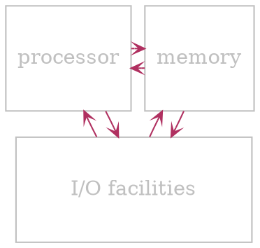
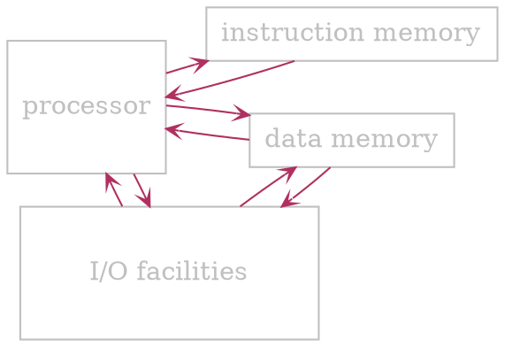
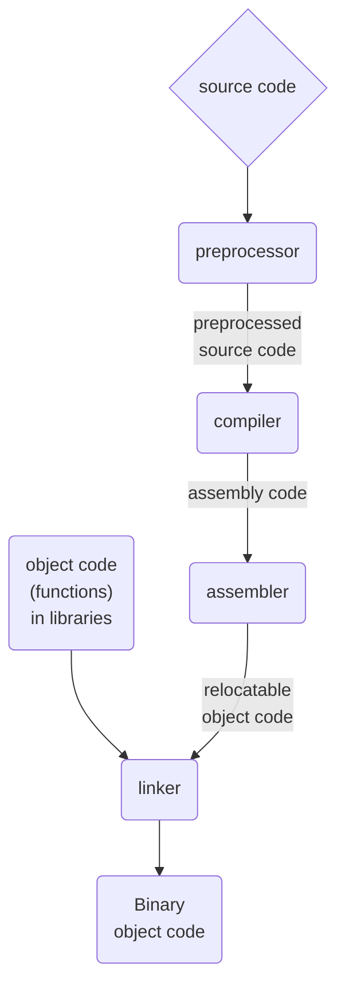

# Terminology

- The term **processor** and computational engine refer broadly to any mechanism that drives *computation*
- CPUs exist in wide varieties and complexities
- **Processor** is key element in all computational systemd

--- 
<br>

# Architechture

## Von Neumann

- *Instruction* and *data* memory are shared



## Harward

- *Instruction* and *data* memory are separate
- Typically used nowadays



--- 
<br>

# General information

- Mechanisms available
	- Fixed logic
	- Selectable logic
	- Parameterized logic
	- Programmable logic

- Most computer architectures follow a *hierarchical* approach  
- Subparts of a large CPU are sophisticated enough to meet the definition of a processor, sometimes they are called *computational engines*

## Programmable device

- ? To a software engineer programming means
	- Writing, compiling and loading code into memory
	- Executing the resulting memory image
- ? To a hardware engineer a programmable device
	- Has a processor separate from the program it runs
	- May have the program burned onto a chip

## Roles

- <u>Coprocessor</u>
	- Operates *in conjunction* and *under control* of *another processor* 
	- Usually
		- Special-purpose
		- Performs a *single task*
		- Operates at *high speed*
	- & Example: FPU (Floating point unit)
- <u>Microcontroller</u>
	- [[#Programmable device]]
	- *Dedicated* to control a *physical system*
		- & Example: control an automobile engine or grocery store door
	- ! Drawback: extremely limited (slow processor and tiny memory)
	- $ Advantage: very low power consumption
- <u>Embedded system processors</u>
	- Runs *sophisticated* electronic device
	- May be more powerful than a *microcontroller*
	- Generally *low power consumption*
	- & Example: control TV, including commands received from a remote and front panel
- <u>General-purpose processors</u>
	- *Most powerful*
	- Completely [[#Programmable device|programmable]]
	- Full functionality
	- Power consumption is a secondary consideration
	- & Example: CPU in a personal computer

## Major components

- $ Controller to coordinate operations (often omitted from architecture diagrams)
	- *Overall responsibility* for execution
	- *Moves through sequence* of steps
	- *Coordinates* other *units*
	- *Timing-based operation*: knows how long each unit requires and schedules steps accordingly
- $ Arithmetic Logic Unit (ALU)
	- Operates as directed by controller
	- Provides *arithmetic* and *boolean* operations
		- @ Arithmetic:
			- addition
			- subtraction
			- multiplication
			- division
		- @ Shift
			- left
			- right
			- circular
		- @ Boolean
			- and
			- or
			- not
			- xor
	- Performs *one operations at a time* as directed
- $ Local data storage
	- *Holds data* values for operations
	- Values must be inserted (e.g., loaded from memory) before the operation can be performed
- $ Internal interconnects (data paths)
	- Allow *transfer of values* between units
- $ External interfaces (I/O buses)
	- Handle communication between **CPU** and rest of the computer system
	- Provides interaction with external memory as well as external *I/O* devices

--- 
<br>

# Program execution

## Fetch-execute cycle

- Basis of [[#Programmable device|programmable]] *processors*
- Allows the processor to *move through program* steps *automatically*
- Implemented by processor's hardware
- At some level, every [[#Programmable device|programmable]] processor implements a **fetch-execute** cycle

### Fetch-execute algorithm

> Repeat <u>forever</u> {
> 
> - *Fetch*: access the **next step** of the program
> - *Execute*: **Perform** the step of the program
> 
> }

## Program translation

`````col
````col-md
flexGrow=1
===

- Processors require a program to be
	- In memory
	- Represented in *binary*
- Programmers prefer a program to be
	- Readable by humans
	- In a *High Level* Language
- @ Solution:
	- Allow programmers to write code in a readable *high-level* language 
	- Translate into binary using compilers

````
````col-md
flexGrow=1
===



````
`````

## Clock rate and instruction rate

- $ Clock rate
	- *Rate* at which *gates are clocked*
	- Provides a measure of the underlying *hardware speed*
- $ Instruction rate
	- Measures the *number of instructions* a processor can execute *per unit time*
	- *Some instructions* can take more than a single *clock cycle*
		- & Example: multiplication takes longer than addition

## Stopping a processor

- Processor runs [[#Fetch-execute cycle|fetch-execute]] indefinitely
- Software must plan next step
- Two possibilities when the *last step* of computation finishes
	- On smallest embedded systems: code enters a loop for testing for a change in input
	- Larger systems: OS runs an infinite loop
- ? Note: to reduce *power consumption*, hardware may provide a way to put CPU to sleep until *I/O* activity occurs

## Starting a processor

- Processor hardware includes a *reset line* that stops the [[#Fetch-execute cycle|fetch-execute cycle]]
- For *power-down*: reset line is *asserted* (pulled high)
- During *power-up*, logic holds the reset until the *processor* and *memory* are initialized
- *Power-up* steps are known as *bootstrapping*

# Instruction sets