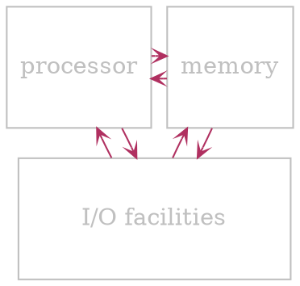
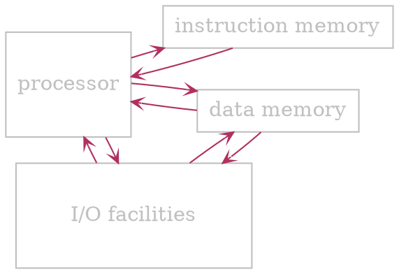
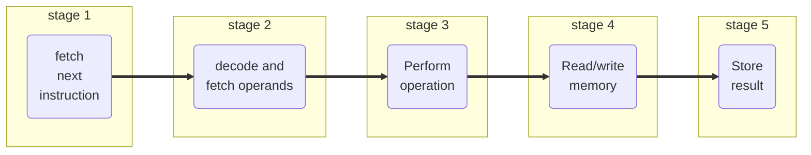
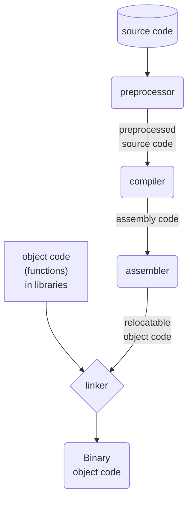

# Processor Terminology

> [!definition] 
> 
> - The term **processor** and computational engine refer broadly to any mechanism that drives *computation*
> - CPUs exist in wide varieties and complexities
> - **Processor** is key element in all computational systems

- $ Also see: [[#Programmable device|programmable device]]

--- 
<br>

# Architechture

## Von Neumann

- *Instruction* and *data* memory are shared



## Harward

- *Instruction* and *data* memory are separate
- Typically used nowadays



--- 
<br>

# General information

- $ Mechanisms available
	- Fixed logic
	- Selectable logic
	- Parameterized logic
	- Programmable logic

- Most computer architectures follow a *hierarchical* approach  
- Subparts of a large CPU are sophisticated enough to meet the definition of a [[#Processor Terminology|processor]], sometimes they are called *computational engines*

## Programmable device

- ? To a software engineer programming means
	- *Writing, compiling and loading* code into memory
	- *Executing* the resulting memory image
- ? To a hardware engineer a programmable device
	- Has a [[#Processor Terminology|processor]] separate from the program it runs
	- May have the program *burned onto a chip*

## Roles

- <u>Coprocessor</u>
	- Operates *in conjunction* and *under control* of *another [[#Processor Terminology|processor]]* 
	- Usually
		- Special-purpose
		- Performs a *single task*
		- Operates at *high speed*
	- & Example: FPU (Floating point unit)
- <u>Microcontroller</u>
	- [[#Programmable device]]
	- *Dedicated* to control a *physical system*
		- & Example: control an automobile engine or grocery store door
	- ! Drawback: extremely limited (slow [[#Processor Terminology|processor]] and tiny memory)
	- $ Advantage: very low power consumption
- <u>Embedded system processors</u>
	- Runs *sophisticated* electronic device
	- May be more powerful than a *microcontroller*
	- Generally *low power consumption*
	- & Example: control TV, including commands received from a remote and front panel
- <u>General-purpose processors</u>
	- *Most powerful*
	- Completely [[#Programmable device|programmable]]
	- Full functionality
	- Power consumption is a secondary consideration
	- & Example: CPU in a personal computer

## Major components

- $ Controller to coordinate operations (often omitted from architecture diagrams)
	- *Overall responsibility* for execution
	- *Moves through sequence* of steps
	- *Coordinates* other *units*
	- *Timing-based operation*: knows how long each unit requires and schedules steps accordingly
- $ Arithmetic Logic Unit (ALU)
	- Operates as directed by controller
	- Provides *arithmetic* and *boolean* operations
		- ~ Arithmetic:
			- addition
			- subtraction
			- multiplication
			- division
		- ~ Shift
			- left
			- right
			- circular
		- ~ Boolean
			- and
			- or
			- not
			- xor
	- Performs *one operations at a time* as directed
- $ Local data storage
	- *Holds data* values for operations
	- Values must be inserted (e.g., loaded from memory) before the operation can be performed
- $ Internal interconnects (data paths)
	- Allow *transfer of values* between units
- $ External interfaces (I/O buses)
	- *Handle communication* between **CPU** and rest of the computer system
	- *Provides interaction* with *external* memory as well as external *I/O* devices

--- 
<br>

# Program execution

## Fetch-execute cycle

> [!definition] 
> 
> - Basis of [[#Programmable device|programmable]] *processors*
> - Allows the [[#Processor Terminology|processor]] to *move through program* steps *automatically*
> - Implemented by processor's hardware
> - At some level, every [[#Programmable device|programmable]] processor implements a **fetch-execute** cycle

### Fetch-execute algorithm

- Fetch the next [[#Instructions|instruction]]
- Decode the [[#Instructions|instruction]] and fetch [[#Parts of an instruction|operands]] from [[#Registers|registers]]
- Perform the *operation* specified by the [[#Parts of an instruction|opcode]] 
- Perform memory *read* or *write*, if needed
- Store the result back to the [[#Registers|registers]]

### Program counter

> [!definition] 
> - Hardware [[#Registers|register]]
> - Used during [[#Fetch-execute cycle|fetch-execute cycle]]
> - Gives address of *next* [[#Instructions|instruction]] to execute
> - ? Also known as *instruction pointer* or *instruction counter*

#### [[#Fetch-execute algorithm]] details

- Access the *next step* of the program from the location given by the [[#Program counter|program counter]]
- Set an internal [[#Registers|address register]] *A* to the address beyond the [[#Instructions|instruction]] that was just fetched
- Execute: Perform the step of the program
- Copy the content from *A* to the [[#Program counter|program counter]]

## Instruction pipeline

> [!definition] 
> 
> - A major idea in [[#Processor Terminology|processor]] design
> - Also called **execution pipeline**
> - $ Optimizes performance
> - Typically used with [[#RISC]] instruction set

> [!note] 
> - We can think of pipelining as an *automatic optimization*
> 	- Hardware speeds up processing *if possible*
> 	- If speedup is not possible, hardware is still correct
> - @ Consequence:
> 	- Code that is not optimized will work correctly, but may run slower

### Pipeline features

- Transparent to programmer
- Speed
	- All stages operate *in parallel*
	- Given stage can start to process a new instruction *as soon as current instruction finishes*
	- @ Effect: *N-stage pipeline* van operate on *N* instructions simultaneously
	- $ Result: 
		- One instruction completes *every time pipeline moves*
		- For [[#RISC]] [[#Processor Terminology|processor]], one instruction on *every clock cycle* (instead of 5)
- ! Stalls if item is not available when a stage needs it
	- Consider code that
		- Performs *addition* and *subtraction*
		- Uses [[#Registers|registers]] from *A* to *E* for [[#Parts of an instruction|operands]] 
		- Instruction sequence
			- $A+B \to C$
			- ! $E-C \to D$ <-- This instruction must wait for *C* to be computed
	- *Pipeline* stall can also occur on
		- *I/O* access
		- External storage access (memory reference)
		- [[#Roles|Coprocessor]] invocation

### Maximizing pipeline speed

- Program must be written to accommodate *instruction pipeline*
- To minimize stalls
	- Avoid *introducing unnecessary [[#Branching|branches]]*
	- Delay references to result [[#Registers|registers]]
- ! A contradiction
	- Good software practice is to *split* a program *into smaller functions*
	- A [[#Subroutine call|function call]] *stalls the pipeline*

> [!example] 
> 
> Rearranging *A* to *B* eliminates stalls. (Compilers do that)
> 
> `````col 
> ````col-md 
> flexGrow=1
> ===
> 
> **A**
> 
> ```ruby
> C <-- add A B
> D <-- subtract E C
> F <-- add G H
> J <-- subtract I F
> M <-- add K L
> P <-- subtract M N
> ```
> 
> ```` 
> ````col-md 
> flexGrow=1
> ===
> 
> **B**
> 
> ```ruby
> C <-- add A B
> F <-- add G H
> M <-- add K L
> D <-- subtract E C
> J <-- subtract I F
> P <-- subtract M N
> ```
> 
> ```` 
> `````

#### Result forwarding

> [!definition] 
> - *Hardware optimization* to *avoid stalls*
> - Allows [[#Major components|ALU]] to reference result in *next instruction*

- & Example:
	- C <-- add A B
	- D <-- subtract E C
- Forwarding hardware passes the result of *add* operation *directly to ALU* without storing it in the [[#Registers|register]]
	- Ensures the value arrives by the time *subtract* [[#Instructions|instruction]] reaches the *pipeline* stage of execution

#### No-op instruction

- Often included in [[#RISC]]
- May seem useless
- Has *no effect* on 
	- [[#Registers|Registers]]
	- Memory
	- [[#Program counter]]
	- Computation
- $ Can be inserted to avoid stalls

- & Example:
	- C <-- add A B
	- no-op
	- D <-- subtract E C
- If [[#Result forwarding|forwarding]] is available, **no-op** allows for result from [[#Registers|register]] *C* to be fetched for *subtract* operation
- Compilers insert **no-op** [[#Instructions|instructions]] to optimize performance

### Approach

- Build *separate hardware blocks* for each step of the [[#Fetch-execute cycle|fetch-execute cycle]]
- Arrange hardware to *pass an instruction through the sequence* of hardware blocks
- Allow step *K* of instruction to execute while step *K-1* of next instruction executes



- [[#Instructions|Instructions]] passing through a 5-stage *pipeline*.
- Once the *pipeline* is filled, each stage is busy on each clock cycle

| clock | stage 1  | stage 2  | stage 3  | stage 4  | stage 5  |
| ----- | -------- | -------- | -------- | -------- | -------- |
| 1     | instr. 1 |          |          |          |          |
| 2     | instr. 2 | instr. 1 |          |          |          |
| 3     | instr. 3 | instr. 2 | instr. 1 |          |          |
| 4     | instr. 4 | instr. 3 | instr. 2 | instr. 1 |          |
| 5     | instr. 5 | instr. 4 | instr. 3 | instr. 2 | instr. 1 |
| 6     | instr. 6 | instr. 5 | instr. 4 | instr. 3 | instr. 2 |
| 7     | instr. 7 | instr. 6 | instr. 5 | instr. 4 | instr. 3 |
| 8     | instr. 8 | instr. 7 | instr. 6 | instr. 5 | instr. 4 |

## Program translation

`````col
````col-md
flexGrow=1
===

- Processors require a program to be
	- In memory
	- Represented in *binary*
- Programmers prefer a program to be
	- Readable by humans
	- In a *High Level* Language
- $ Solution:
	- Allow programmers to write code in a readable *high-level* language 
	- *Translate into binary* using compilers

````
````col-md
flexGrow=1
===



````
`````

## Clock rate and instruction rate

### Clock rate

- *Rate* at which *gates are clocked*
- Provides a measure of the underlying *hardware speed*

### Instruction rate

- Measures the *number of instructions* a [[#Processor Terminology|processor]] can execute *per unit time*
- *Some instructions* can take more than a single *clock cycle*
	- & Example: multiplication takes longer than addition

## Stopping a processor

- [[#Processor Terminology|Processor]] runs [[#Fetch-execute cycle|fetch-execute]] indefinitely
- Software must plan next step
- *Two possibilities* when the *last step* of computation finishes
	- On smallest embedded systems: code enters a loop for testing for a change in input
	- Larger systems: OS runs an infinite loop
- & Note: to reduce *power consumption*, hardware may provide a way to put CPU to sleep until *I/O* activity occurs

## Starting a processor

- [[#Processor Terminology|Processor's]] *hardware* includes a *reset line* that stops the [[#Fetch-execute cycle|fetch-execute cycle]]
- For *power-down*: reset line is *asserted* (pulled high)
- During *power-up*, logic holds the reset until the [[#Processor Terminology|processor]] and *memory* are initialized
- *Power-up* steps are known as *bootstrapping*

--- 
<br>

# Instructions

## What instructions should a CPU offer?

- Minimum set is *sufficient, but inconvenient*
- Extremely large is *convenient, but inefficient*
- ? Architects must consider additional factors
	- *Physical size* of a [[#Processor Terminology|processor]] chip
	- Expected *use*
	- ! Power consumption
	- & Trade-offs mean that a variety of designs exist

## Instruction set architecture

- Idea pioneered by IBM
- Allow multiple, compatible models
- $ Define
	- Set of *instructions*
	- *Operands* and meaning
- ! Do not define
	- Implementation *details*
	- [[#Clock rate and instruction rate|Processor's speed]]

- **Instruction set architecture** includes:
	- Functionality: what the instructions *provide*
		- Arithmetic ([[Data representation#Integer representation in binary|integers]] or [[Data representation#Floating point|floating point]])
		- Logic ([[Data representation#Bit (Binary digit)|bit]] manipulation and testing)
		- Control ([[#Branching|branching]], *function call*)
		- Other (*graphics*, *data conversion*)
	- Format: *representation* of each instruction
	- Semantics: *effect* when instruction is executed

## Parts of an instruction

- $ Opcode
	- Specifies *operation* to be performed
- $ Operands
	- Specify *data values* on which to operate
- $ Result location
	- Specifies *where result* is to be *placed*

- Instruction is represented as a sequence of [[Data representation#Bit (Binary digit)|bits]] in memory (usually multiple of [[Data representation#Byte|bytes]])
	- Typically
		- **Opcode** at the beginning of instruction
		- **Operands** follow **opcode**

```asciidoc-table
[frame=none]
[cols="1,1,1,3"]
|===

^| Opcode
^| Operand 1

^| Operand 2
^| . . .

|===
```

### Types of opcodes

- Operations are usually classified into groups`
- & Example classification:
	- [[Data representation#Integer representation in binary|Integer]] arithmetic
	- [[Data representation#Floating point|Floating point]] arithmetic
	- Logical (boolean)
	- Data access and transfer
	- Conditional and unconditional [[#Branching|branching]]
	- [[#Processor Terminology|Processor]] control
	- Graphics

## Branching

- $ Absolute branch
	- Typically named *jump*
	- [[#Parts of an instruction|Operand]] is an *address*
	- *Assigns* [[#Parts of an instruction|operand]] value to internal [[#Registers|register]] *A* 
- $ Conditional branch
	- Same as *Absolute branch*, but branches on condition
		```armasm
		cmp r4 r5 # compare r4 and r5, set condition code
		be  lab1  # branch to lab1 if condition code specifies equal (be = branch equal)
		mov r3, 0 # place 0 in r3
		```

- $ Relative branch
	- Typically named *br*
	- [[#Parts of an instruction|Operand]] is a [[Data representation#Signed integers|signed]] value
	- *Adds* [[#Parts of an instruction|operand]] to internal [[#Registers|register]] *A* 

## Subroutine call

- Jump to *subroutine* (*jsr* [[#Instruction sets|instruction]])
	- Similar to *jump*
	- *Saves* value of internal [[#Registers|register]] *A*
	- *Replaces* *A* with [[#Parts on an instruction|operand]] address
- Return from *subroutine* (*ret* instruction)
	- *Retrieves* value saved during *jsr*
	- *Replaces* *A* with saved value

### Passing arguments

- Multiple methods are used
- Choice depends on *language/compiler* and *hardware*
- & Examples:
	- Store arguments *in memory*
	- Store arguments *in special-purpose hardware [[#Registers|registers]]
	- Store arguments *in [[#General purpose registers|general purpose registers]]*
- Many techniques are also used for *returning result* from function 

- $ Also see: [[#Register window|register window]]

## Instruction length

### Fixed-length

- Every instruction is the *same size*
- Hardware is *less complex*
- $ Hardware can *run faster*
- ! *Wasted space*: some instructions don't use all the bits

### Variable length

- Some instructions are shorter than others
- Allows for [[#Instructions|instructions]] with *no [[#Parts of an instruction|operands]]*, a *few [[#Parts of an instruction|operands]]*, or *many [[#Parts of an instruction|operands]]*
- $ *No wasted space*

## Types of Instruction sets

### CISC

> [!definition] 
> **C**omplex **I**nstruction **S**et **C**omputer

- *Many instructions* (often *hundreds*)
- Given [[#Instructions|instruction]] can require *arbitrary time to compute*
- & Example: Intel/AMD (x86/x64) or IBM [[#Instructions|instruction set]]
- @ Typical complex [[#Instructions|instructions]]:
	- Move graphical item on bitmapped display
	- Copy or clear a region of memory
	- Perform a [[Data representation#Floating point|floating point]] computation

### RISC

> [!definition] 
> **R**educed **I**nstruction **S**et **C**omputer

- *Few instructions* (typically *32* or *64*)
- Each instruction executes in *one clock cycle*
- & Example: [[#MIPS]] or ARM instruction set
- @ Omits complex instructions, instead *sequence of instructions* are used
	- No [[Data representation#Floating point|floating point]] instructions
	- No *graphics* instructions

## Example instruction set

### MIPS

- Early [[#RISC]] design
- Minimalistic
- Only *32* [[#Instruction sets|instructions]]

More info: [instruction set reference 1](https://www.dsi.unive.it/~gasparetto/materials/MIPS_Instruction_Set.pdf) [instruction set reference 2](https://ecs-network.serv.pacific.edu/ecpe-170/tutorials/mips-instruction-set)

## Aesthetic aspects of instruction sets

- $ Elegance
	- Balanced
	- No frivolous or useless [[#Instruction sets|instructions]]
- $ Orthogonality
	- No unnecessary duplication
	- No overlap between [[#Instruction sets|instructions]]
- $ Ease of programming 
	- [[#Instruction sets|Instructions]] match intuition
	- [[#Instruction sets|Instructions]] are free from arbitrary restrictions

--- 
<br>

# Registers

> [!example] 
> Example of programming with **registers**
> - ? Task:
> 	- Start with variables *X* and *Y*
> 	- Add *X* and *Y* and place the result in *Z* (also in memory)
> - $ Steps:
> 	- *Load* a copy of *X* into register *1*
> 	- *Load* a copy of *Y* into register *2*
> 	- *Add* the value in register *1* to the value in register *2*, and put the result in register *3*
> 	- *Store* a copy of the value from [[#Registers|register]] *3* in *Z*

## General purpose registers

- *High-speed* storage mechanism
- Part of the [[#Processor Terminology|processor]] (*on chip*)
- Each [[#Registers|register]] holds an [[Data representation#Integer representation in binary|integer]] or a *pointer*
- Numbered from *0* to *N-1*
- $ Basic uses:
	- *Temporary storage* during computation
	- [[#Parts of an instruction|Operand]] for arithmetic operation
- & Note: some [[#Processor Terminology|processors]] require *all operands* for an arithmetic operation to come from **general-purpose** [[#Registers|registers]]

## Floating point registers

- Usually separate from [[#General purpose registers|general purpose]] [[#Registers|registers]]
- Each holds one [[Data representation#Floating point|floating point]] value
- **Floating point** registers are [[#Parts of an instruction|operands]] for [[Data representation#Floating point|floating point]] arithmetic

## Condition codes

- Extra hardware [[Data representation#Bit (Binary digit)|bits]] (not part of [[#General purpose registers|general purpose]] [[#Registers|registers]])
- Set by [[#Major components|ALU]] each time an [[#Instruction sets|instruction]] produces a result
- Used to indicate
	- [[Data representation#Overflow|Overflow]]
	- Underflow
	- Whether result is positive, negative, or zero
	- Other exceptions
- Tested in [[#Branching|conditional branch instruction]] 

## Register terminology

### Register spilling

- Occurs when *a [[#Registers|register]] is* needed for a computation and *all registers are occupied*
- General idea:
	- *Save* current contents of [[#Registers|register]](s) *into memory*
	- *Load* [[#Registers|register]](s) from memory *when values are needed*

### Register allocation

- Refers to *choosing which values to keep* in [[#Registers|registers]] *at a given time*
- Performed by a compiler (sometimes by a programmer)

### Double precision

- Refers to value that is *twice as large* as a standard value ([[Data representation#Integer representation in binary|integer]], [[Data representation#Floating point|floating point]])
- Most [[#Processor Terminology|processors]] *don't have dedicated registers* for **double precision** computation, so instead *a contiguous pair of registers is used*
- & Example: multiplication of 2 *32-[[Data representation#Bit (Binary digit)|bit]]* [[Data representation#Integer representation in binary|integers]] 
	- Result can require *64-[[Data representation#Bit (Binary digit)|bits]]*, (so it goes into *2* [[#Registers|registers]] e.g. 4 and 5)

### Register banks

- [[#Registers]] partitioned into *disjoint sets* called **banks**
- Additional hardware detail
- $ Optimizes performance
- ! Complicates programming

#### Typical register bank scheme

- Registers are divided into *2* [[#Register banks|banks]]
- [[#Major components|ALU]] [[#Instructions|instruction]] that takes *2* [[#Parts of an instruction|operands]] must have one [[#Parts of an instruction|operand]] from each [[#Register banks|banks]]
- Compiler (sometimes programmer) must *ensure that operands are in separate [[#Register banks|banks]]*
- & Note: having *2* [[#Parts of an instruction|operands]] from the same [[#Register banks|bank]] will result in a run-time error

#### Why register banks?

- *Parallel hardware facilities* allow simultaneous access to both [[#Register banks|banks]]
- Access takes *half as long* as using *a single* [[#Register banks|bank]]

#### Consequences of using register banks

- <u>Some trivial programs cause problems</u>

> [!example] 
> 
> 1. $X + Y \to R$
> 2. $Z - X \to S$
> 3. $Y + Z \to T$
> 
> [[#Parts of an instruction|Operands]] must be assigned to [[#Register banks|banks]]
> - ! No feasible choise for the above snippet

- <u>Register conflicts</u>
	- Occur when [[#Parts of an instruction|operands]] specify the same [[#Register banks|register bank]]
	- Reported by the [[#Program translation|compiler/assembler]]
	- Code should be modified or *extra [[#Instructions|instruction]] to copy* an [[#Parts of an instruction|operand]] value to the opposite [[#Register banks|register bank]] should be added
	- & Example: In the previous sample 
		- Start with *Y* and *Z* in the same [[#Register banks|register bank]]
		- Before adding *Y* and *Z*, copy one to another [[#Register banks|register bank]]

### Register window

> [!definition] 
> - Hardware optimization for [[#Passing arguments|passing arguments]] 
> - Makes only a *subset* of registers visible at any time
> - Caller places arguments in *reserved* [[#Registers|registers]]
> - During procedure call, **register window** moves to *hide old* [[#Registers|registers]] and *expose new* ones

- Before [[#Subroutine call|calling a subroutine]] (*A*, *B*, *C*, *D* are arguments)
```asciidoc-table
[frame=none]
[cols="1,1,1,1,1,1,1,1,1,1,1,1,1,1,1,1"]
|===

8+^| Registers 0-7
8+^| Unavailable

^| x1
^| x2
^| x3
^| x4
^| *A*
^| *B*
^| *C*
^| *D*

^| 
^| 
^| 
^| 
^| 
^| 
^| 
^| 

|===
```

- After [[#Subroutine call|calling a subroutine]]
```asciidoc-table
[frame=none]
[cols="1,1,1,1,1,1,1,1,1,1,1,1,1,1,1,1"]
|===

4+^| Unavailable
8+^| Registers 0-7
4+^| Unavailable

^| x1
^| x2
^| x3
^| x4
^| *A*
^| *B*
^| *C*
^| *D*

^| I1
^| I2
^| I3
^| I4
^| 
^| 
^| 
^| 

|===
```