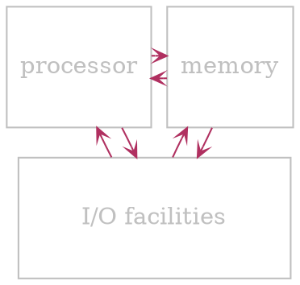
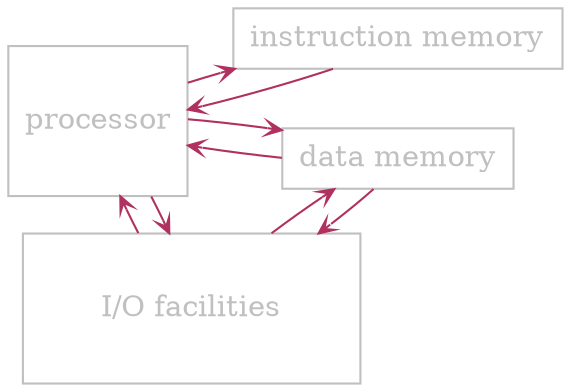
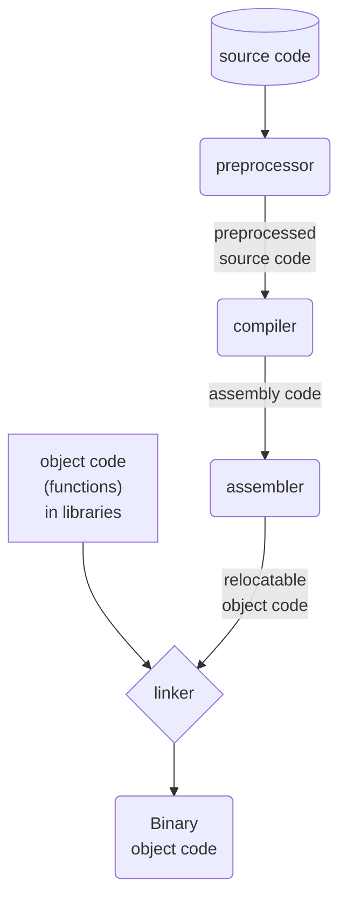

# Processor Terminology

- The term **processor** and computational engine refer broadly to any mechanism that drives *computation*
- CPUs exist in wide varieties and complexities
- **Processor** is key element in all computational systemd

- $ Also see: [[#Programmable device|programmable device]]

--- 
<br>

# Architechture

## Von Neumann

- *Instruction* and *data* memory are shared



## Harward

- *Instruction* and *data* memory are separate
- Typically used nowadays



--- 
<br>

# General information

- $ Mechanisms available
	- Fixed logic
	- Selectable logic
	- Parameterized logic
	- Programmable logic

- Most computer architectures follow a *hierarchical* approach  
- Subparts of a large CPU are sophisticated enough to meet the definition of a [[#Processor Terminology|processor]], sometimes they are called *computational engines*

## Programmable device

- ? To a software engineer programming means
	- *Writing, compiling and loading* code into memory
	- *Executing* the resulting memory image
- ? To a hardware engineer a programmable device
	- Has a [[#Processor Terminology|processor]] separate from the program it runs
	- May have the program *burned onto a chip*

## Roles

- <u>Coprocessor</u>
	- Operates *in conjunction* and *under control* of *another [[#Processor Terminology|processor]]* 
	- Usually
		- Special-purpose
		- Performs a *single task*
		- Operates at *high speed*
	- & Example: FPU (Floating point unit)
- <u>Microcontroller</u>
	- [[#Programmable device]]
	- *Dedicated* to control a *physical system*
		- & Example: control an automobile engine or grocery store door
	- ! Drawback: extremely limited (slow [[#Processor Terminology|processor]] and tiny memory)
	- $ Advantage: very low power consumption
- <u>Embedded system processors</u>
	- Runs *sophisticated* electronic device
	- May be more powerful than a *microcontroller*
	- Generally *low power consumption*
	- & Example: control TV, including commands received from a remote and front panel
- <u>General-purpose processors</u>
	- *Most powerful*
	- Completely [[#Programmable device|programmable]]
	- Full functionality
	- Power consumption is a secondary consideration
	- & Example: CPU in a personal computer

## Major components

- $ Controller to coordinate operations (often omitted from architecture diagrams)
	- *Overall responsibility* for execution
	- *Moves through sequence* of steps
	- *Coordinates* other *units*
	- *Timing-based operation*: knows how long each unit requires and schedules steps accordingly
- $ Arithmetic Logic Unit (ALU)
	- Operates as directed by controller
	- Provides *arithmetic* and *boolean* operations
		- ~ Arithmetic:
			- addition
			- subtraction
			- multiplication
			- division
		- ~ Shift
			- left
			- right
			- circular
		- ~ Boolean
			- and
			- or
			- not
			- xor
	- Performs *one operations at a time* as directed
- $ Local data storage
	- *Holds data* values for operations
	- Values must be inserted (e.g., loaded from memory) before the operation can be performed
- $ Internal interconnects (data paths)
	- Allow *transfer of values* between units
- $ External interfaces (I/O buses)
	- *Handle communication* between **CPU** and rest of the computer system
	- *Provides interaction* with *external* memory as well as external *I/O* devices

--- 
<br>

# Program execution

## Fetch-execute cycle

- Basis of [[#Programmable device|programmable]] *processors*
- Allows the [[#Processor Terminology|processor]] to *move through program* steps *automatically*
- Implemented by processor's hardware
- At some level, every [[#Programmable device|programmable]] processor implements a **fetch-execute** cycle

### Fetch-execute algorithm

- Fetch the next [[#Instruction sets|instruction]]
- Decode the [[#Instruction sets|instruction]] and fetch [[#Parts on an instruction|operands]] from [[#Registers|registers]]
- Perform the *operation* specified by the [[#Parts on an instruction|opcode]] 
- Perform memory *read* or *write*, if needed
- Store the result back to the [[#Registers|registers]]

## Program translation

`````col
````col-md
flexGrow=1
===

- Processors require a program to be
	- In memory
	- Represented in *binary*
- Programmers prefer a program to be
	- Readable by humans
	- In a *High Level* Language
- $ Solution:
	- Allow programmers to write code in a readable *high-level* language 
	- *Translate into binary* using compilers

````
````col-md
flexGrow=1
===



````
`````

## Clock rate and instruction rate

### Clock rate

- *Rate* at which *gates are clocked*
- Provides a measure of the underlying *hardware speed*

### Instruction rate

- Measures the *number of instructions* a [[#Processor Terminology|processor]] can execute *per unit time*
- *Some instructions* can take more than a single *clock cycle*
	- & Example: multiplication takes longer than addition

## Stopping a processor

- [[#Processor Terminology|Processor]] runs [[#Fetch-execute cycle|fetch-execute]] indefinitely
- Software must plan next step
- *Two possibilities* when the *last step* of computation finishes
	- On smallest embedded systems: code enters a loop for testing for a change in input
	- Larger systems: OS runs an infinite loop
- & Note: to reduce *power consumption*, hardware may provide a way to put CPU to sleep until *I/O* activity occurs

## Starting a processor

- [[#Processor Terminology|Processor's]] *hardware* includes a *reset line* that stops the [[#Fetch-execute cycle|fetch-execute cycle]]
- For *power-down*: reset line is *asserted* (pulled high)
- During *power-up*, logic holds the reset until the [[#Processor Terminology|processor]] and *memory* are initialized
- *Power-up* steps are known as *bootstrapping*

--- 
<br>

# Instruction sets

## What instructions should a CPU offer?

- Minimum set is *sufficient, but inconvenient*
- Extremely large is *convenient, but inefficient*
- ? Architects must consider additional factors
	- *Physical size* of a [[#Processor Terminology|processor]] chip
	- Expected *use*
	- ! Power consumption
	- & Trade-offs mean that a variety of designs exist

## Instruction set architecture

- Idea pioneered by IBM
- Allow multiple, compatible models
- $ Define
	- Set of *instructions*
	- *Operands* and meaning
- ! Do not define
	- Implementation *details*
	- [[#Clock rate and instruction rate|Processor's speed]]

- **Instruction set architecture** includes:
	- Functionality: what the instructions *provide*
		- Arithmetic ([[Data representation#Integer representation in binary|integers]] or [[Data representation#Floating point|floating point]])
		- Logic ([[Data representation#Bit (Binary digit)|bit]] manipulation and testing)
		- Control (*branching*, *function call*)
		- Other (*graphics*, *data conversion*)
	- Format: *representation* of each instruction
	- Semantics: *effect* when instruction is executed

## Parts on an instruction

- $ Opcode
	- Specifies *operation* to be performed
- $ Operands
	- Specify *data values* on which to operate
- $ Result location
	- Specifies *where result* is to be *placed*

- Instruction is represented as a sequence of [[Data representation#Bit (Binary digit)|bits]] in memory (usually multiple of [[Data representation#Byte|bytes]])
	- Typically
		- **Opcode** at the beginning of instruction
		- **Operands** follow **opcode**

```asciidoc-table
[cols="1,1,1,3"]
|===

^| Opcode
^| Operand 1

^| Operand 2
^| . . .

|===
```

## Instruction length

### Fixed-length

- Every instruction is the *same size*
- Hardware is *less complex*
- Hardware can *run faster*
- *Wasted space*: some instructions don't use all the bits

### Variable length

- Some instructions are shorter than others
- Allows for instructions with *no [[#Parts on an instruction|operands]]*, a *few [[#Parts on an instruction|operands]]*, or *many [[#Parts on an instruction|operands]]*
- *No wasted space*

## Types of Instruction sets

### CISC

> Complex Instruction Set Computer

- *Many instructions* (often *hundreds*)
- Given instruction can require *arbitrary time to compute*
- & Example: Intel/AMD (x86/x64) or IBM [[#Instruction sets|instruction set]]
- @ Typical complex instructions:
	- Move graphical item on bitmapped display
	- Copy or clear a region of memory
	- Perform a [[Data representation#Floating point|floating point]] computation

### RISC

> Reduced Instruction Set Computer

- *Few instructions* (typically *32* or *64*)
- Each instruction executes in *one clock cycle*
- & Example: MIPS or ARM instruction set
- @ Omits complex instructions, instead *sequence of instructions* are used
	- No [[Data representation#Floating point|floating point]] instructions
	- No *graphics* instructions

--- 
<br>

# Registers

> [!example] 
> Example of programming with **registers**
> - ? Task:
> 	- Start with variables *X* and *Y*
> 	- Add *X* and *Y* and place the result in *Z* (also in memory)
> - $ Steps:
> 	- *Load* a copy of *X* into register *1*
> 	- *Load* a copy of *Y* into register *2*
> 	- *Add* the value in register *1* to the value in register *2*, and put the result in register *3*
> 	- *Store* a copy of the value from [[#Registers|register]] *3* in *Z*

## General purpose registers

- *High-speed* storage mechanism
- Part of the [[#Processor Terminology|processor]] (*on chip*)
- Each [[#Registers|register]] holds an [[Data representation#Integer representation in binary|integer]] or a *pointer*
- Numbered from *0* to *N-1*
- $ Basic uses:
	- *Temporary storage* during computation
	- [[#Parts on an instruction|Operand]] for arithmetic operation
- & Note: some [[#Processor Terminology|processors]] require *all operands* for an arithmetic operation to come from **general-purpose** [[#Registers|registers]]

## Floating point registers

- Usually separate from [[#General purpose registers|general purpose]] [[#Registers|registers]]
- Each holds one [[Data representation#Floating point|floating point]] value
- **Floating point** registers are [[#Parts on an instruction|operands]] for [[Data representation#Floating point|floating point]] arithmetic

## Register terminology

### Register spilling

- Occurs when *a [[#Registers|register]] is* needed for a computation and *all registers are occupied*
- General idea:
	- *Save* current contents of [[#Registers|register]](s) *into memory*
	- *Load* [[#Registers|register]](s) from memory *when values are needed*

### Register allocation

- Refers to *choosing which values to keep* in [[#Registers|registers]] *at a given time*
- Performed by a compiler (sometimes by a programmer)

### Double precision

- Refers to value that is *twice as large* as a standard value ([[Data representation#Integer representation in binary|integer]], [[Data representation#Floating point|floating point]])
- Most [[#Processor Terminology|processors]] *don't have dedicated registers* for **double precision** computation, so instead *a contiguous pair of registers is used*
- & Example: multiplication of 2 *32-[[Data representation#Bit (Binary digit)|bit]]* [[Data representation#Integer representation in binary|integers]] 
	- Result can require *64-[[Data representation#Bit (Binary digit)|bits]]*, (so it goes into *2* [[#Registers|registers]] e.g. 4 and 5)

### Register banks

- [[#Registers]] partitioned into *disjoint sets* called **banks**
- Additional hardware detail
- $ Optimizes performance
- ! Complicates programming

#### Typical register bank scheme

- Registers are divided into *2* [[#Register banks|banks]]
- [[#Major components|ALU]] [[#Instruction sets|instruction]] that takes *2* [[#Parts on an instruction|operands]] must have one [[#Parts on an instruction|operand]] from each [[#Register banks|banks]]
- Compiler (sometimes programmer) must *ensure that operands are in separate [[#Register banks|banks]]*
- & Note: having *2* [[#Parts on an instruction|operands]] from the same [[#Register banks|bank]] will result in a run-time error

#### Why register banks?

- *Parallel hardware facilities* allow simultaneous access to both [[#Register banks|banks]]
- Access takes half as long as using *a single* [[#Register banks|bank]]

#### Consequences

- <u>Some trivial programs cause problems</u>

> [!example] 
> 
> - $X + Y \to R$
> - $Z - X \to S$
> - $Y + Z \to T$
> 
> [[#Parts on an instruction|Operands]] must be assigned to [[#Register banks|banks]]
> - ! No feasible choise for the above snippet

- <u>Register conflicts</u>
	- Occur when [[#Parts on an instruction|operands]] specify the same [[#Registers|register]] [[#Register banks|bank]]
	- Reported by the [[#Program translation|compiler/assembler]]
	- Code should be modified or *extra [[#Instruction sets|instruction]] to copy* an [[#Parts on an instruction|operand]] value to the opposite [[#Registers|register]] [[#Register banks|bank]] should be added
	- & Example: In the previous sample 
		- Start with *Y* and *Z* in the same bank
		- Before adding *Y* and *Z*, copy one to another [[#Registers|register]] [[#Register banks|bank]]

