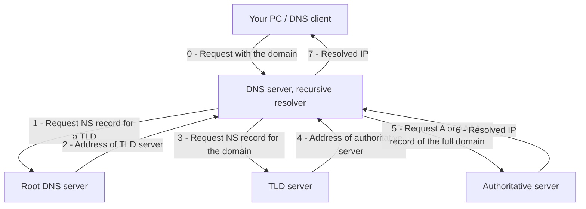

# DNS, what it is, how it works and its issues


## Table of contents

```table-of-contents
title: 
style: nestedOrderedList # TOC style (nestedList|nestedOrderedList|inlineFirstLevel)
minLevel: 2 # Include headings from the specified level
maxLevel: 4 # Include headings up to the specified level
includeLinks: true # Make headings clickable
hideWhenEmpty: false # Hide TOC if no headings are found
debugInConsole: false # Print debug info in Obsidian console
```

## Introduction

### What is DNS and why do we need it

> [!definition] 
> DNS stands for **Domain Name System**

It's a system that allows us to get IP addresses of internet resources (computers, services, etc.) by a (domain) name. **DNS** is used every time you visit any website by a *name instead of an IP address*, like <u>google.com</u> or <u>github.com</u>. Without **DNS** you would need to remember all the IP addresses for different websites, It would be near impossible to put *multiple services on one IP*, *georouting* and *load balancing* (multiple IPs for one domain) would be harder as well. With DNS, you have this neatly abstracted away from the end users behind a readable and easy to remember name.

### How it works (behind the scenes)

#### Protocol

DNS sits on the **Application layer** and so it can work on top of any transport layer protocol, typically **UDP** or **TCP**

#### Overview

The system is based on a *network of servers* (a tree), each server is responsible for a part of the full domain

`````col 
````col-md 
flexGrow=0.85
===

![[URL_structure.jpg]]

```` 
````col-md 
flexGrow=1
===

We are interested in the **TLD** (**T**op **L**evel **D**omain), the **domain name** and the **subdomain**, as those are the ones handled by **DNS**

- **TLD**s (TLD zones) are handled by *TLD nameservers*, there are *more than 1514* **TLD** nameservers, one for each TLD (.com, .edu, .io, ...), they are maintained by contries or organisations, ISPs, depending on who owns the **TLD**, there are contry-code **TLD**s, generic and special ones (https://www.iana.org/domains/root/db)
- Root nameservers (root zone) keep track of those **TLD**s nameservers, there are **13** root servers and they are maintained by organizations like **ICANN**, **RIPE**, etc. (https://www.iana.org/domains/root/servers)
- Domains and subdomains are handled by **authoratative namservers**, those are maintained by the organisations owning the domain or a delegate organization and there are a lot of them

```` 
`````


The request chain looks something like this. It's not necessary to follow this exact pattern, but in most of the cases it looks like this.




We can see this using the **dig** tool

```bash
> dig +trace example.com

; <<>> DiG 9.20.8 <<>> +trace example.com
;; global options: +cmd
.                       59839   IN      NS      m.root-servers.net.
.                       59839   IN      NS      f.root-servers.net.
.                       59839   IN      NS      a.root-servers.net.
.                       59839   IN      NS      l.root-servers.net.
.                       59839   IN      NS      c.root-servers.net.
.                       59839   IN      NS      e.root-servers.net.
.                       59839   IN      NS      g.root-servers.net.
.                       59839   IN      NS      k.root-servers.net.
.                       59839   IN      NS      b.root-servers.net.
.                       59839   IN      NS      i.root-servers.net.
.                       59839   IN      NS      j.root-servers.net.
.                       59839   IN      NS      d.root-servers.net.
.                       59839   IN      NS      h.root-servers.net.
;; Received 525 bytes from 127.0.0.53#53(127.0.0.53) in 32 ms

com.                    172800  IN      NS      a.gtld-servers.net.
com.                    172800  IN      NS      b.gtld-servers.net.
com.                    172800  IN      NS      c.gtld-servers.net.
com.                    172800  IN      NS      d.gtld-servers.net.
com.                    172800  IN      NS      e.gtld-servers.net.
com.                    172800  IN      NS      f.gtld-servers.net.
com.                    172800  IN      NS      g.gtld-servers.net.
com.                    172800  IN      NS      h.gtld-servers.net.
com.                    172800  IN      NS      i.gtld-servers.net.
com.                    172800  IN      NS      j.gtld-servers.net.
com.                    172800  IN      NS      k.gtld-servers.net.
com.                    172800  IN      NS      l.gtld-servers.net.
com.                    172800  IN      NS      m.gtld-servers.net.
;; Received 1171 bytes from 198.97.190.53#53(h.root-servers.net) in 23 ms

example.com.            172800  IN      NS      a.iana-servers.net.
example.com.            172800  IN      NS      b.iana-servers.net.
;; Received 235 bytes from 192.31.80.30#53(d.gtld-servers.net) in 27 ms

example.com.            300     IN      A       23.192.228.80
example.com.            300     IN      A       23.192.228.84
example.com.            300     IN      A       23.215.0.136
example.com.            300     IN      A       23.215.0.138
example.com.            300     IN      A       96.7.128.175
example.com.            300     IN      A       96.7.128.198
;; Received 398 bytes from 199.43.133.53#53(b.iana-servers.net) in 113 ms
```

> We can see that there are multiple nameservers authorized for resolving the same TLD and domain name, this makes the system fault-tolerant

> [!note]
 In the real world, this process *does not happen every time*, because your resolver **caches** infomation based on the **TTL** (**T**ime **T**o **L**ive) value of the received record to *lower the notwork activity and load on the DNS servers*

#### Types of DNS records

**DNS** does not only provide IPs, but other information as well

> These are just some of the types, there are more obviously

##### - **A** and **AAAA**

These records are used the most, they hold IPv4 and IPv6 (AAAA) addresses, they are used when accessing websites

| example.com | record type: | value:    | TTL   |     |
| ----------- | ------------ | --------- | ----- | --- |
| @           | A            | 192.0.2.1 | 14400 |     |
|             |              |           |       |     |
##### - **MX**

These records hold the addresses of mail servers and indicate how email messages should be routed in accordance with **SMTP** (Simple Mail Transfer Protocol)

| example.com | record type: | priority: | value:                | TTL   |     |
| ----------- | ------------ | --------- | --------------------- | ----- | --- |
| @           | MX           | 10        | mailhost1.example.com | 45000 |     |
| @           | MX           | 20        | mailhost2.example.com | 45000 |     |
|             |              |           |                       |       |     |
##### - **NS**

These records hold the addresses of other nameservers, these records are used during the recursive DNS resolution process

| example.com | record type: | value:                | TTL   |     |
| ----------- | ------------ | --------------------- | ----- | --- |
| @           | NS           | ns1.exampleserver.com | 21600 |     |
|             |              |                       |       |     |

##### - **TXT**

These records hold arbitrary text, originally they were intended to be used for human-readable notes, but today, two of the most important uses are email spam prevention and domain ownership verification 

| example.com | record type: | value:                                              | TTL   |     |
| ----------- | ------------ | --------------------------------------------------- | ----- | --- |
| @           | TXT          | "This is an awesome domain! Definitely not spammy." | 32600 |     |
|             |              |                                                     |       |     |
|             |              |                                                     |       |     |

##### - **CNAME**

There records serve as aliases and hold another address

| blog.example.com | record type: | value:                     | TTL   |     |
| ---------------- | ------------ | -------------------------- | ----- | --- |
| @                | CNAME        | is an alias of example.com | 32600 |     |
|                  |              |                            |       |     |

In this example, **blog.example.com** is an alias to **example.com**, ofter, when sites have subdomains (*blog.example.com* or *shop.example.com*), those subdomains will have **CNAME** records that point to a *root domain* (*example.com*)

> [!note] 
> Even though **blog.example.com** will have *the same IP* as **example.com** (via its [[#- **A** and **AAAA**|A/AAAA]] record), the proxy on the server side *may route the traffic differently* based on the subdomain and return you the blogs page and not the home page

## Types of DNS

### Forward DNS (regular DNS)

This is your 'normal' type of **DNS**, a 'phone book' of sorts, where domains are translated into IPs. This is what was discussed in the previous section. 

#### Uses

Used for accessing websites, determining where to send email, etc.

<u>Some other uses include</u>
- Load balancing (returning multiple IPs for a domain name)
- Geo-routing (Returning a different IP based on the location)

#### Example

`````col 
````col-md 
flexGrow=2
===

![[Pasted image 20250426180012.png]]

```` 
````col-md 
flexGrow=1
===

In this example we can see that **google.com** resolves to **142.250.203.142**

```` 
`````


### Reverse DNS (rDNS) 

This, as the name suggests, does the opposite. For reverse query you use a special domain `in-addr.arpa`. In this domain an IPv4 address is represented as a sequence of four decimal numbers (parts of decimal representation of an IP), separated by dots + the second level domain.

We have a special **DNS** record for reverse lookups: **PTR**

For example, **PTR** record for `4.4.8.8.in-addr.arpa` points to `dns.google` and [[#- **A** and **AAAA**|A]] record of `dns.google` points to `8.8.4.4`

> [!note]
> Most entries only have one **PTR** record, but there is no restriction on the their number. Multiple **PTR** records can used when *multiple hostnames then resolve to a single address* (web server). However, **DNS** lookups are usually done over UDP, and because UDP has a limited message size, in edge cases, multiple **PTRs** could cause a **DNS** response to *exceed those UDP limits*.

#### Uses

- Network troubleshooting via tools such as **traceroute**, **ping**, and the "Received:" trace header field for **SMTP** e-mail.
- A *forward-confirmed reverse DNS* (**FCrDNS**) verification, a form of authentication showing a valid relationship between the *owner of a domain name* and the *owner of the server* that has been given an *IP address*. While weak, it's good enough for filtering spammers
- System logging or monitoring tools often receive only the IP addresses of devices. So to show a more human readable name, those tools use rDNS

#### Example

`````col 
````col-md 
flexGrow=2
===

![[Pasted image 20250426180504.png]]

```` 
````col-md 
flexGrow=1
===

In this example we can see that the resolved **IP** of **github.com** *reverse resolves* to **lb-140-82-121-3-fra.github.com** by the ping utility

```` 
`````


### Multicast DNS (mDNS)


This one is *different* from the regular **DNS** because in only work in the *local network* and is used for resolving local device names.
It uses IP multicast **UDP** packets and is implemented by **avahi** on most linux distribution and **bonjour** on apple devices, windows has its own implementation as well. 

> **mDNS** can work with [[#DNS-SD]] for expanding the 'zero-configuration' setup

By default, only the `.local` **TLD** is handled by mDNS

When resolving, **mDNS** client sends an **IP multicast** and host with the name matching one in the multicast responds with a multicast including its IP
#### Example

`````col 
````col-md 
flexGrow=2
===

![[Pasted image 20250426181301.png]]
![[Pasted image 20250426183519.png]]

```` 
````col-md 
flexGrow=1
===

In this example, the IPs of my router and laptop are resolved with **mDNS**

```` 
`````

### Others based on DNS

#### LLMNR

This one has the same idea as [[#Multicast DNS (mDNS)]], but developed by microsoft and used only on Windows. As of **2022** it is deprecated in favor of **mDNS**

#### DNS-SD

This is not a protocol is a protocol extension to **DNS** mostly used with **mDNS**, it allows machines to *publish and discover a named list of services* and to *resolve those services* with regular **DNS** queries

##### Example

`````col 
````col-md 
flexGrow=2
===

![[Pasted image 20250426183736.png]]

```` 
````col-md 
flexGrow=1
===

In this example we can see all the services published by devices in my home network

```` 
`````

## DNS Issues

### Why is it insecure?

Originally, *security was not considered when designing DNS*, because *networks were isolated and not accessible to the public*. **DNS** responses in their original form don't have cryptographic signatures and are not encrypted, so practically anybody can see which websites you are visiting.

### DNS attacks

#### Cache poisoning / DNS hijaking

In this attack, a *malicious record* is introduced into a *DNS resolver's cache* causing the clients to *get an incorrect address*. 
An attacker may *use flaws in the system itself* (i.e. UDP flood), *be in control* of one of the authoritative servers or *impersonate* a DNS server.
If the system uses dynamic DNS configuration like microsoft AD, it's even easier.
Scope of this attack is *quite broad*, because one single poisoning with a large **TTL** value with compromise all the hosts using this resolver for a long time.
Most of the poisoning attacks can be prevented by not blindly trusting the received data.

##### Caching process


`````col 
````col-md 
flexGrow=1
===

```dynamic-svg
---
invert-shade
invert-color
width:100%
---
[[dns-uncached-response.svg]]
```

```` 
````col-md 
flexGrow=1
===

```dynamic-svg
---
invert-shade
invert-color
width:100%
---
[[dns-cached-response.svg]]
```


```` 
`````


##### Poisoning process example (impersonation)

`````col 
````col-md 
flexGrow=1
===

```dynamic-svg
---
invert-shade
invert-color
width:100%
---
[[dns-cache-poisoning-attack.svg]]
```

```` 
````col-md 
flexGrow=1
===

```dynamic-svg
---
invert-shade
invert-color
width:100%
---
[[dns-cache-poisoned.svg]]
```

```` 
`````

#### Amplification attacks

This is a kind of **DDOS** (Distributed Denial Of Service) attack leveraging open **DNS** resolvers. An attacker uses a botnet to send requests to open **DNS** resolvers with an **IP** of the victim as the reply address. This is the same idea as registering a social network account and putting your friend's phone/email but multiplied over a lot of hosts. The result of this is that the victim gets a lot of incoming traffic, *much more than the attacker is sending*, hence the "Amplification"

`````col 
````col-md 
flexGrow=1
===

![[Pasted image 20250426191815.png]]

```` 
````col-md 
flexGrow=1
===

1. The attacker uses a compromised endpoint to send **UDP** packets *with spoofed IP addresses (IP of the victim) to a DNS resolver.*
2. Each packet is a request, often containing an argument such as “**ANY**” so as to have the largest possible response.
3. After receiving the requests, *the DNS resolver, sends a large response* to the spoofed IP address.
4. The target *becomes overwhelmed* with the amount of traffic, resulting in a denial-of-service.

```` 
`````


#### TTL (Time To Live) attacks

This attack is aimed at *bypassing domain based network filters which filter by resolved IP*. For example, a system prevents you from entering addresses resolving to local **IP**s, but if you return a non-local IP with a very low **TTL**, the system may allow you to use that domain name, but later down the line, the system will re-resolve the address, but this time to a different (local) **IP**.

### Ways to make it secure

#### DNSCrypt

It's a protocol that authenticates and encrypts **DNS** traffic between the client and the **DNS** server with the use of private/public keys and certificates. It's a predecessor to **DNSSEC**. It prevents **man-in-the-middle** attacks and **amplification** attacks by requiring the question to be larger or equal to the response. 
It utilizes port *443*, but it is **NOT** https.

> [!FROM WIKI]
> Instead of relying on trusted certificate authorities commonly found in web browsers, the client has to trust the public signing key of the chosen provider. This key is used to verify a set of certificates, retrieved using conventional DNS queries.  These certificates contain short-term public keys used for key exchange, as well as an identifier of the cipher to use. Clients are encouraged to generate a new key for every query, while servers are encouraged to rotate short-term key pairs every 24 hours.

#### DNSSEC (DNS Security extension)

This is a continuation of **DNSCrypt**. It's a set of extensions specified by IETF. 
While DNSCrypt verifies the records received from a resolver, *ensuring that these records are identical to what the resolver sen*t, DNSSEC allows a resolver to verify that the records received from authoritative servers are *identical to what whoever controls the zone actually configured*. So **DNSSEC** does one level deeper, preventing **cache poisoning** as well, not just **man-in-the-middle**. But it's not used for encryption, this job is delegated to **DoH** or **DoT**

> [!note]
> Even though this seems like a great idea on the surface, not a lot of servers implement it and client support is sub-par as well
> ![[dnssec.jpg|450]]

#### DoH (DNS over HTTPS) and DoT (DNS oven TLS)

##### DoT

This protocol uses **TLS** (The same security protocol that **https** uses) to encrypt traffic improving privacy and preventing eavesdropping. Traffic is sent on port **853**

```dynamic-svg
---
invert-shade
invert-color
width:50%
---
[[dns-traffic-over-tls-https.svg]]
```


##### DoH

This protocol encrypts **DNS** queries and responses by *encapsulating them within the HTTPS protocol*, operating on the standard https port **443**. *This makes DNS traffic look like regular web traffic*, providing both privacy by preventing eavesdropping and potentially bypassing network censorship and monitoring.

(**DNSSEC** is for validation, **DOH** is for encryption)

> [!note]
> This is widely used nowadays, which is pretty nice!
> ![[Screenshot_20250426_193800_NextDNS Manager.jpg|450]]

##### ODoH

This is an extension to **DoH** aimed at improving privacy by having a proxy **DNS** server that supports **DoH** and that proxies your and other people's queries. This way the target **DNS** server does not know the identity of the requester.

#### DoQ (DNS over QUICK)

This protocol combines features from **DoT**, **DoH** and **DNSSEC**. It uses **QUIC** (HTTP/3), so there is much less overhead (up to 10% less) compared to the upper-mentioned protocols.

> [!note] 
> This protocol was standardized in **2022**, so the support is practically non-existent in public resolvers  

## Conclusion

**DNS** is a VERY important part of our web infrastructure, without it, doing practically any type of service lookup/resolution and access would be MUCH harder

## References

- https://arxiv.org/pdf/2011.10121
- https://arxiv.org/html/2312.04577v1
- https://www.ietf.org/archive/id/draft-denis-dprive-dnscrypt-06.html
- https://arxiv.org/abs/2202.02987
- https://arxiv.org/abs/2501.13540
- https://ieeexplore.ieee.org/document/9681241
- https://en.wikipedia.org/wiki/Link-Local_Multicast_Name_Resolution
- https://en.wikipedia.org/wiki/Domain_Name_System
- https://en.wikipedia.org/wiki/Zero-configuration_networking#DNS-SD
- https://www.akamai.com/blog/security-research/weaponizing-dhcp-dns-spoofing-hands-o
- https://en.wikipedia.org/wiki/Domain_Name_System_Security_Extensions
- https://en.wikipedia.org/wiki/DNSCrypt
- https://www.cloudflare.com/learning/ddos/dns-amplification-ddos-attack/
- https://en.wikipedia.org/wiki/Reverse_DNS_lookup
- https://www.cloudflare.com/learning/dns/dns-over-tls/
- https://arxiv.org/pdf/2204.03975
- https://www.ibm.com/think/tutorials/using-dig-trace
- https://www.iana.org/domains/root/servers
- https://www.iana.org/domains/root/db
- https://www.cloudflare.com/learning/dns/dns-records/dns-txt-record/
- https://www.cloudflare.com/learning/dns/dns-records/dns-ns-record/
- https://www.cloudflare.com/learning/dns/dns-records/dns-a-record/
- https://www.cloudflare.com/learning/dns/dns-records/dns-mx-record/
- https://www.cloudflare.com/learning/dns/dns-records/dns-cname-record/
  