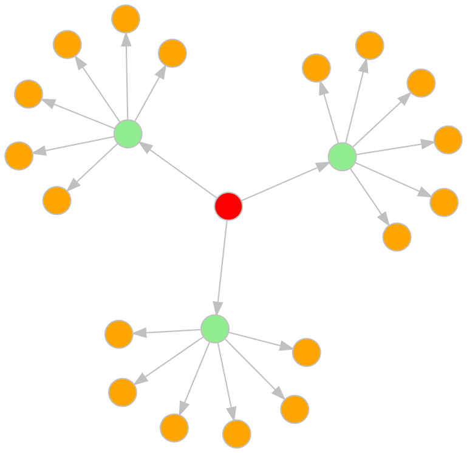
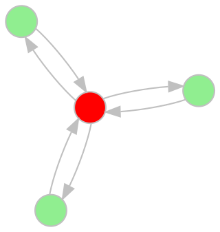
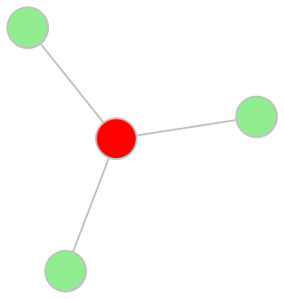
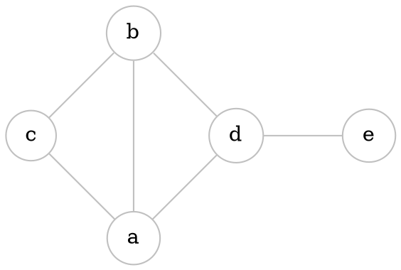
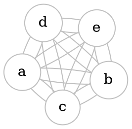
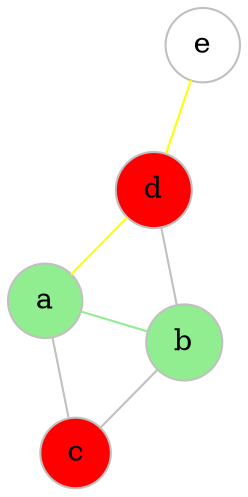

> Multi-graph is a collection of points
> and line segments that connect these points

# Directed graphs



$$
V = \{V_{1}, V_{2}, V_{3}, ... V_{n}\} - vertices \\
$$

$$
L = (L_{1}, L_{2}, L_{3}, ... L_{n}) - lines
$$

> Two lines are **parallel**, if their initial and final vertices coincide

> Line, whose initial and final vertices coincide, is called a **loop**

> A multi-graph that contains no parallel lines is called **directed graph** or **digraph**. 

> **Digraph** without loops is a **simple digraph**.


# Undirected graph

`````col
````col-md
flexGrow=1
===



````
````col-md
flexGrow=1
===



````
`````

> If the graph is symmetric we can replace any pair of arcs 
> $(V_{i}, V_{j},)$ and $(V_{j}, V_{i},)$ with a pair $\{V_{i}, V_{j}\}$ and call it **edge**


# Defining a graph

$$
V = \{a, b, c, d, e\}
$$
$$
E = \{\{a, b\}, \{a, c\}, \{a, d\}, \{b, c\}, \{b, d\}, \{d, e\}\},
$$
$$
G = (V, E)
$$
OR
$$
G = (\{a, b, c, d, e\}, \{\{a, b\}, \{a, c\}, \{a, d\}, \{b, c\}, \{b, d\}, \{d, e\}\})
$$




# Graph properties and stuff

## Graph order

Order of graph $G = (V, E)$ is $|V| = n$ (number of vertices)


## Special graphs

$G = (V, \emptyset)$ - **empty**
$G = (\emptyset, \emptyset)$ - **null**
$G = (\{V\}, \emptyset)$ - **trivials**

If a graph G has $$
\begin{flalign}
\frac{n(n-1)}{n} &&
\end{flalign}$$edges is is **complete** ($K_{n}$)




## Vertices and edges

### Properties

1. $A$ and $B$ are **adjacent**, C and D are not. See [[#Adjacency matrix]]
2. $A$ and $B$ are **incident** to edge $\{a, b\}$. See [[#Incidence matrix]]
3. Edges $\{a,d\}$ and $\{e,d\}$ are **adjacent**



### Adjacency matrix

> Similar to relation matrix

> [!note] 
> Simple undirected graph is a *symmetric* *anti-reflexive* relation, so it’s matrix will be *symmetric* and with *zero main diagonal*.

$$
\begin{array}{c c c c c} & 
\begin{array}{c c c c c} a & b & c & d & e \\ \end{array} \\
\begin{array}{c c c c c} a\\b\\c\\d\\e \end{array} &

\begin{pmatrix}
- & 1 & 1 & 1 & -\\
1 & - & 1 & 1 & - \\
1 & 1 & - & - & - \\
1 & 1 & - & - & 1 \\
- & - & - & 1 & -
\end{pmatrix}

\end{array}
$$


### Incidence matrix

> Rows are **vertices**. 
> Columns are **edges**.

> [!note] 
> This matrix may not be square, each **column** has exactly **two units** corresponding to an edge

$$
\begin{array}{c c c c c} & 
\begin{array}{c c c c c} ab & ac & ad & bc & bd & de\\ \end{array} \\
\begin{array}{c c c c c} a\\b\\c\\d\\e \end{array} &

\begin{pmatrix}
1 & 1 & 1 && - & - & - \\
1 & - & - && 1 & 1 & - \\
- & 1 & - && 1 & - & - \\
- & - & 1 && - & 1 & 1 \\
- & - & - && - & - & 1
\end{pmatrix}

\end{array}
$$


### Neighborhood of vertices

> $\Gamma(vertex)=${set of adjacent vertices}

In out [[#Properties|graph]]:
- $\Gamma(A)=${b, c, d}
- $\Gamma(B)=${a, c, d}
- $\Gamma(C)=${a, b}
- $\Gamma(D)=${a, b, e}
- $\Gamma(E)=${d}


### Order (degree) of vertices

Order/degree of vertex $p(V)= | \Gamma(V) |$ 

> For example: $p(A) = 3$ 

> [!note] 
> Vertex of directed graph has both **indegree** and **outdegree**

Also see [[#Graph order]]


### Number of graph edges

In out [[#Properties|graph]]:
- $\Gamma(A)=$ 3
- $\Gamma(B)=$ 3
- $\Gamma(C)=$ 2
- $\Gamma(D)=$ 3
- $\Gamma(E)=$ 1

Number of edges: 
1. $$\frac{p(A)+p(B)+p(C)+p(D)+p(E)}{2}=\frac{3+3+2+3+1}{2}=\frac{12}{6}=6$$
2. We can take [[#Adjacency matrix]] or [[#Incidence matrix]] and sum all elements, we will get the same result


Next: [[Graphs - operations]]
