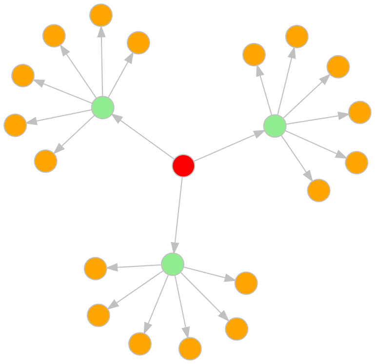
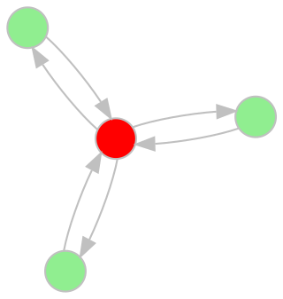
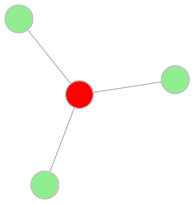
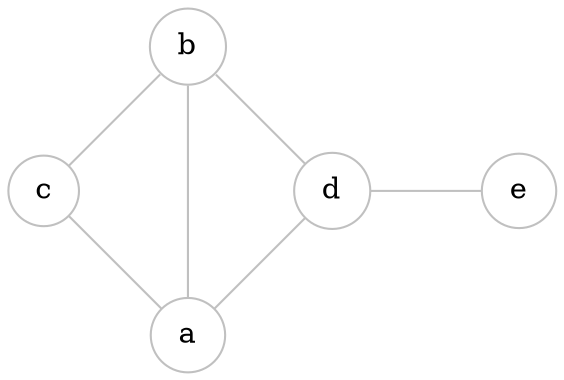

> Multi-graph is a collection of points
> and line segments that connect these points

# Directed graphs



$$
V = \{V_{1}, V_{2}, V_{3}, ... V_{n}\} - vertices \\
$$

$$
L = (L_{1}, L_{2}, L_{3}, ... L_{n}) - lines
$$

> Two lines are **parallel**, if their initial and final vertices coincide

> Line, whose initial and final vertices coincide, is called a **loop**

> A multi-graph that contains no parallel lines is called **directed graph** or **digraph**. 

> **Digraph** without loops is a **simple digraph**.

# Undirected graph


```start-multi-column
ID: Graphs
Number of Columns: 2
Largest Column: standard
```



--- column-end ---



=== end-multi-column

> If the graph is symmetric we can replace any pair of arcs 

$$
(V_{i}, V_{j},) \ and \ (V_{j}, V_{i},) \ with \ a \ pair \ \{V_{i}, V_{j}\} \ and \ call \ it \ EDGE
$$


# Defining a graph

$$
V = \{a, b, c, d, e\}
$$
$$
E = \{\{a, b\}, \{a, c\}, \{a, d\}, \{b, c\}, \{b, d\}, \{d, e\}\},
$$
$$
G = (V, E)
$$
OR
$$
G = (\{a, b, c, d, e\}, \{\{a, b\}, \{a, c\}, \{a, d\}, \{b, c\}, \{b, d\}, \{d, e\}\})
$$



