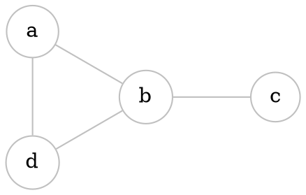
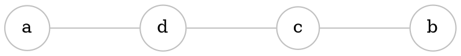
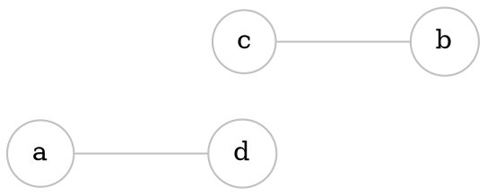

# Intersection

If $G_{1}=(V_{1}, E_{1})$, and $G_{2}=(V_{2}, E_{2})$, then $G_{1} \cap G_{2}=(V_{1} \cap V_{2}, E_{1} \cap E_{2})$ 

> (Intersection of vertices and edges)

`````col

````col-md
## $G_{1}$
---

````

````col-md
## $G_{2}$
---

````

````col-md
## $G_{1} \cap G_{2}$
---

````

`````


# Union


