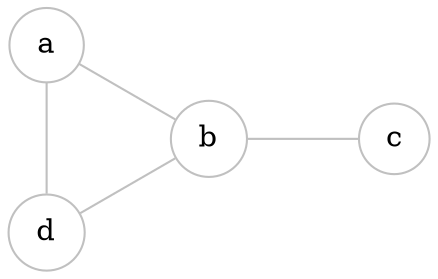
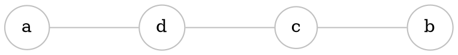
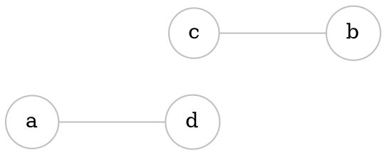

# Intersection

If $G_{1}=(V_{1}, E_{1})$, and $G_{2}=(V_{2}, E_{2})$, then $G_{1} \cap G_{2}=(V_{1} \cap V_{2}, E_{1} \cap E_{2})$ 

> (Intersection of vertices and edges)


```start-multi-column
ID: intersection
Number of Columns: 3
largest column: center
Largest Column: standard
```



--- column-end ---



--- column-end ---



=== end-multi-column ===

# Union


