Previous: [[Graphs - operations]]

# Subgraph ($G' \subset G$)

> Graph $G' = (V', E')$ is a *subgraph* of graph $G = (V, E)$ if $V' \subset V$, $E' \subset E$

`````col
````col-md
flexGrow=1
===
$G$

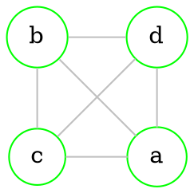

````
````col-md
flexGrow=1
===
$T \subset G$

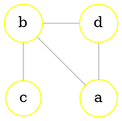

````
`````

--- 
<br>

# Special vertices

`````col
````col-md
flexGrow=1
===
## Isolated

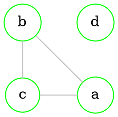

> In this case [[Graphs - basics#Directed graphs|vertex]] **d** is **isolated**

````
````col-md
flexGrow=1
===
## Rising

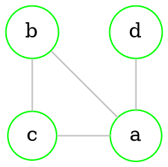
> In this case [[Graphs - basics#Directed graphs|vertex]] **d** is **rising** (it's [[Graphs - basics#Order (degree) of vertices|order]] is 1 | $p(v)=1$)

````
`````

--- 
<br>

# Homogeneous graph

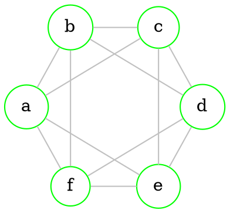

> Graph is **homogeneous**, if all [[Graphs - basics#Directed graphs|vertices]] have the same [[Graphs - basics#Order (degree) of vertices|degree]] 

--- 
<br>

# Connected graph

> Graph is called **connected**, if any two [[Graphs - basics#Directed graphs|vertices]] can be connected by a [[#Path|path]]

`````col
````col-md
flexGrow=1
===
### Connected

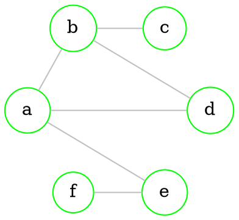

````
````col-md
flexGrow=1
===
### Not connected

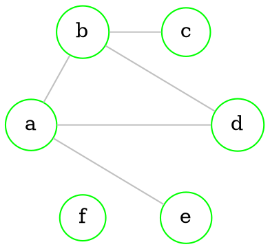

````
`````

> [!note]
> *Connected* means that we can start *journey* from any [[Graphs - basics#Directed graphs|vertex]] and access any vertex we want

## Connected components

> Maximal [[#Connected graph|connected]] [[#Subgraph ($G' subset G$)|subgraph]] is called a **connected component**. 
> Second [[#Connected graph|graph]] has *2* **connected components**

> [!note]
> 1. Any graph of [[Graphs - basics#Graph order|order]] *n* has no more than *n* connected components
> 2. If graph of [[Graphs - basics#Graph order|order]] *n* has *n* connected components, then all [[Graphs - basics#Directed graphs|vertices]] are [[#Special vertices|isolated]]
> 3. A [[#Connected graph|connected graph]] of second [[Graphs - basics#Graph order|order]] has one [[Graphs - basics#Undirected graph|edge]] 
> 4. A [[#Connected graph|connected graph]] of third [[Graphs - basics#Graph order|order]] has 2 or 3 [[Graphs - basics#Undirected graph|edges]] 

--- 
<br>

# Walk

> *Walk* is any finite sequence of graph [[Graphs - basics#Directed graphs|vertices]] and [[Graphs - basics#Undirected graph|edges]] 


Can be written in 2 ways:
1. *e*, {e, a}, *a*, {a, d}, *d*, {b, d}, *b*, {a, b}, *a*
2. *e*, *a*, *d*, *b*, *a*

> [!note]
> If you are going for a walk, you can visit same street ([[Graphs - basics#Undirected graph|edges]]) several times

## Open / closed walk

> [[#Walk]] is **open** if first and last [[Graphs - basics#Directed graphs|vertices]] are different
> If walk starts and ends in the same vertex, it called **closed**

> [!info] 
> First and last vertices are called **terminal** vertices

## Circuit

> If all [[Graphs - basics#Undirected graph|edges]] of [[#Walk|walk]] are distinct, it called a **circuit**

## Path

> [[#Open / closed walk|Open]] [[#Circuit|circuit]] is called a **path** 

### Length of the path

> **Length of the [[#Path|path]] ** is amount of it's [[Graphs - basics#Undirected graph|edges]] 

## Cycle

> [[#Open / closed walk|Closed]] [[#Circuit|circuit]] is called a **cycle** 

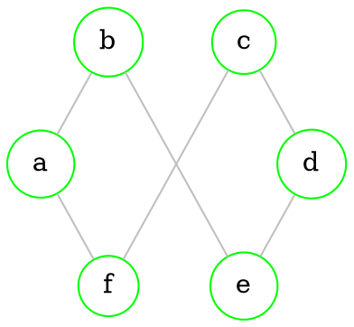

> [[#Connected graph]] is a [[#Cycle|cycle]], if all vertices have [[Graphs - basics#Order (degree) of vertices|degree]] 2 | $p(v_{i})=2$

### Independent cycles

`````col
````col-md
flexGrow=1
===

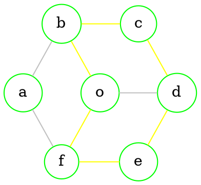

````
````col-md
flexGrow=1
===

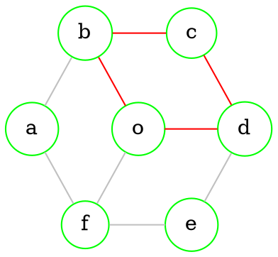

````
````col-md
flexGrow=1
===

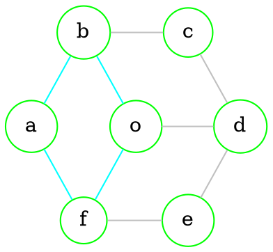

````
`````

#### How to determine which cycles are independent

> Which [[#Cycle|cycles]] of a [[Graphs - basics#Complete graph|complete graph]] $K_{5}$ are **independent**?
> 
> $C_{1}=\{v_{5}, v_{2}, v_{3}, v_{4}, v_{2}, v_{1}, v_{4}, v_{5}\}$
> $C_{2}=\{v_{5}, v_{2}, v_{1}, v_{4}, v_{5}\}$
> $C_{3}=\{v_{2}, v_{3}, v_{4}, v_{2}\}$
> $C_{4}=\{v_{5}, v_{1}, v_{3}, v_{4}, v_{5}\}$
> $C_{5}=\{v_{1}, v_{4}, v_{3}, v_{1}\}$

1. Let's enumerate the edges: 
	- $\{v_{1}, v_{2}\} - 1$
	- $\{v_{1}, v_{3}\} - 2$
	- $\{v_{1}, v_{4}\} - 3$
	- $\{v_{1}, v_{5}\} - 4$
	- $\{v_{2}, v_{3}\} - 5$
	- $\{v_{2}, v_{4}\} - 6$
	- $\{v_{2}, v_{5}\} - 7$
	- $\{v_{3}, v_{4}\} - 8$
	- $\{v_{3}, v_{5}\} - 9$
	- $\{v_{4}, v_{5}\} - 10$

2. Make vectors for every cycle and fill the table
	- [[Graphs - basics#Undirected graph|Edge]] $\{v_{1}, v_{2}\}$ is present in $C_{1}$ and $C_{2}$ but in *reverse order*, we write *-1* in the table for those [[#Cycle|cycles]]
	- [[Graphs - basics#Undirected graph|Edge]] $\{v_{1}, v_{2}\}$ is *not present* in any other [[#Cycle|cycles]], we write *0* in the table for those [[#Cycle|cycles]]
	- [[Graphs - basics#Undirected graph|Edge]] $\{v_{1}, v_{3}\}$ is present in $C_{4}$ in the *same order*, we write *1* in the table for this [[#Cycle|cycle]]

|         |  1  |  2  |  3  |  4  |  5  |  6  |  7  |  8  |  9  | 10  |
| ------- |:---:|:---:|:---:|:---:|:---:|:---:|:---:|:---:|:---:|:---:|
| $C_{1}$ | -1  |  0  |  1  |  0  |  1  | -1  | -1  |  1  |  0  |  1  |
| $C_{2}$ | -1  |  0  |  1  |  0  |  0  |  0  | -1  |  0  |  0  |  1  |
| $C_{3}$ |  0  |  0  |  0  |  0  |  1  | -1  |  0  |  1  |  0  |  0  |
| $C_{4}$ |  0  |  1  |  0  | -1  |  0  |  0  |  0  |  1  |  0  |  1  |
| $C_{5}$ |  0  | -1  |  1  |  0  |  0  |  0  |  0  | -1  |  0  |  0  |

3. Now we find the *rank* of the matrix
> After simplification we get *4* **independent** cycles

|         |  1  |  2  |  3  |  4  |
| ------- |:---:|:---:|:---:|:---:|
| $C_{2}$ |  1  |  0  |  0  |  0  |
| $C_{5}$ |  0  |  1  |  0  |  0  |
| $C_{4}$ |  0  |  0  |  1  |  0  |
| $C_{1}$ |  0  |  0  |  0  |  1  |

#### Cycles base

> Let's take this case for example

|         |  1  |  2  |  4  |
| ------- |:---:|:---:|:---:|
| $C_{1}$ |  1  |  0  | -1  |
| $C_{2}$ |  1  | -1  |  0  |
| $C_{3}$ | -1  |  1  |  0  |

> To find the **base** we need to find minors with *determinant* not equal to *0*

> We will discard one row and try to make *nonzero determinant* from remaining ones.

````col
```col-md
flexGrow=1
===

##### Remove $C_{1}$

|         |  1  |  2  |  4  |
| ------- |:---:|:---:|:---:|
| $C_{2}$ |  1  | -1  |  0  |
| $C_{3}$ | -1  |  1  |  0  |

> Column 3 is all zeros, we can't use it
> Remaining columns make *zero determinant*. So these vectors are *dependent*.

```
```col-md
flexGrow=1
===

##### Remove $C_{2}$

|         |  1  |  2  |  4  |
| ------- |:---:|:---:|:---:|
| $C_{1}$ |  1  |  0  | -1  |
| $C_{3}$ | -1  |  1  |  0  |

> Column 1 and 2 make a *nonzero* determinant.
> Base is $\{C_{1}, C_{3}\}$

```
```col-md
flexGrow=1
===

##### Remove $C_{3}$

|         |  1  |  2  |  4  |
| ------- |:---:|:---:|:---:|
| $C_{1}$ |  1  |  0  | -1  |
| $C_{2}$ |  1  | -1  |  0  |

> Column 1 and 2 make a *nonzero* determinant.
> Base is $\{C_{1}, C_{2}\}$

```
````

> In this case **base** is $\{C_{1}, C_{3}\}$ or $\{C_{1}, C_{2}\}$

--- 
<br>

# Separability of graphs

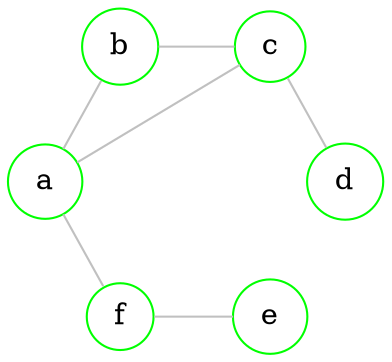

## Articulations

> [[Graphs - basics#Directed graphs|Vertex]] $v \in V$ of graph $G=(V, E)$ is called **articulation**, if graph $G-v$ has more [[#Connected components|connected components]] than graph $G$

> If graph has an **articulation** it is **separable**

> [[Graphs - basics#Directed graphs|Vertices]] *f*, *a*, *c* are **articulations** in [[#Separability of graphs|our graph]]

`````col
````col-md
flexGrow=1
===
### $G-c$

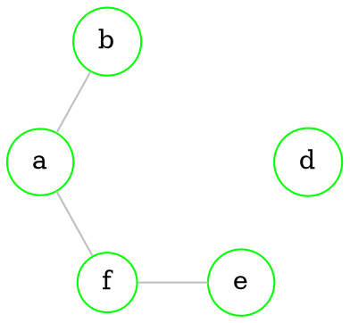

````
````col-md
flexGrow=0.8
===
### $G-a$

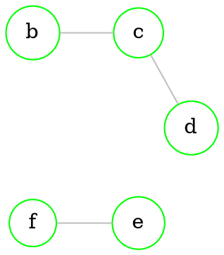

````
````col-md
flexGrow=1
===
### $G-f$

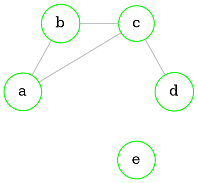

````
`````

## Blocks

> **Block** - maximal [[#Subgraph ($G' subset G$)|subgraph]] without [[#Articulations|articulations]] 

> [[#Separability of graphs|Our graph]] has *4* **blocks**
`````col

````col-md
flexGrow=1
===

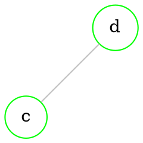

````
````col-md
flexGrow=1
===


````
````col-md
flexGrow=1
===

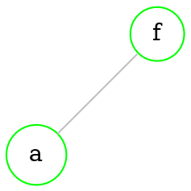

````
````col-md
flexGrow=1
===

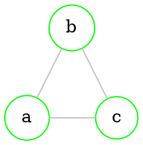

````
`````

## Bridges

> [[Graphs - basics#Undirected graph|Edge]] $e \in E$ of graph $G=(V, E)$ is called **articulation**, if graph $G-e$ has more [[#Connected components|connected components]] than graph $G$ 

> [[Graphs - basics#Undirected graph|Edges]] $\{c, d\}$, $\{e, f\}$ and $\{a, f\}$ are **bridges** in [[#Separability of graphs|our graph]] 

`````col
````col-md
flexGrow=1
===
### $G-\{c,d\}$

```dot 
graph neato { 

bgcolor="transparent" 

graph [layout = neato] 

node [shape = circle, 
      style = filled, 
      width=0.3, 
      height=0.3, 
      color=green, 
      fillcolor = white] 

a [pos="0,0!"] 
b [pos="0.5,0.9!"] 
c [pos="1.5,0.9!"] 
d [pos="2,0!"] 
e [pos="1.5,-0.9!"] 
f [pos="0.5,-0.9!"] 

edge [color = grey] 
c -- {a b}
b -- a
a -- f
f -- e
} 
```

````
````col-md
flexGrow=1
===
### $G-\{e,f\}$

```dot 
graph neato { 

bgcolor="transparent" 

graph [layout = neato] 

node [shape = circle, 
      style = filled, 
      width=0.3, 
      height=0.3, 
      color=green, 
      fillcolor = white] 

a [pos="0,0!"] 
b [pos="0.5,0.9!"] 
c [pos="1.5,0.9!"] 
d [pos="2,0!"] 
e [pos="1.5,-0.9!"] 
f [pos="0.5,-0.9!"] 

edge [color = grey] 
d -- c
c -- {a b}
b -- a
a -- f
} 
```

````
````col-md
flexGrow=1
===
### $G-\{a,f\}$

```dot 
graph neato { 

bgcolor="transparent" 

graph [layout = neato] 

node [shape = circle, 
      style = filled, 
      width=0.3, 
      height=0.3, 
      color=green, 
      fillcolor = white] 

a [pos="0,0!"] 
b [pos="0.5,0.9!"] 
c [pos="1.5,0.9!"] 
d [pos="2,0!"] 
e [pos="1.5,-0.9!"] 
f [pos="0.5,-0.9!"] 

edge [color = grey] 
d -- c
c -- {a b}
b -- a
f -- e
} 
```

````
`````

## Separating sets

```dot 
graph neato { 

bgcolor="transparent" 

graph [layout = circo] 

node [shape = circle, 
      style = filled, 
      width=0.3, 
      height=0.3, 
      color=green, 
      fillcolor = white] 

edge [color = grey] 
a -- {c b}
c -- b
d -- {c b e}
f -- {i}
g -- {h}

edge [color = red]
d -- f
e -- f
g -- f

edge [color = yellow]
e -- g

} 
```

> Subset $S \subset E$ is a **separating** set of [[#Connected graph|connected graph]] $G=(V,E)$, if graph $G'=(V,E \textbackslash S)$ is a *disconnected* graph

> In this case $\{\{d,f\}, \{e,f\}, \{g,f\}, \{e,g\}\}$ is a **separating set**

### Cuts

> Any minimal [[#Separating sets|separating set]] is a **cut**

> [!note]
> Any [[#Bridges|bridge]] is a [[#Separating sets|separating set]] and a **cut**

> In this case $\{\{d,f\}, \{e,f\}, \{g,f\}\}$ is a **cut**


Next: [[Graphs - metrics]]