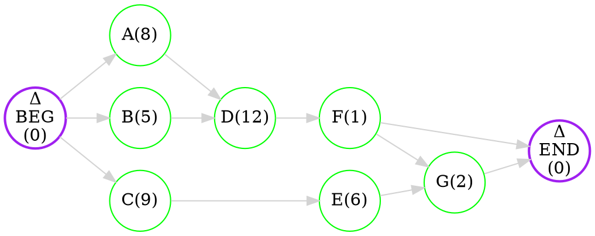

# Directed graph

> [!definition] 
> A graph, [[Graphs - basics#Vertices and edges|edges]] of which have *directions*
> See also: [[Graphs - basics#Directed graphs]]

# Applications

## Scheduling

> [!definition] 
> **Executors** - workers performing a task ($V_{1}, V_{2}, V_{3}$)
> **Tasks** - separate jobs that *can't* be subdivided (Must be performed by *one* **Executor**)
> **Execution times** - a number assigned to each task. (how much time does the task take to execute)
> **Consistency relationships** - are constraints on the order in which tasks are performed. 
> 
> > [!note] 
> > Task *X* precedes Task *Y*, and this means that Task *Y* cannot be started until Task *X* is completed

The main stages of the problem are conveniently described by a [[#Directed graph|directed graph]]:
- Graph [[Graphs - basics#Vertices and edges|vertices]] – tasks
- Arcs (directed [[Graphs - basics#Vertices and edges|edges]]) - Relationships of Consistency.

> Directed graphs describe *relationships* between objects, but these relationships are not necessarily reciprocal

When object is *associated* with another object, this is indicated by an *arrow* pointing from point to point

```dot 
---
preset:math-graph
---
digraph neato { 

bgcolor="transparent" 
rankdir = "LR"
graph [layout = dot] 

node [shape = circle, 
      style = filled, 
      width=0.7, 
      height=0.7, 
      fixedsize=true
      color=green, 
      fillcolor = white] 

A [label="A(6)"]
B [label="B(5)"]
C [label="C(7)"]
D [label="D(2)"]
E [label="E(5)"]

node [penwidth=2, color=purple]
BEGIN [label="Δ\nBEG\n(0)"]
END [label="Δ\nEND\n(0)"]

edge [color = lightgrey] 
 
BEGIN -> A
BEGIN -> B
BEGIN -> C
A -> D
B -> D
C -> E

D -> END
E -> END

} 
```

A [[#Directed graph|directed graph]] has *5* tasks and *2* fictive (BEGIN and END) with *0* **execution time**

> The notion *A(6)* means that the execution of task *A* takes *6* units of time
> *A* is executed before *D* (shown by arrow)

### Priority lists

> [!definition] 
> Rules according to which we assign tasks to *executors* based on a *list of priorities* are:
> - **All executors are busy**
> 	- Wait
> - **One executor is free** -
> 	- Review the list of priorities from the beginning, looking for the first *prepared* task, and assign it to that executor. 

#### Random

> [!note] 
> There are $5!=120$ different schedules
> - ! But not every can be fulfilled

- A B C D E 
	- **17** time units

```asciidoc
[cols=18*]
|===

^| ^|1 ^|2 ^|3 ^|4 ^|5 ^|6 ^|7 ^|8 ^|9 ^|10 ^|11 ^|12 ^|13 ^|14 ^|15 ^|16 ^|17

| V1
6+^| [yellow-cell]#A#
2+^| [green-cell]#D#
9+^| -

| V2
5+^| [orange-cell]#B#
7+^| [cyan-cell]#C#
5+^| [blue-cell]#E#

|===
```

- A B D C E
	- **18** time units

```asciidoc
[cols=19*]
|===

^| ^|1 ^|2 ^|3 ^|4 ^|5 ^|6 ^|7 ^|8 ^|9 ^|10 ^|11 ^|12 ^|13 ^|14 ^|15 ^|16 ^|17 ^|18

| V1
6+^| [yellow-cell]#A#
2+^| [green-cell]#D#
5+^| -
5+^| [blue-cell]#E#

| V2
5+^| [orange-cell]#B#
  ^| -
7+^| [cyan-cell]#C#
5+^| -

|===
```

- C E B A D
	- **20** time units

```asciidoc
[cols=21*]
|===

^| ^|1 ^|2 ^|3 ^|4 ^|5 ^|6 ^|7 ^|8 ^|9 ^|10 ^|11 ^|12 ^|13 ^|14 ^|15 ^|16 ^|17 ^|18 ^|19 ^|20

| V1
7+^| [cyan-cell]#C#
5+^| [blue-cell]#E#
6+^| [yellow-cell]#A#
2+^| [green-cell]#D#


| V2
7+^| 
5+^| [orange-cell]#B#
8+^| -

|===
```

#### Descending time algorithm

> Longer jobs should be done earlier than short-term ones.

> [!note] 
> If several tasks are *prepared*, take one with the biggest [[#Scheduling|execution time]]

- C A B E D

```asciidoc
[cols=14*]
|===

^| ^|1 ^|2 ^|3 ^|4 ^|5 ^|6 ^|7 ^|8 ^|9 ^|10 ^|11 ^|12 ^|13

| V1
7+^| [cyan-cell]#C#
5+^| [blue-cell]#E#
  ^| -


| V2
6+^| [yellow-cell]#A#
5+^| [orange-cell]#B#
2+^| [green-cell]#D#

|===
```

#### Critical path algorithm

- The sums of the [[#Scheduling|execution times]] of all roads running from vertex **X** to vertex **END** must be calculated
- The path with the *biggest sum* is called the *critical path* of vertex **X**
- The sum of the [[#Scheduling|execution times]] of *all tasks* on the *critical path* is called the **project critical time**
- We can use **countercurrent algorithm** to find the *critical path length* of any *vertex* in the project graph
	- The main idea is to start from the vertex **END** and travel back to the vertex **START**

> [!note] 
> If several tasks are *prepared*, take one with the biggest *critical path length*



- A B C D E F G

```asciidoc
[cols=23*]
|===

^| ^|1 ^|2 ^|3 ^|4 ^|5 ^|6 ^|7 ^|8 ^|9 ^|10 ^|11 ^|12 ^|13 ^|14 ^|15 ^|16 ^|17 ^|18 ^|19 ^|20 ^|21 ^|22

| V1
 8+^| [yellow-cell]#A#
12+^| [green-cell]#D#
   ^| [purple-cell]#F#
   ^| -
 
| V2

5+^| [orange-cell]#B#
9+^| [cyan-cell]#C#
6+^| [blue-cell]#E#
2+^| [red-cell]#G#

|===
```

##### Countercurrent algorithm

> [!note] 
> The **length** of the *critical* path is **23**
> It is *not possible* to create a schedule *shorter than 23* time units

```dot 
---
preset:math-graph
---
digraph neato { 

bgcolor="transparent" 
rankdir = "LR"
graph [layout = dot] 

node [shape = circle, 
      style = filled, 
      width=0.7, 
      height=0.7, 
      fixedsize=true
      color=green, 
      fillcolor = white] 

A [label=<A(8)<br/><font color="red">[23]</font>>]
B [label=<B(5)<br/><font color="red">[20]</font>>]
C [label=<C(9)<br/><font color="red">[17]</font>>]
D [label=<D(12)<br/><font color="red">[15]</font>>]
E [label=<E(6)<br/><font color="red">[8]</font>>]
F [label=<F(1)<br/><font color="red">[3]</font>>]
G [label=<G(2)<br/><font color="red">[2]</font>>]

node [penwidth=2, color=purple]
BEGIN [label=<Δ<br/>BEG<br/>(0)<font color="red">[23]</font>>, width=0.9, height=0.9]
END [label=<Δ<br/>END<br/>(0)<font color="red">[0]</font>>, width=0.9, height=0.9]

edge [color = lightgrey] 
 
BEGIN -> A [color=pink]
BEGIN -> B
BEGIN -> C
A -> D [color=pink]
B -> D
D -> F [color=pink]
F -> G [color=pink]
F -> END
C -> E
E -> G
G -> END [color=pink]

} 
```

### Timing

- Suppose we know the **optimal** schedule *time* $T_{opt}$
- Then the *timing* of *any other schedule* will satisfy this inequality
	- $$T\leq ( 2-\frac{1}{N} ) * T_{opt}$$
- **N** - number of *executors*

> [!example] 
> Let **N** = 2, then $$T\leq \frac{3}{2}*T_{opt}$$
> 
> - Suppose we have *2* schedules with times $T_{1}=18$ and $T_{2}=12$
> - $T_{2}<T_{1}$, we can assume that $T_{2}=T_{opt}$, substitute to formula:
> 
> $$T\leq \frac{3}{2} * 12 = 18$$
> 
> We see that $T_{2}=T_{opt}$, and $T_{1}=18$ - *longest* possible schedule

> [!example] 
> Let **N** = 3, and
> 
> $$T\leq \frac{7}{4}*T_{opt}$$
> 
> - Suppose we have a schedule with a *runtime* of $T_{1}=49$
> - Can another timetable be drawn up with a *runtime* of $T_{2}=25$?
> 
> $T_{2}<T_{1}$, then $T_{1} \neq T_{opt}$. Let's substitute
> 
> $$49 \leq \frac{7}{4} * T_{opt}\ \ \ \ \ \ 28 \leq T_{opt}$$
> 
> We see that $T_{2}<T_{opt}$ and it is **impossible**

### Paradoxes

- Paradox of an *additional executor*:
	- It's not always a good idea to add another executor, *the job may take longer*
- Paradox of *faster execution*:
	- It's not always a good idea to reduce task execution time (preparation, etc.), total execution time may increase

### Journey through the matrix

> - Suppose we have a rectangular table with *non-negative* numbers in each cell
> - We travel from the *top left* box to the *bottom right* cell
> - From *all these routes*, we have to choose the one with the *least sum* of *painted cells*

`````col 
````col-md 
flexGrow=1
===

```asciidoc
[cols=6*]
|===

^| 5  ^| 8 ^| 13 ^| 6  ^| 17 ^| 31
^| 28 ^| 4 ^| 12 ^| 3  ^| 9  ^| 11
^| 3  ^| 2 ^| 42 ^| 16 ^| 8  ^| 6
^| 15 ^| 1 ^| 7  ^| 11 ^| 14 ^| 26

|===
```

```` 
````col-md 
flexGrow=1
===

```asciidoc
[cols=6*]
|===

^| [d-yellow-cell]#5#  ^| 8 ^| 13 ^| 6  ^| 17 ^| 31
^| [d-yellow-cell]#28# ^| [d-yellow-cell]#4# ^| [d-yellow-cell]#12# ^| [d-yellow-cell]#3#  ^| 9  ^| 11
^| 3  ^| 2 ^| 42 ^| [d-yellow-cell]#16# ^| [d-yellow-cell]#8#  ^| 6
^| 15 ^| 1 ^| 7  ^| 11 ^| [d-yellow-cell]#14# ^| [d-yellow-cell]#26#

|===
```

```` 
````col-md 
flexGrow=1
===

```asciidoc
[cols=6*]
|===

^| [d-green-cell]#5#  ^| [d-green-cell]#8# ^| [d-green-cell]#13# ^| [d-green-cell]#6#  ^| [d-green-cell]#17# ^| 31
^| 28 ^| 4 ^| 12 ^| 3  ^| [d-green-cell]#9#  ^| 11
^| 3  ^| 2 ^| 42 ^| 16 ^| [d-green-cell]#8#  ^| [d-green-cell]#6#
^| 15 ^| 1 ^| 7  ^| 11 ^| 14 ^| [d-green-cell]#26#

|===
```

```` 
`````

- We will apply an algorithm similar to the [[#Countercurrent algorithm|countercurrent algorithm]], only we will look for the *minimum* instead of the *maximum*. 

`````col 
````col-md 
flexGrow=1
===

If we are at the *target cell*, the weitgh *doesn't change*

```asciidoc
[cols=6*]
|===

^|   ^|   ^|   ^|   ^|   ^| -
^|   ^|   ^|   ^|   ^|   ^| -
^|   ^|   ^|   ^|   ^|   ^| -
^| - ^| - ^| - ^| - ^| - ^| [d-blue-cell]#26#

|===
```

```` 
````col-md 
flexGrow=1
===

Going from *left adjacent* cell, we add it's value: *14 + 26 = 40*

```asciidoc
[cols=6*]
|===

^|   ^|   ^|   ^|   ^|   ^| -
^|   ^|   ^|   ^|   ^|   ^| -
^|   ^|   ^|   ^|   ^|   ^| -
^| - ^| - ^| - ^| - ^| [d-blue-cell]#40# ^| [d-cyan-cell]#26#

|===
```

```` 
````col-md 
flexGrow=1
===

Going from 2nd *left adjacent* cell, we add it's value: *40 + 11 = 51*

```asciidoc
[cols=6*]
|===

^|   ^|   ^|   ^|   ^|   ^| -
^|   ^|   ^|   ^|   ^|   ^| -
^|   ^|   ^|   ^|   ^|   ^| -
^| - ^| - ^| - ^| [d-blue-cell]#51# ^| [d-cyan-cell]#40# ^| [d-green-cell]#26#

|===
```

```` 
`````

`````col 
````col-md 
flexGrow=1
===

Same for the vertical part, fill in all the rest cells

```asciidoc
[cols=6*]
|===

^|   ^|   ^|   ^|   ^|   ^| [d-green-cell]#74#
^|   ^|   ^|   ^|   ^|   ^| [d-green-cell]#43#
^|   ^|   ^|   ^|   ^|   ^| [d-green-cell]#32#
^| [d-green-cell]#74# ^| [d-green-cell]#59# ^| [d-green-cell]#58# ^| [d-green-cell]#51# ^| [d-green-cell]#40# ^| [d-green-cell]#26#

|===
```

```` 
````col-md 
flexGrow=1
===

For central cells we have *2* options, choose minimum

```asciidoc
[cols=6*]
|===

^|   ^|   ^|   ^|   ^|   ^| [d-green-cell]#74#
^|   ^|   ^|   ^|   ^|   ^| [d-green-cell]#43#
^|   ^|   ^|   ^|   ^| [d-blue-cell]#40# ^| [d-cyan-cell]#32#
^| [d-green-cell]#74# ^| [d-green-cell]#59# ^| [d-green-cell]#58# ^| [d-green-cell]#51# ^| [d-cyan-cell]#40# ^| [d-green-cell]#26#

|===
```

> **8 + 32 = 40** <- We chose this one
> 8 + 40 = 48

```` 
````col-md 
flexGrow=1
===

Same fof all other cells, fill them out

```asciidoc
[cols=6*]
|===
^| 78 ^| 73 ^| 71 ^| 58 ^| 66 ^| 74
^| 92 ^| 65 ^| 64 ^| 52 ^| 49 ^| 43
^| 64 ^| 61 ^| 98 ^| 56 ^| 40 ^| 32
^| 74 ^| 59 ^| 58 ^| 51 ^| 40 ^| 26
|===
```

```` 
`````

`````col 
````col-md 
flexGrow=1
===

> We now have 2 matrices, and we can choose the best path

```` 
````col-md 
flexGrow=1
===

```asciidoc
[cols=6*]
|===

^| [d-blue-cell]#5#  ^| [d-blue-cell]#8# ^| 13 ^| 6  ^| 17 ^| 31
^| 28 ^| [d-blue-cell]#4# ^| 12 ^| 3  ^| 9  ^| 11
^| 3  ^| [d-blue-cell]#2# ^| 42 ^| 16 ^| 8  ^| 6
^| 15 ^| [d-blue-cell]#1# ^| [d-blue-cell]#7#  ^| [d-blue-cell]#11# ^| [d-blue-cell]#14# ^| [d-blue-cell]#26#

|===
```

```` 
````col-md 
flexGrow=1
===

```asciidoc
[cols=6*]
|===
^| [d-blue-cell]#78# ^| [d-blue-cell]#73# ^| 71 ^| 58 ^| 66 ^| 74
^| 92 ^| [d-blue-cell]#65# ^| 64 ^| 52 ^| 49 ^| 43
^| 64 ^| [d-blue-cell]#61# ^| 98 ^| 56 ^| 40 ^| 32
^| 74 ^| [d-blue-cell]#59# ^| [d-blue-cell]#58# ^| [d-blue-cell]#51# ^| [d-blue-cell]#40# ^| [d-blue-cell]#26#
|===
```

```` 
`````

--- 
<br>

# Go to other topics
``` dataview
list from "uni/Discrete math"
```

