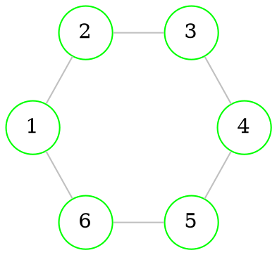

# Length of the path

> **Length of the [[Graphs - connectivity#Path|path]]** is amount of it's [[Graphs - basics#Undirected graph|edges]] 

## Distance between vertices

> Distance between 2 [[Graphs - basics#Directed graphs|vertices]] is the length of shortest [[Graphs - connectivity#Path|path]] connecting these vertices.

## Distance matrix

> This is how you make a **distance matrix**

`````col
````col-md
flexGrow=1
===



````
````col-md
flexGrow=1
===

|     | 1              | 2              | 3              | 4              | 5              | 6              |
| --- | -------------- | -------------- | -------------- | -------------- | -------------- | -------------- |
| 1   | X              | #h/green **1** | **2**          | #h/red **3**   | **2**          | #h/green **1** |
| 2   | #h/green **1** | X              | #h/green **1** | **2**          | #h/red **3**   | **2**          |
| 3   | **2**          | #h/green **1** | X              | #h/green **1** | **2**          | #h/red **3**   |
| 4   | #h/red **3**   | **2**          | #h/green **1** | X              | #h/green **1** | **2**          |
| 5   | **2**          | #h/red **3**   | **2**          | #h/green **1** | X              | #h/green **1** |
| 6   | #h/green **1** | **2**          | #h/red **3**   | **2**          | #h/green **1** | X              |

````
`````


1. Make an [[Graphs - basics#Adjacency matrix|adjacency matrix]] T

$$ 

\begin{array}{} & 

\begin{pmatrix}  
- & \color{lightgreen}1 & - & - & - & \color{lightgreen}1 \\ 
\color{lightgreen}1 & - & \color{lightgreen}1 & - & - & - \\ 
- & \color{lightgreen}1 & - & \color{lightgreen}1 & - & - \\ 
- & - & \color{lightgreen}1 & - & \color{lightgreen}1 & - \\ 
- & - & - & \color{lightgreen}1 & - & \color{lightgreen}1 \\ 
\color{lightgreen}1 & - & - & - & \color{lightgreen}1 & - \\     
\end{pmatrix} 

\end{array} 
$$

2. We move the units from the adjacency matrix to the distance matrix 
3. Simple graph is symmetric antireflective relation. We calculate $T*T$ (composition)

$$ 

\begin{array}{} & 

\begin{pmatrix}  
- & \color{lightgreen}1 & - & - & - & \color{lightgreen}1 \\ 
\color{lightgreen}1 & - & \color{lightgreen}1 & - & - & - \\ 
- & \color{lightgreen}1 & - & \color{lightgreen}1 & - & - \\ 
- & - & \color{lightgreen}1 & - & \color{lightgreen}1 & - \\ 
- & - & - & \color{lightgreen}1 & - & \color{lightgreen}1 \\ 
\color{lightgreen}1 & - & - & - & \color{lightgreen}1 & - \\     
\end{pmatrix} 
*
\begin{pmatrix}  
- & \color{lightgreen}1 & - & - & - & \color{lightgreen}1 \\ 
\color{lightgreen}1 & - & \color{lightgreen}1 & - & - & - \\ 
- & \color{lightgreen}1 & - & \color{lightgreen}1 & - & - \\ 
- & - & \color{lightgreen}1 & - & \color{lightgreen}1 & - \\ 
- & - & - & \color{lightgreen}1 & - & \color{lightgreen}1 \\ 
\color{lightgreen}1 & - & - & - & \color{lightgreen}1 & - \\     
\end{pmatrix} 
=
\begin{pmatrix}  
\color{orange}1 & - & \color{orange}1 & - & \color{orange}1 & - \\ 
- & \color{orange}1 & - & \color{orange}1 & - & \color{orange}1 \\ 
\color{orange}1 & - & \color{orange}1 & - & \color{orange}1 & - \\ 
- & \color{orange}1 & - & \color{orange}1 & - & \color{orange}1 \\ 
\color{orange}1 & - & \color{orange}1 & - & \color{orange}1 & - \\ 
- & \color{orange}1 & - & \color{orange}1 & - & \color{orange}1  
\end{pmatrix} 

\end{array} 
$$

4. All newly formed *non-zero elements* show that the distance between the vertices is not greater than *2*. We write *2* in **distance matrix**
5. We calculate $T*T*T$ 

$$ 

\begin{array}{} & 

\begin{pmatrix}  
- & \color{lightgreen}1 & - & - & - & \color{lightgreen}1 \\ 
\color{lightgreen}1 & - & \color{lightgreen}1 & - & - & - \\ 
- & \color{lightgreen}1 & - & \color{lightgreen}1 & - & - \\ 
- & - & \color{lightgreen}1 & - & \color{lightgreen}1 & - \\ 
- & - & - & \color{lightgreen}1 & - & \color{lightgreen}1 \\ 
\color{lightgreen}1 & - & - & - & \color{lightgreen}1 & - \\     
\end{pmatrix} 
*
\begin{pmatrix}  
\color{orange}1 & - & \color{orange}1 & - & \color{orange}1 & - \\ 
- & \color{orange}1 & - & \color{orange}1 & - & \color{orange}1 \\ 
\color{orange}1 & - & \color{orange}1 & - & \color{orange}1 & - \\ 
- & \color{orange}1 & - & \color{orange}1 & - & \color{orange}1 \\ 
\color{orange}1 & - & \color{orange}1 & - & \color{orange}1 & - \\ 
- & \color{orange}1 & - & \color{orange}1 & - & \color{orange}1  
\end{pmatrix} 
=
\begin{pmatrix}  
- & \color{red}1 & - & \color{red}1 & - & \color{red}1 \\ 
\color{red}1 & - & \color{red}1 & - & \color{red}1 & - \\ 
- & \color{red}1 & - & \color{red}1 & - & \color{red}1 \\ 
\color{red}1 & - & \color{red}1 & - & \color{red}1 & - \\ 
- & \color{red}1 & - & \color{red}1 & - & \color{red}1 \\ 
\color{red}1 & - & \color{red}1 & - & \color{red}1 & - \\     
\end{pmatrix} 

\end{array} 
$$

6. All newly formed *non-zero elements* show that the distance between the vertices is not greater than *3*. We write *3* in **distance matrix**

