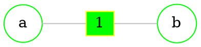
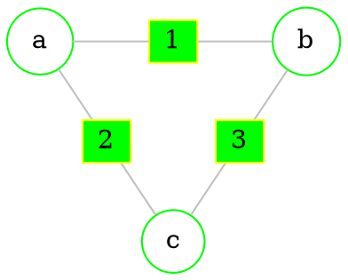
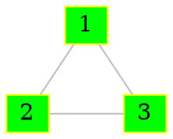
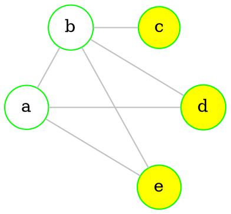
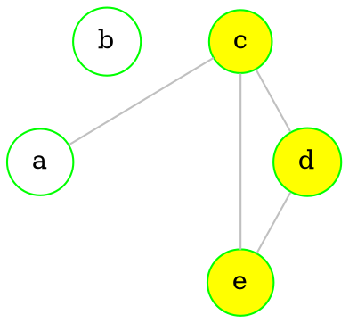

```dot 
graph neato { 

bgcolor="transparent" 

graph [layout = neato] 

node [shape = circle, 
      style = filled, 
      width=0.3, 
      height=0.3, 
      color=green, 
      fillcolor = white] 

a

edge [color = grey] 

} 
```

# Edge graph

> Graph's $G=(V,E)$ *edge graph* is graph $G_{b}=(V_{b},E_{b})$ if it has as many [[Graphs - basics#Directed graphs|vertices]] as $G$ has [[Graphs - basics#Undirected graph|edges]], and it's [[Graphs - basics#Directed graphs|vertices]] are [[Graphs - basics#Vertices and edges|adjacent]] if corresponding [[Graphs - basics#Undirected graph|edges]] of $G$ were [[Graphs - basics#Vertices and edges|adjacent]]

> [!info] 
> **Edge** graph has $$\frac{1}{2} \sum_{n=1}^{n} p^2 {(v_{i})}-m$$ edges
> Where **m** - amount of graph's $G$ edges
> And $p(v_{i})$ - [[Graphs - basics#Order (degree) of vertices|vertex degree]] 

`````col
````col-md
flexGrow=1
===
## Graph $G$



````
````col-md
flexGrow=1
===

## Graph $G_{b}$

$(\emptyset,\emptyset)$

````
`````

`````col
````col-md
flexGrow=1
===
## Graph $G$



````
````col-md
flexGrow=1
===

## Graph $G_{b}$


````
`````

`````col
````col-md
flexGrow=1
===
## Graph $G$



````
````col-md
flexGrow=1
===

## Graph $G_{b}$



````
`````

--- 
<br>

# Stable and dominant (sub)sets

## Stable set

> Graph's $G=(V,E)$ [[Graphs - basics#Directed graphs|vertex]] subset, $S \subset V$, is called a **stable set**, if any of it's *two* [[Graphs - basics#Directed graphs|vertices]] are not [[Graphs - basics#Vertices and edges|adjacent]]

> [!tldr] 
> Basically, such set has no [[Graphs - basics#Undirected graph|edges]]

> [!Example] 
> 
> $\{c,d\}$ is a stable set
> 
> ```dot 
>	graph neato { 
> bgcolor="transparent" 
> 
> graph [layout = neato] 
> 
> node [shape = circle, 
>       style = filled, 
>       width=0.3, 
>       height=0.3, 
>       color=green, 
>       fillcolor = white] 
> 
> a [pos="1,0!"] 
> b [pos="0,1!"] 
> 
> node [fillcolor = red]
> c [pos="0,0!"] 
> d [pos="1,1!"] 
> 
> edge [color = grey] 
>  
> a -- {b d} 
> c -- {b} 
> d -- {b} 
> 
> } 
> ```

### Stability number

> **Stability number** - size of biggest possible [[#Stable set|stable subset]]
> In out example it's *2*

> [!note]
> Stability number satisfies inequality
> $$\alpha (G) \geq \sum _{i=1}^{n} \frac{1}{1+p(v_{i})}$$
> Where $p(v_{i})$ is [[Graphs - basics#Order (degree) of vertices|vertex degree]] 

### How to easily find biggest stable subset

1. Find [[Graphs - operations#Graph's complement ($ neg G$)|complement]] of graph $G$ 

`````col 
````col-md 

#### $G$



```` 
````col-md 

#### $\neg G$




```` 
`````

2. Find biggest [[Graphs - basics#Complete graph|complete]] [[Graphs - connectivity#Subgraph ($G' subset G$)|subgraph]] ($\{e,c,d\}$) in $G$'s complement
3. This [[Graphs - connectivity#Subgraph ($G' subset G$)|subgraph]]'s vertices will make a [[#Stable set|stable set]] in $G$ 

## Dominant set

> Graph's $G=(V,E)$ subset of [[Graphs - basics#Directed graphs|vertices]] is called a **dominant set**, if any vertex *NOT* from this subset is [[Graphs - basics#Vertices and edges|adjacent]] to *at least* one vertex from this subset

> [!example] 
> $\{c,b,f\}$ is a **dominant set**
> ```dot 
> graph neato { 
> 
> rankdir=LR;
> 
> bgcolor="transparent" 
> 
> graph [layout = neato] 
> 
> node [shape = circle, 
>       style = filled, 
>       width=0.3, 
>       height=0.3, 
>       color=green, 
>       fillcolor = white] 
> a d e g
> 
> node [fillcolor = green]
> c b f
> 
> edge [color = lightgreen]
> f -- {e d g}
> a -- b
> b -- d
> b -- c
> c -- a
> c -- d
> 
> 
> edge [color = grey] 
> e -- d
> 
> } 
> ```

### Dominance number

> **Dominance number** - size of smallest possible [[#Dominant set|dominant set]]
> In out example it's *3*

> [!note]
> Sometimes taking vertex with biggest [[Graphs - basics#Order (degree) of vertices|degree]] makes everything worse

--- 
<br>

# Clique

> **Clique** in an [[Graphs - basics#Undirected graph|undirected graph]] $G=(V,E)$ is a [[Graphs - basics#Directed graphs|vertex]] subset, $S \subset V$, which [[Graphs - basics#Undirected graph|edges]] make a [[Graphs - basics#Complete graph|complete graph]]

> [!example] 
> $\{e,d,f\}$ and $\{a,b,c,d\}$ are **cliques**
> ```dot 
> graph neato { 
> 
> bgcolor="transparent" 
> 
> graph [layout = neato] 
> 
> node [shape = circle, 
>       style = filled, 
>       width=0.3, 
>       height=0.3, 
>       color=green, 
>       fillcolor = white] 
> g
> 
> node [fillcolor = green]
> e f
> 
> node [fillcolor = yellow]
> d
> 
> node [fillcolor = red]
> a b c
> 
> edge [color = lightgreen]
> 
> 
> edge [color = grey] 
> e -- d
> a -- b
> b -- d
> b -- c
> c -- a
> c -- d
> f -- {e d g}
> 
> } 
> ```

--- 
<br>

# Go to other topics
``` dataview
list from "uni/Discrete math"
```
