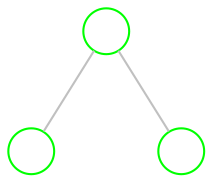
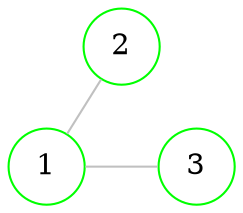
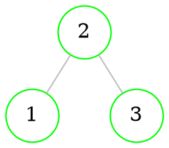
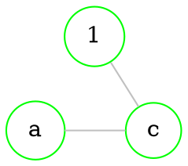

# Homomorphism 

> [!definition]
> Graphs $G_{1}=(V_{1},E_{1})$ and $G_{2}=(V_{2},E_{2})$ are **homomorphic**, if there exists such function: $f:G_{1}\to G_{2}$
> 1. If $v \in V_{1}$, then $f(v) \in V_{2}$
> 2. If $e \in E_{1}$, then $f(e) \in E_{2}$
> 3. If in graph $G$ [[Graphs - basics#Directed graphs|vertices]] $u$ and $v$ were [[Graphs - basics#Vertices and edges|adjacent]], then in $G_{2}$ [[Graphs - basics#Directed graphs|vertices]] $f(u)$ and $f(v)$ are also [[Graphs - basics#Vertices and edges|adjacent]]
> 
> > [!tldr] 
> > We map one graph onto another, [[#Folding|folding]] if necessary

> [!theorem] 
> 1. If function $f$ is **homomorphism** from $G_{1}$ to $G_{2}$, then $f(G_{1})$ is a [[Graphs - connectivity#Subgraph ($G' subset G$)|subgraph]] of $G_{2}$
> 2. If graph $G_{1}$ is [[Graphs - connectivity#Connected graph|connected]] and function $f$ is **homomorphism**, then $f(G_{1})$ is also [[Graphs - connectivity#Connected graph|connected]]
> 3. If graph $G_{1}$ is [[Graphs - basics#Complete graph|complete]] and function $f$ is **homomorphism**, then $f(G_{1})$ is also [[Graphs - basics#Complete graph|complete]]

> [!example] 
> Construct **homomorphism** from *B* to *A*
> 
> `````col
> ````col-md
> flexGrow=1
> ===
> **A**
> 
> ```dot 
> graph neato { 
> 
> bgcolor="transparent" 
> 
> graph [layout = neato] 
> 
> node [shape = circle, 
>       style = filled, 
>       width=0.3, 
>       height=0.3, 
>       color=green, 
>       fillcolor = white] 
> 
> edge [color = grey] 
> 
> "3/b" -- {1 "2/a"}
> "2/a" -- 1
> 
> } 
> ```
> 
> ````
> ````col-md
> flexGrow=1
> ===
> 
> **B**
> 
> ```dot 
> graph neato { 
> 
> bgcolor="transparent" 
> 
> graph [layout = neato] 
> 
> node [shape = circle, 
>       style = filled, 
>       width=0.3, 
>       height=0.3, 
>       color=green, 
>       fillcolor = white] 
> 
> edge [color = grey] 
> 
> a -- b
> 
> } 
> ```
> 
> ````
> `````
> 
> $f(a)=2, f(b)=3$

## Folding

> One of the techniques for constructing [[#Homomorphism|homomorphism]] is **graph folding**

> [!example] 
> Map *A* to *B* 
> 
> `````col 
> ````col-md 
> flexGrow=1
> ===
> 
> **A**
> 
> ```dot 
> graph neato { 
> 
> bgcolor="transparent" 
> 
> graph [layout = neato] 
> 
> node [shape = circle, 
>       style = filled, 
>       width=0.3, 
>       height=0.3, 
>       color=green, 
>       fillcolor = white] 
> 
> 1 [pos="-1,-0.5!"] 
> 2 [pos="1,-0.5!"] 
> 3 [pos="-1,0.5!"] 
> 4 [pos="1,0.5!"] 
> 5 [pos="0,0!"] 
> 
> 
> node [color=transparent, 
>       fillcolor=transparent, 
>       label="", 
> 	  width=0,
>       height=0]
> "-" [pos="0, 1!"] 
> "." [pos="0,-1!"]
> 
> edge [color = grey] 
> 
> 5 -- {1 2 3 4}
> 1 -- 3
> 2 -- 4
> 
> edge [style=dashed, color=green]
> 5 -- {".", "-"}
> 
> } 
> ```
> 
> ```` 
> ````col-md 
> flexGrow=1
> ===
> 
> **B**
> 
> ```dot 
> graph neato { 
> 
> bgcolor="transparent" 
> 
> graph [layout = neato] 
> 
> node [shape = circle, 
>       style = filled, 
>       width=0.3, 
>       height=0.3, 
>       color=green, 
>       fillcolor = white] 
> 
> a [pos="-1,-0.5!"] 
> b [pos="-1,0.5!"] 
> c [pos="0,0!"] 
> 
> edge [color = grey] 
> 
> a -- b
> b -- c
> c -- a
> 
> } 
> ```
> 
> ```` 
> `````
> 
> We get this:
> 
> $f(1)=f(2)=a$
> $f(3)=f(4)=b$
> $f(5)=c$
> 
> ```dot 
> graph neato { 
> 
> bgcolor="transparent" 
> 
> graph [layout = neato] 
> 
> node [shape = circle, 
>       style = filled, 
>       width=0.3, 
>       height=0.3, 
>       color=green, 
>       fillcolor = white] 
> 
> "1,2" [pos="-1,-0.5!"] 
> "3,4" [pos="-1,0.5!"] 
> 
> node [width=0.65, 
>       height=0.65]
> 5 [pos="0,0!"] 
> 
> edge [color = grey] 
> 
> 5 -- {"3,4", "1,2"}
> "3,4" -- "1,2"
> 
> 
> } 
> ```

--- 
<br>

# Isomorphism

> [!definition] 
> Graphs $G_{1}=(V_{1},E_{1})$ and $G_{2}=(V_{2},E_{2})$ are **isomorphic** ($G_{1} \cong G_{2}$), if there exists such *bijection* $f:G_{1} \to G_{2}$, that 
> $\forall \{u,v\} \in E_{1} \implies \{f(u), f(v)\} \in E_{2}$ and 
> $\forall \{w,y\} \in E_{2} \implies \{f^{-1}(w), f^{-1}(y)\} \in E_{1}$ 
> $|V_{1}|=|V_{2}|$, $|E_{1}|=|E_{2}|$
> 
> > [!tldr] 
> > The same graph written differently

> [!example] 
> 
> `````col 
> ````col-md 
> flexGrow=1
> ===
> 
> ## $G$
> 
> ```dot 
> graph neato { 
> 
> bgcolor="transparent" 
> 
> graph [layout = neato] 
> 
> node [shape = circle, 
>       style = filled, 
>       width=0.3, 
>       height=0.3, 
>       color=green, 
>       fillcolor = white] 
> 
> a [pos="1,0!"] 
> b [pos="0,1!"] 
> c [pos="0,0!"] 
> d [pos="1,1!"] 
> 
> edge [color = grey] 
>  
> c -- {a b d}
> a -- {b d}
> b -- d
> 
> } 
> ```
> 
> ```` 
> ````col-md 
> flexGrow=2
> ===
> 
> ## $T$
> 
> ```dot 
> graph neato { 
> 
> rankdir=LR;
> 
> bgcolor="transparent" 
> 
> graph [layout = dot] 
> 
> node [shape = circle, 
>       style = filled, 
>       width=0.3, 
>       height=0.3, 
>       color=green, 
>       fillcolor = white] 
> 
> 
> edge [color = grey] 
>  
> 3 -- {1 2 4}
> 1 -- {2 4}
> 2 -- 4
> 
> } 
> ```
> 
> ```` 
> `````
> 

> [!info] 
> Properties:
> 
> 1. Graph is **isomorphic** to itself
> 2. If $G_{1}$ is **isomorphic** to $G_{2}$, then $G_{2}$ is **isomorphic** to $G_{1}$
> 3. If $G_{1}$ is **isomorphic** to $G_{2}$ and $G_{2}$ to $G_{3}$, then $G_{1}$ is **isomorphic** to $G_{3}$


## Labeled and unlabeled graphs

> [!definition] 
> A class of graphs any representatives of which are [[#Isomorphism|isomorphic]] graphs is called an **unlabeled** graph
> Any element of this class is a **labeled** graph

`````col 
````col-md 
flexGrow=1
===

### D (Unlabeled)



```` 
````col-md 
flexGrow=1
===

### A (Labeled)



```` 

````col-md 
flexGrow=1
===

### B (Labeled)



```` 

````col-md 
flexGrow=1
===

### C (Labeled)



```` 

`````

### Invariants

> [!definition] 
> Graph functions ([[Graphs - basics#Directed graphs|vertices]], [[Graphs - basics#Undirected graph|edges]], [[Graphs - basics#Order (degree) of vertices|degree]] sequences, [[Graphs - metrics#Diameter of a graph|diameter]], amount of [[Graphs - metrics#Center of a graph|centers]], amount of [[Graphs - connectivity#Articulations|articulations]], etc.), that have same value with all [[#Isomorphism|isomorphic]] graphs are called **invariants**. 

> [!example] 
> $A$, $B$, $C$ are [[#Isomorphism|isomorphic]] to each other, all of them have 3 [[Graphs - basics#Directed graphs|vertices]], 2 [[Graphs - basics#Undirected graph|edges]], same [[Graphs - basics#Order (degree) of vertices|degree]] sequences, same [[Graphs - metrics#Diameter of a graph|diameter]] and amount of [[Graphs - metrics#Center of a graph|centers]], same amount of [[Graphs - connectivity#Articulations|articulations]] and so on.

### Amount of labeled graphs

> Let’s $|V|=n;$, then amount of all possible [[Graphs - basics#Undirected graph|edges]] (pairs of 2 different [[Graphs - basics#Directed graphs|vertices]]) is:
> 
> $\large m=\frac{n(n-1)}{2}$
> 
> So generating function for amount of $n$-th order [[#Labeled and unlabeled graphs|labeled]] graphs is:
> 
> $G_{n}(x)=(1+x)^m$
> 
> Amount of *all* possible [[#Labeled and unlabeled graphs|labeled]] graphs (of $n$-th order): $G_{n}(1)=(1+1)^m=2^m$
> 
> Amount of *all* possible [[#Labeled and unlabeled graphs|labeled]] graphs can be calculated *approximately*:
> 
> $\large g_{n}(x) \sim \frac{2^m}{n!}, n \to \infty$

## Checking for isomorphism

1. We can start from [[#Invariants|invariants]], so we'll first check:
	1. Amount of [[Graphs - basics#Directed graphs|vertices]]
	2. Amount of [[Graphs - basics#Undirected graph|edges]]
	3. Vertex [[Graphs - basics#Order (degree) of vertices|degrees]]
	4. [[Graphs - metrics#Distance matrix|Distance matrices]]
	5. [[Graphs - connectivity#Length of the path|Length]] of [[Graphs - connectivity#Cycle|cycles]] 
	6. ...


