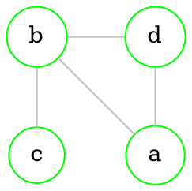
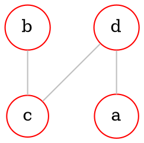
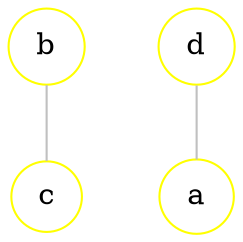
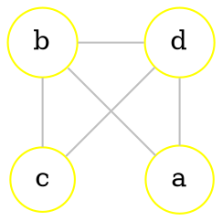
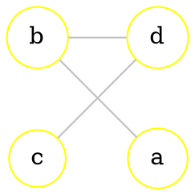
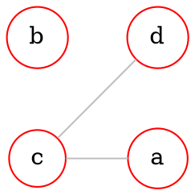
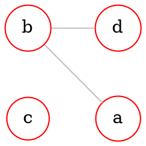

# Intersection (AND/$\cap$)

If $G_{1}=(V_{1}, E_{1})$ and $G_{2}=(V_{2}, E_{2})$, then $G_{1} \cap G_{2}=(V_{1} \cap V_{2}, E_{1} \cap E_{2})$ 

> Intersection of [[Graphs - basics#Directed graph|vertices]] and [[Graphs - basics#Undirected graph|edges]]

`````col

````col-md
## $G_{1}$


````

````col-md
## $G_{2}$


````

````col-md
## $G_{1} \cap G_{2}$


````

`````
## How to calculate

### Using [[Graphs - basics#Adjacency matrix|adjacency matrix]]

$C=A \cap B$ | $c_{ij}=a_{ij} \ \& \ b_{ij}$ 
> Perform logical *AND* on all elements of the 2 matrices

### Using [[Graphs - basics#Incidence matrix|incidence matrix]]

> Find equal columns
````col
```col-md
flexGrow=1
===

#### $G$

$$

\begin{array}{c c c c c} &
\begin{array}{c c c c c} a\\b\\c\\d \end{array} &

\begin{pmatrix} 
\color{orange}1 & \color{lightgreen}1 & \color{lightgreen}- & \color{orange}-  \\ 
\color{orange}1 & \color{lightgreen}- & \color{lightgreen}1 & \color{orange}1  \\ 
\color{orange}- & \color{lightgreen}- & \color{lightgreen}1 & \color{orange}-  \\ 
\color{orange}- & \color{lightgreen}1 & \color{lightgreen}- & \color{orange}1     
\end{pmatrix}

\end{array}
$$

```
```col-md
flexGrow=1
===

#### $T$

$$
\begin{array}{c c c c c} & 
\begin{array}{c c c c c} a\\b\\c\\d \end{array} &

\begin{pmatrix}
\color{lightgreen}1 & \color{lightgreen}- & \color{cyan}-  \\
\color{lightgreen}- & \color{lightgreen}1 & \color{cyan}-  \\
\color{lightgreen}- & \color{lightgreen}1 & \color{cyan}1  \\
\color{lightgreen}1 & \color{lightgreen}- & \color{cyan}1 
\end{pmatrix}

\end{array}
$$

```
```col-md
flexGrow=1
===

#### $G \cap T$

$$
\begin{array}{c c c c c} & 
\begin{array}{c c c c c} a\\b\\c\\d \end{array} &

\begin{pmatrix}
\color{lightgreen}1 & \color{lightgreen}-  \\
\color{lightgreen}- & \color{lightgreen}1  \\
\color{lightgreen}- & \color{lightgreen}1  \\
\color{lightgreen}1 & \color{lightgreen}- 
\end{pmatrix}

\end{array}
$$

```
````

---
<br>

# Union (OR/$\cup$)

If $G_{1}=(V_{1}, E_{1})$ and $G_{2}=(V_{2}, E_{2})$, then $G_{1} \cup G_{2}=(V_{1} \cup V_{2}, E_{1} \cup E_{2})$ 

> Union of [[Graphs - basics#Directed graph|vertices]] and [[Graphs - basics#Undirected graph|edges]]

`````col

````col-md
## $G_{1}$
---

````

````col-md
## $G_{2}$
---

````

````col-md
## $G_{1} \cup G_{2}$
---

````

`````
## How to calculate

### Using [[Graphs - basics#Adjacency matrix|adjacency matrix]]

$C=A \cup B$ | $c_{ij}=a_{ij} \ \lor \ b_{ij}$ 
> Perform logical *OR* on all elements of the 2 matrices

### Using [[Graphs - basics#Incidence matrix|incidence matrix]]

> Add all unique columns
````col
```col-md
flexGrow=1
===

#### $G$

$$

\begin{array}{c c c c c} &
\begin{array}{c c c c c} a\\b\\c\\d \end{array} &

\begin{pmatrix} 
\color{orange}1 & \color{lightgreen}1 & \color{lightgreen}- & \color{orange}-  \\ 
\color{orange}1 & \color{lightgreen}- & \color{lightgreen}1 & \color{orange}1  \\ 
\color{orange}- & \color{lightgreen}- & \color{lightgreen}1 & \color{orange}-  \\ 
\color{orange}- & \color{lightgreen}1 & \color{lightgreen}- & \color{orange}1     
\end{pmatrix}

\end{array}
$$

```
```col-md
flexGrow=1
===

#### $T$

$$
\begin{array}{c c c c c} & 
\begin{array}{c c c c c} a\\b\\c\\d \end{array} &

\begin{pmatrix}
\color{lightgreen}1 & \color{lightgreen}- & \color{cyan}-  \\
\color{lightgreen}- & \color{lightgreen}1 & \color{cyan}-  \\
\color{lightgreen}- & \color{lightgreen}1 & \color{cyan}1  \\
\color{lightgreen}1 & \color{lightgreen}- & \color{cyan}1 
\end{pmatrix}

\end{array}
$$

```
```col-md
flexGrow=1.1
===

#### $G \cup T$

$$
\begin{array}{c c c c c} & 
\begin{array}{c c c c c} a\\b\\c\\d \end{array} &

\begin{pmatrix} 
\color{orange}1 & \color{lightgreen}1 & \color{lightgreen}- & \color{orange}- & \color{cyan}- \\ 
\color{orange}1 & \color{lightgreen}- & \color{lightgreen}1 & \color{orange}1 & \color{cyan}- \\ 
\color{orange}- & \color{lightgreen}- & \color{lightgreen}1 & \color{orange}- & \color{cyan}1 \\ 
\color{orange}- & \color{lightgreen}1 & \color{lightgreen}- & \color{orange}1 & \color{cyan}1   
\end{pmatrix}

\end{array}
$$

```
````

---
<br>

# Cyclic sum (XOR/$\oplus$)

$G_{1}=(V_{1}, E_{1})$ and $G_{2}=(V_{2}, E_{2})$, then $G_{1} \oplus G_{2}=(\sim V, \sim E)$

> [!note] 
> Only different [[Graphs - basics#Undirected graph|edges]]

`````col

````col-md
## $G_{1}$
---

````

````col-md
## $G_{2}$
---

````

````col-md
## $G_{1} \oplus G_{2}$
---

````

`````
## How to calculate

### Using [[Graphs - basics#Adjacency matrix|adjacency matrix]]

$C=A \oplus B$ | $c_{ij}=a_{ij} \ \oplus \ b_{ij}$ 
> Perform logical *XOR* on all elements of the 2 matrices

### Using [[Graphs - basics#Incidence matrix|incidence matrix]]

> Add only different columns
````col
```col-md
flexGrow=1
===

#### $G$

$$

\begin{array}{c c c c c} &
\begin{array}{c c c c c} a\\b\\c\\d \end{array} &

\begin{pmatrix} 
\color{orange}1 & \color{lightgreen}1 & \color{lightgreen}- & \color{orange}-  \\ 
\color{orange}1 & \color{lightgreen}- & \color{lightgreen}1 & \color{orange}1  \\ 
\color{orange}- & \color{lightgreen}- & \color{lightgreen}1 & \color{orange}-  \\ 
\color{orange}- & \color{lightgreen}1 & \color{lightgreen}- & \color{orange}1     
\end{pmatrix}

\end{array}
$$

```
```col-md
flexGrow=1
===

#### $T$

$$
\begin{array}{c c c c c} & 
\begin{array}{c c c c c} a\\b\\c\\d \end{array} &

\begin{pmatrix}
\color{lightgreen}1 & \color{lightgreen}- & \color{cyan}-  \\
\color{lightgreen}- & \color{lightgreen}1 & \color{cyan}-  \\
\color{lightgreen}- & \color{lightgreen}1 & \color{cyan}1  \\
\color{lightgreen}1 & \color{lightgreen}- & \color{cyan}1 
\end{pmatrix}

\end{array}
$$

```
```col-md
flexGrow=1
===

#### $G \oplus T$

$$
\begin{array}{c c c c c} & 
\begin{array}{c c c c c} a\\b\\c\\d \end{array} &

\begin{pmatrix} 
\color{orange}1 & \color{orange}- & \color{cyan}- \\ 
\color{orange}1 & \color{orange}1 & \color{cyan}- \\ 
\color{orange}- & \color{orange}- & \color{cyan}1 \\ 
\color{orange}- & \color{orange}1 & \color{cyan}1   
\end{pmatrix}

\end{array}
$$

```
````

---
<br>

# Difference ($A \textbackslash B = A\cap \neg B$)

## Graph's complement ($\neg G$)

Complement of graph $G=(V, E)$ is a graph $\neg G=(V, \neg E)$

> [!note]
> 1. $G \cup \neg G=K_{n}$ ([[#Union (OR/$ cup$)|Union]] of graph and it's complement is a [[Graphs - basics#Complete graph|complete]] graph) 
> 2. $G \cap \neg G=(V, \emptyset)$ ([[#Intersection (AND/$ cap$)|Intersection]] of graph and it's complement is a graph with no edges)

`````col

````col-md
### $G$
---

````

````col-md
### $\neg G$
---

````

`````
### How to calculate

#### Using [[Graphs - basics#Adjacency matrix|adjacency matrix]]

$C=\neg  A$ | $c_{ij}=\neg a_{ij}$ 
> Perform logical *NOT* on all elements of the 2 matrices


## Actual difference
`````col

````col-md
### $G$
---

````

````col-md
### $B$
---

````

````col-md
### $G\cap \neg B \ \ \ (A - B)$
---

````

`````
### How to calculate

#### Using [[Graphs - basics#Adjacency matrix|adjacency matrix]]

$C=A \textbackslash B$ | $c_{ij}=a_{ij} \& \neg b_{ij}$ 
> Perform logical *AND* between all elements from the first matrix and logical *NOT* of element from the second matrix

### Using [[Graphs - basics#Incidence matrix|incidence matrix]]

> Remove equal columns from the first matrix
````col
```col-md
flexGrow=1
===

#### $G$

$$

\begin{array}{c c c c c} &
\begin{array}{c c c c c} a\\b\\c\\d \end{array} &

\begin{pmatrix} 
\color{orange}1 & \color{lightgreen}1 & \color{lightgreen}- & \color{orange}-  \\ 
\color{orange}1 & \color{lightgreen}- & \color{lightgreen}1 & \color{orange}1  \\ 
\color{orange}- & \color{lightgreen}- & \color{lightgreen}1 & \color{orange}-  \\ 
\color{orange}- & \color{lightgreen}1 & \color{lightgreen}- & \color{orange}1     
\end{pmatrix}

\end{array}
$$

```
```col-md
flexGrow=1
===

#### $T$

$$
\begin{array}{c c c c c} & 
\begin{array}{c c c c c} a\\b\\c\\d \end{array} &

\begin{pmatrix}
\color{lightgreen}1 & \color{lightgreen}- & \color{cyan}-  \\
\color{lightgreen}- & \color{lightgreen}1 & \color{cyan}-  \\
\color{lightgreen}- & \color{lightgreen}1 & \color{cyan}1  \\
\color{lightgreen}1 & \color{lightgreen}- & \color{cyan}1 
\end{pmatrix}

\end{array}
$$

```
```col-md
flexGrow=1
===

#### $G \textbackslash T$

$$
\begin{array}{c c c c c} & 
\begin{array}{c c c c c} a\\b\\c\\d \end{array} &

\begin{pmatrix} 
\color{orange}1 & \color{orange}-  \\ 
\color{orange}1 & \color{orange}1  \\ 
\color{orange}- & \color{orange}-  \\ 
\color{orange}- & \color{orange}1    
\end{pmatrix}

\end{array}
$$

```
````

--- 
<br>

# Go to other topics
``` dataview
list from "uni/Discrete math"
```

