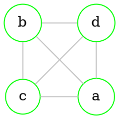
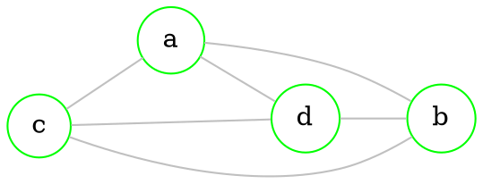

# Planar graph

> [!definition] 
> Graph is called **planar**, it it can be drawn with [[Graphs - basics#Undirected graph|edges]] not intersecting.

`````col 
````col-md 
flexGrow=1
===



```` 
````col-md 
flexGrow=2
===



```` 
`````

## Area of a [[#Planar graph|planar]] graph

> [!definition] 
> **Area** of a [[#Planar graph|planar]] graph is the *biggest* possible area of plane where *any two points* can be connected by *line* that does not intersect with [[Graphs - basics#Undirected graph|edges]]

```tikz
\usepackage{tikz}

\definecolor{green_g}{HTML}{B8BB26}
\definecolor{orange_g}{HTML}{FE8019}
\definecolor{blue_g}{HTML}{83A598}

\begin{document}

\begin{tikzpicture}
   % NODES
   \node (a) at ( -3.0,  0.0) {}; % a
   \node (1) at ( 1.7, -2.0) {}; % 1
   \node (2) at ( 1.0,  0.0) {}; % 2
   \node (c) at ( 7,    0) {}; % c
   \node (3) at ( 1.2,  2) {}; % 3

   % DRAW CONNECTIONS
   \fill[fill=orange_g] (a.center)--(2.center)--(3.center);
   \fill[fill=green_g]  (c.center)--(2.center)--(3.center);
   \fill[fill=blue_g]   (a.center)--(c.center)--(1.center);
   \path[draw] (a)--(c);
   \path[draw] (2)--(3);
   \path[draw] (a)--(3);
   \path[draw] (c)--(3);
   \path[draw] (1)--(a);
   \path[draw] (1)--(c);

   % DRAW NODES
   \draw[color=white, fill=black]  (a) circle (0.4) node {\Huge a};
   \draw[color=white, fill=black]  (1) circle (0.4) node {\Huge 1};
   \draw[color=white, fill=black]  (2) circle (0.4) node {\Huge 2};
   \draw[color=white, fill=black]  (3) circle (0.4) node {\Huge 3};
   \draw[color=white, fill=black]  (c) circle (0.4) node {\Huge c};

\end{tikzpicture}

\end{document}
```

## Theorems

> [!note] 
> These 2 graphs are **not** planar
> 
> 
> `````col 
> ````col-md 
> flexGrow=1
> ===
> 
> ### $K_{3,3}$
> 
> ```dot 
> graph neato { 
> 
> bgcolor="transparent" 
> 
> graph [layout = neato] 
> 
> node [shape = circle, 
>       style = filled, 
>       width=0.3, 
>       height=0.3, 
>       color=green, 
>       fillcolor = white] 
> 
> a [pos="0,1!"] 
> b [pos="1,1!"] 
> c [pos="2.,1!"] 
> 1 [pos="0,-1!"] 
> 2 [pos="1,-1!"] 
> 3 [pos="2,-1!"] 
> 
> edge [color = grey] 
> 
> a -- {1 2 3}
> b -- {1 2 3}
> c -- {1 2 3}
> 
> } 
> ```
> 
> ```` 
> ````col-md 
> flexGrow=1
> ===
> 
> ### $K_{5}$
> 
> ```dot 
> graph neato { 
> 
> bgcolor="transparent" 
> 
> graph [layout = neato] 
> 
> node [shape = circle, 
>       style = filled, 
>       width=0.3, 
>       height=0.3, 
>       color=green, 
>       fillcolor = white] 
> 
> a [pos="0.1,-0.1!"] 
> b [pos="0.4,0.9!"] 
> c [pos="1.6,0.9!"] 
> d [pos="1.9,-0.1!"] 
> e [pos="1,-0.8!"] 
> 
> edge [color = grey] 
>  
> a -- {b c d e}
> b -- {c d e}
> c -- {d e}
> d -- e
> 
> } 
> ```
> 
> 
> ```` 
> `````

> [!theorem] 
> If $G$ is [[Graphs - connectivity#Connected graph|connected]] graph, with *n* [[Graphs - basics#Directed graph|vertices]], *m* [[Graphs - basics#Undirected graph|edges]] and *a* areas, then
> $n - m + a = 2$
> 
> (In our case $n=5,m=7,a=4$ and $5-7+4=2$)

> [!theorem] 
> If $G$ - [[Graphs - connectivity#Connected graph|connected]] [[#Planar graph|planar]] with *n* [[Graphs - basics#Directed graph|vertices]] ($n \geq 3$) and *m* [[Graphs - basics#Undirected graph|edges]], then 
> $3n-m \geq 6$

> [!theorem] 
> Any [[#Planar graph|planar]] graph has vertex which [[Graphs - basics#Order (degree) of vertices|degree]] is *not bigger than 5*

