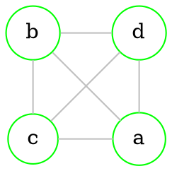
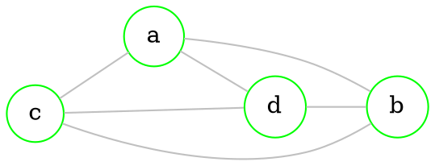

# Planar graph

> [!definition] 
> Graph is called **planar**, it it can be drawn with [[Graphs - basics#Undirected graph|edges]] not intersecting.

`````col 
````col-md 
flexGrow=1
===



```` 
````col-md 
flexGrow=2
===



```` 
`````

## Area of a [[#Planar graph|planar]] graph

> [!definition] 
> **Area** of a [[#Planar graph|planar]] graph is the *biggest* possible area of plane where *any two points* can be connected by *line* that does not intersect with [[Graphs - basics#Undirected graph|edges]]

