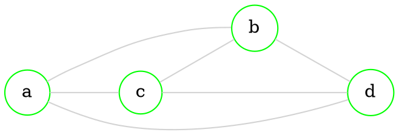
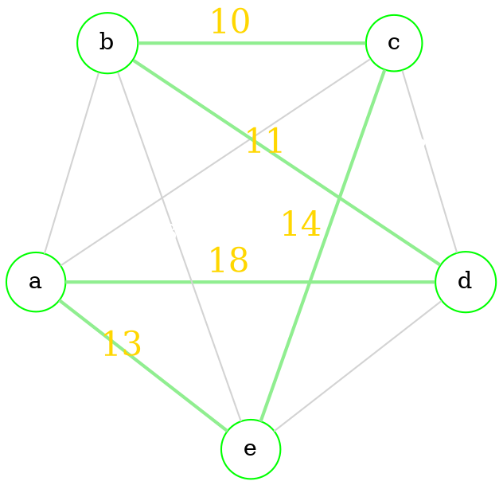
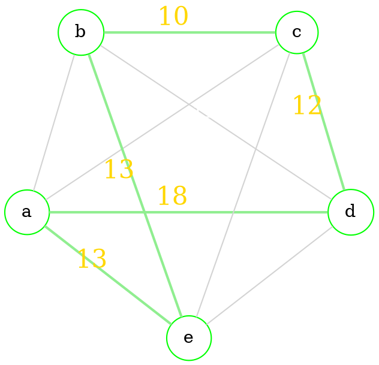

# Shortest path problem

> [!definition] 
> In graph theory, the *shortest [[Graphs - connectivity#Path|path]] problem* is the problem of finding a path between two [[Graphs - basics#Directed graphs|vertices]] in a graph such that the *sum of the weights* of its [[Graphs - basics#Undirected graph|edges]] *is minimized*

> [!info] 
> The problem of finding the shortest path between two *intersections* <u>on a road map</u> may be modeled as <u>a special case of the shortest path problem</u> in graphs, where the [[Graphs - basics#Directed graphs|vertices]] correspond to *intersections* and the [[Graphs - basics#Undirected graph|edges]] correspond to *road segments*, <u>each weighted by the length of the segment</u>

## Variations

### Single-source

- We have to find **shortest** [[Graphs - connectivity#Path|paths]] from a *source* [[Graphs - basics#Directed graphs|vertex]] to *all other* [[Graphs - basics#Directed graphs|vertices]] in the graph

> [!note] 
> Applicable algorithms:
> 1. [[#Algorithms|Dijkstra's algorithm]]
> 2. [[#Algorithms|Bellman–Ford algorithm]]

### Single-destination

- We have to find <u>shortest paths</u> from *all vertices* in the [[Graphs - basics#Directed graphs|directed graphs]] graph to a *single destination* vertex. This can be reduced to the **single-source** shortest path problem by reversing the arcs in the directed graph

### All-pairs

- We have to find <u>shortest paths</u> between *every pair of [[Graphs - basics#Directed graphs|vertices]]* in the graph

> [!note] 
> Applicable algorithms:
> 1. [[#Algorithms|Floyd–Warshall algorithm]]
> 2. [[#Algorithms|Johnson's algorithm]]
> 1. [[#Algorithms|A* search algorithm]] ([[#All-pairs|single-pair]])

## Algorithms

1. [[#Dijkstra's algorithm]] - solves the [[#Single-source|single-source]] problem with <u>non-negative edge weight</u>
2. **Bellman–Ford algorithm** - solves the [[#Single-source|single-source]] problem if edge <u>weights may be negative</u>
3. __A* search algorithm__ - solves for [[#All-pairs|single-pair]] shortest path using heuristics to try to speed up the search
4. [[#Floyd-Warshall algorithm]] - solves [[#All-pairs|all-pairs]] shortest paths
5. **Johnson's algorithm** - solves [[#All-pairs|all-pairs]] shortest paths, and may be faster than *Floyd–Warshall* on sparse graphs
6. **Viterbi algorithm** - the shortest stochastic path problem with an additional probabilistic weight on each node 

> [!note] 
>  - <u>The Stochastic Shortest Path problem</u> generalizes the classic deterministic shortest path problem

### Dijkstra's algorithm

1. Mark all nodes <u>unvisited</u>. Put them in a set, we will call it *the unvisited set*
2. Assign a tentative [[Graphs - metrics#Distances|distance]] value to every node: 
	- **Zero** for our *initial(starting) node* and 
	- **Infinity** for all other nodes
	- Set the initial node as current

> [!note]  
> - The *tentative distance *of a node is the [[Graphs - connectivity#Length of the path|length]] of the shortest path discovered so far between the node and the starting node
> - Since initially no path is known to any other [[Graphs - basics#Directed graphs|vertex]] other than the source itself, all other *tentative distances* are set to *infinity*

3. For the current node, consider all of its <u>unvisited</u> [[Graphs - basics#Properties|neighbors]] and *calculate their tentative distances through the current node*. Compare the newly calculated tentative distance to the current assigned value and *assign the smallest one* 
4. Mark the current node as <u>visited</u> and remove it from the *unvisited set*. (A visited node will never be checked again)
5. If the *destination* node has been marked visited or if the smallest tentative [[Graphs - metrics#Distances|distance]] among the nodes in the <u>unvisited set</u> is infinity (no connection between the *initial* node and *remaining* unvisited nodes), then stop. 
6. Otherwise, select the <u>unvisited</u> node that is marked with the smallest tentative [[Graphs - metrics#Distances|distance]], set it as the new current node, and go back to step 3.

#### Example

> Find shortest path between *A* and *F*

1. Assign a tentative [[Graphs - metrics#Distances|distance]] value to every node
```dot 
---
ellipse-fill:keep-shade
---
graph neato { 

bgcolor="transparent" 

rankdir="LR"

graph [layout = dot, ranksep=1,nodesep=.5] 

subgraph cluster_space {
	graph [peripheries=0]
	
	node [shape = circle, 
	      style = filled, 
	      width=0.45, 
	      height=0.45, 
	      color=yellow, 
	      fillcolor=snow, 
	      fontcolor=ghostwhite,
	      fixedsize=true,
	      penwidth=3]  
	
	a [label="\n\n\nA(0,0)",color=orange]
	b [label="\n\n\nB(∞,0)"]
	c [label="\n\n\nC(∞,0)"]
	d [label="D(∞,0)\n\n\n\n"]
	e [label="E(∞,0)\n\n\n\n"]
	f [label="\n\n\nF(∞,0)",color=red]
	
	edge [color=lightgray, fontcolor=lightgray]  
	
	a -- b [label="5",weight=5]
	a -- c [label="6",weight=6]
	b -- e [label="2",weight=2]
	b -- f [label="10",weight=10]
	b -- c [label="3",weight=3]
	b -- d [label="7",weight=7]
	c -- e [label="7",weight=7]
	d -- f [label="2",weight=2]
	f -- e [label="4",weight=4]
	
	}
} 
```

2. Consider neighbours of *A*. 
	- Assign **(5,A)** to *B*
	- Assign **(6,A)** to *C*
	- *B* has the smallest tentative [[Graphs - metrics#Distances|distance]], we will work with *B* next
```dot 
---
ellipse-fill:keep-shade
---
graph neato { 

bgcolor="transparent" 

rankdir="LR"

graph [layout = dot, ranksep=1,nodesep=.5] 

subgraph cluster_space {
	graph [peripheries=0]
	
	node [shape = circle, 
	      style = filled, 
	      width=0.45, 
	      height=0.45, 
	      color=yellow, 
	      fillcolor=snow, 
	      fontcolor=ghostwhite,
	      fixedsize=true,
	      penwidth=3] 
	
	a [label="\n\n\nA(0,0)",color=darkcyan,fontcolor=blue]
	b [label="\n\n\nB(5,A)",fontcolor=red]
	c [label="\n\n\nC(6,A)",fontcolor=red]
	d [label="D(∞,0)\n\n\n\n"]
	e [label="E(∞,0)\n\n\n\n"]
	f [label="\n\n\nF(∞,0)",color=red]
	
	edge [color=lightgray, fontcolor=lightgray] 
	
	a -- b [label="5",weight=5,color=darkred,penwidth=2]
	a -- c [label="6",weight=6,color=darkred,penwidth=2]
	b -- e [label="2",weight=2]
	b -- f [label="10",weight=10]
	b -- c [label="3",weight=3]
	b -- d [label="7",weight=7]
	c -- e [label="7",weight=7]
	d -- f [label="2",weight=2]
	f -- e [label="4",weight=4]
	
	}
} 
```

3. Consider neighbors of *B*. 
	- Assign **(12,B)** to *D*
	- Assign **(7,B)** to *E*
	- Assign **(15,B)** to *F*
	- *C* already has a smaller tentative weight, don't assign **(8,B)**. 
	- *C* has the smallest tentative [[Graphs - metrics#Distances|distance]], we will work with *C* next
```dot 
---
ellipse-fill:keep-shade
---
graph neato { 

bgcolor="transparent" 

rankdir="LR"

graph [layout = dot, ranksep=1,nodesep=.5] 

subgraph cluster_space {
	graph [peripheries=0]
	
	node [shape = circle, 
	      style = filled, 
	      width=0.45, 
	      height=0.45, 
	      color=yellow, 
	      fillcolor=snow, 
	      fontcolor=ghostwhite,
	      fixedsize=true,
	      penwidth=3]
	
	a [label="\n\n\nA(0,0)",color=orange,fontcolor=blue]
	b [label="\n\n\nB(5,A)",color=darkcyan,fontcolor=blue]
	c [label="\n\n\n    C(6,A)",xlabel=<<font color="red">(8,B)</font>>]
	d [label="D(12,B)\n\n\n\n",fontcolor=red]
	e [label="E(7,B)\n\n\n\n",fontcolor=red]
	f [label="\n\n\nF(15,B)",color=red,fontcolor=red]
	
	edge [color=lightgray, fontcolor=lightgray] 
	
	a -- b [label="5",weight=5,color=green,penwidth=2]
	a -- c [label="6",weight=6]
	b -- e [label="2",weight=2,color=darkred,penwidth=2]
	b -- f [label="10",weight=10,color=darkred,penwidth=2]
	b -- c [label="3",weight=3,color=darkred,penwidth=2]
	b -- d [label="7",weight=7,color=darkred,penwidth=2]
	c -- e [label="7",weight=7]
	d -- f [label="2",weight=2]
	f -- e [label="4",weight=4]
	
	}
} 
```

4. Consider neighbors of *C*. 
	- We don't calculate tentative distance to *B*, because it is <u>visited</u>. 
	- *E* already has a smaller tentative weight, don't assign **(13,C)**. 
	- *E* has the smallest tentative [[Graphs - metrics#Distances|distance]], we will work with *E* next
```dot 
---
ellipse-fill:keep-shade
---
graph neato { 

bgcolor="transparent" 

rankdir="LR"

graph [layout = dot, ranksep=1,nodesep=.5] 

subgraph cluster_space {
	graph [peripheries=0]
	
	node [shape = circle, 
	      style = filled, 
	      width=0.45, 
	      height=0.45, 
	      color=yellow, 
	      fillcolor=snow, 
	      fontcolor=ghostwhite,
	      fixedsize=true,
	      penwidth=3] 
	
	a [label="\n\n\nA(0,0)",color=orange,fontcolor=blue]
	b [label="\n\n\nB(5,A)",color=purple,fontcolor=blue]
	c [label="\n\n\nC(6,A)",color=darkcyan,fontcolor=blue]
	d [label="D(12,B)\n\n\n\n"]
	e [label="E(7,B)\n\n\n\n",xlabel=<<font color="red">(13,C)</font>>]
	f [label="\n\n\nF(15,B)",color=red]
	
	edge [color=lightgray, fontcolor=lightgray]  
	
	a -- b [label="5",weight=5]
	a -- c [label="6",weight=6,color=green,penwidth=2]
	b -- e [label="2",weight=2]
	b -- f [label="10",weight=10]
	b -- c [label="3",weight=3]
	b -- d [label="7",weight=7]
	c -- e [label="7",weight=7,color=darkred,penwidth=2]
	d -- f [label="2",weight=2]
	f -- e [label="4",weight=4]
	
	}
} 
```

5. Consider neighbors of *E*. 
	- We don't calculate tentative distance to *B* and *C*, because they are <u>visited</u>.
	- Assign **(11,E)** to *F* (smaller tentative [[Graphs - metrics#Distances|distance]])
```dot 
---
ellipse-fill:keep-shade
---
graph neato { 

bgcolor="transparent" 

rankdir="LR"

graph [layout = dot, ranksep=1,nodesep=.5] 

subgraph cluster_space {
	graph [peripheries=0]
	
	node [shape = circle, 
	      style = filled, 
	      width=0.45, 
	      height=0.45, 
	      color=yellow, 
	      fillcolor=snow, 
	      fontcolor=ghostwhite,
	      fixedsize=true,
	      penwidth=3] 
	
	a [label="\n\n\nA(0,0)",color=orange,fontcolor=blue]
	b [label="\n\n\nB(5,A)",color=purple,fontcolor=blue]
	c [label="\n\n\nC(6,A)",color=purple,fontcolor=blue]
	d [label="D(12,B)\n\n\n\n"]
	e [label="E(7,B)\n\n\n\n",color=darkcyan,fontcolor=blue]
	f [label="\n\n\n      F(15,B)",color=red,xlabel=<<font color="red">(11,E)</font>>]
	
	edge [color=lightgray, fontcolor=lightgray] 
	
	a -- b [label="5",weight=5,color=lightgreen,penwidth=2]
	a -- c [label="6",weight=6]
	b -- e [label="2",weight=2,color=lightgreen,penwidth=2]
	b -- f [label="10",weight=10]
	b -- c [label="3",weight=3]
	b -- d [label="7",weight=7]
	c -- e [label="7",weight=7]
	d -- f [label="2",weight=2]
	f -- e [label="4",weight=4,color=darkred,penwidth=2]
	
	}
} 
```

6. We have reached our destination *F*, stop
	- First element shows [[Graphs - metrics#Distances|distance]], second - **directions**
	- So, final directions are: $A \to B \to E \to F$
```dot 
---
ellipse-fill:keep-shade
---
graph neato { 

bgcolor="transparent" 

rankdir="LR"

graph [layout = dot, ranksep=1,nodesep=.5]

subgraph cluster_space {
	graph [peripheries=0] 
	
	node [shape = circle, 
	      style = filled, 
	      width=0.45, 
	      height=0.45, 
	      color=yellow, 
	      fillcolor=snow, 
	      fontcolor=ghostwhite,
	      fixedsize=true,
	      penwidth=3]
	
	a [label="\n\n\nA(0,0)",color=orange,fontcolor=blue]
	b [label="\n\n\nB(5,A)",color=purple,fontcolor=blue]
	c [label="\n\n\nC(6,A)",color=purple,fontcolor=blue]
	d [label="D(12,B)\n\n\n\n"]
	e [label="E(7,B)\n\n\n\n",color=purple,fontcolor=blue]
	f [label="\n\n\nF(11,E)",color=red,fontcolor=red]
	
	edge [color=lightgray, fontcolor=lightgray] 
	
	a -- b [label="5",weight=5,color=lightgreen,penwidth=3]
	a -- c [label="6",weight=6]
	b -- e [label="2",weight=2,color=lightgreen,penwidth=3]
	b -- f [label="10",weight=10]
	b -- c [label="3",weight=3]
	b -- d [label="7",weight=7]
	c -- e [label="7",weight=7]
	d -- f [label="2",weight=2]
	f -- e [label="4",weight=4,color=lightgreen,penwidth=3]
	
	}
} 
```

### Floyd-Warshall algorithm

```dot 
---
preset:math-graph
---
graph neato { 

bgcolor="transparent" 

rankdir="LR"

graph [layout = dot, ranksep=0.5,nodesep=.5] 

subgraph cluster_space {
	graph [peripheries=0]
	
	node [shape = circle, 
	      style = filled, 
	      width=0.45, 
	      height=0.45, 
	      color=yellow, 
	      fillcolor=white, 
	      fixedsize=true]  
	
	v1, v2, v3, v4, v5
	
	edge [color=lightgray, fontcolor=darkgray]  
	
	v1 -- v2 [label="2",weight=2]
	v1 -- v4 [label="3",weight=3]
	v2 -- v3 [label="4",weight=4]
	v3 -- v4 [label="6",weight=6]
	v3 -- v5 [label="2",weight=2]
	v2 -- v5 [label="1",weight=1]
	v4 -- v5 [label="3",weight=3]
	
	}
} 
```

1. Make matrices $D$ and $P$, $D$ stores [[Graphs - metrics#Distances|distances]], $P$ - information about *paths*
```latex
\newcommand\x{\times}

\begin{multicols}{2}

	\begin{equation*}
	  D= 
	  \left(\begin{array}{>{\columncolor{ForestGreen}}ccccc}
	    \rowcolor{ForestGreen}
	    0       & 2      & \infty & 3      & \infty \\
	    2       & 0      & 4      & \infty & 1      \\
	    \infty  & 4      & 0      & 6      & 2      \\
	    3       & \infty & 6      & 0      & 3      \\
	    \infty  & 1      & 2      & 3      & 0      \\
	  \end{array}\right)
	\end{equation*}\break

	\begin{equation*}
	  P= 
	  \left(\begin{array}{ccccc}
	    0 & 0 & 0 & 0 & 0 \\
	    0 & 0 & 0 & 0 & 0 \\
	    0 & 0 & 0 & 0 & 0 \\
	    0 & 0 & 0 & 0 & 0 \\
	    0 & 0 & 0 & 0 & 0 \\
	  \end{array}\right)
	\end{equation*}\break

\end{multicols}

```

2. Take every *row* and *column* sequentially. If *element* is <u>not</u> **0** or **$\infty$** we add them.
	- Take *smaller* element

3. $2 + \infty > 4$, so we *don't* change the element
```latex
\newcommand\x{\times}
\newcommand\y{\cellcolor{olive}}
\newcommand\z{\cellcolor{green!80!black}}

\begin{multicols}{2}

	
	\begin{equation*}
	  D= 
	  \left(\begin{array}{>{\columncolor{ForestGreen}}ccccc}
	    \rowcolor{ForestGreen}
	    0       & 2      & \z \infty & 3      & \infty \\
	    \z 2    & 0      & \y 4      & \infty & 1      \\
	    \infty  & 4      & 0         & 6      & 2      \\
	    3       & \infty & 6         & 0      & 3      \\
	    \infty  & 1      & 2         & 3      & 0      \\
	  \end{array}\right)
	\end{equation*}\break

	\begin{equation*}
	  P= 
	  \left(\begin{array}{ccccc}
	    0 & 0 & 0 & 0 & 0 \\
	    0 & 0 & 0 & 0 & 0 \\
	    0 & 0 & 0 & 0 & 0 \\
	    0 & 0 & 0 & 0 & 0 \\
	    0 & 0 & 0 & 0 & 0 \\
	  \end{array}\right)
	\end{equation*}\break

\end{multicols}

```

4. $2+3< \infty$, so we *change* the element to **5** and mark it in the matrix $P$
5. Same for 1 more element
```latex
\newcommand\x{\times}
\newcommand\y{\cellcolor{olive}}
\newcommand\yy{\cellcolor{yellow}}
\newcommand\z{\cellcolor{green!80!black}}
\newcommand\zz{\cellcolor{green!30!black}}

\begin{multicols}{2}

	
	\begin{equation*}
	  D= 
	  \left(\begin{array}{>{\columncolor{ForestGreen}}ccccc}
	    \rowcolor{ForestGreen}
	    0       & \zz 2 & \infty & \z 3  & \infty \\
	    \z 2    & 0     & 4      & \yy 5 & 1      \\
	    \infty  & 4     & 0      & 6     & 2      \\
	    \zz 3   & \y 5  & 6      & 0     & 3      \\
	    \infty  & 1     & 2      & 3     & 0      \\
	  \end{array}\right)
	\end{equation*}\break

	\begin{equation*}
	  P= 
	  \left(\begin{array}{ccccc}
	    0 & 0    & 0 &     0 & 0 \\
	    0 & 0    & 0 & \yy 1 & 0 \\
	    0 & 0    & 0 &     0 & 0 \\
	    0 & \y 1 & 0 &     0 & 0 \\
	    0 & 0    & 0 &     0 & 0 \\
	  \end{array}\right)
	\end{equation*}\break

\end{multicols}

```

6. Repeat for the next *row* and *column* 
```latex
\newcommand\x{\times}
\newcommand\y{\cellcolor{olive}}
\newcommand\yy{\cellcolor{yellow}}
\newcommand\z{\cellcolor{green!80!black}}
\newcommand\zz{\cellcolor{green!30!black}}

\newcommand\bl{\cellcolor{blue!80!black}}
\newcommand\blb{\cellcolor{blue!30!black}}

\begin{multicols}{2}

	
	\begin{equation*}
	  D= 
	  \left(\begin{array}{c>{\columncolor{ForestGreen}}cccc}
	     0      & \z  2     & 6      & 3     & \yy 3 \\
	    \rowcolor{ForestGreen}
	    \zz  2  &     0     & 4      & 5     & \z  1      \\
	    \y   6  & \zz 4     & 0      & 6     &     2      \\
	     3      &     5     & 6      & 0     &     3      \\
	     3      &     1     & 2      & 3     &     0      \\
	  \end{array}\right)
	\end{equation*}\break

	\begin{equation*}
	  P= 
	  \left(\begin{array}{ccccc}
	         0 &    0    & \bl 2 &     0 & \bl 2 \\
	         0 &    0    &     0 & \yy 1 &     0 \\
	    \blb 2 &    0    &     0 &     0 &     0 \\
	         0 & \y 1    &     0 &     0 &     0 \\
	    \blb 2 &    0    &     0 &     0 &     0 \\
	  \end{array}\right)
	\end{equation*}\break

\end{multicols}

```

7. Do this for **all** *rows* and *columns*, after doing it, we get these
	- In $D$ we have *shortest* [[Graphs - metrics#Distances|distances]] 
	- In $P$ we have information about [[Graphs - connectivity#Path|paths]] 
	- & For example: from vertex *4* to vertex *2* we should go through vertex *5*
```latex
---
mix-multiplier:0.4
---
\newcommand\x{\cellcolor{violet!80}}
\newcommand\y{\cellcolor{violet!10}}
\newcommand\z{\cellcolor{blue!20}}
\newcommand\g{\cellcolor{green!20}}
\newcommand\m{\cellcolor{green!10}}
\newcommand\q{\cellcolor{red!90}}

\begin{multicols}{2}

	
	\begin{equation*}
	  D= 
	  \left(\begin{array}{ccccc}
	     0 & \x 2 & \y 5 & \z 3 & \z 3 \\
	     \x 2 & 0 & \z 3 & \g 4 & \m 1 \\
	     \y 5 & \z 3 & 0 & \y 5 & \x 2 \\
	     \z 3 & \g 4 & \y 5 & 0 & \z 3 \\
	     \z 3 & \m 1 & \x 2 & \z 3 & 0
	  \end{array}\right)
	\end{equation*}\break

	\begin{equation*}
	  P= 
	  \left(\begin{array}{ccccc}
	     0    &    0 & \y 5 &    0 & \x 2 \\
	     0    &    0 & \y 5 & \y 5 &    0 \\
	     \y 5 & \y 5 & 0    & \y 5 &    0 \\
	     0    & \q 5 & \y 5 &    0 &    0 \\
	     \x 2 &    0 & 0    &    0 &    0 \\
	  \end{array}\right)
	\end{equation*}\break

\end{multicols}

```

> [!note] 
> 1. Presented graph is [[Graphs - basics#Undirected graph|undirected]], so really we needed to calculate only **half** of values
> 2. If there are any *$\infty$* after finishing algorithm – graph is **not** [[Graphs - connectivity#Connected graph|connected]]

--- 
<br>

# Travelling salesman problem

> [!definition] 
> The **travelling salesman problem** ask the following question: 
> - "Given a list of cities and the [[Graphs - metrics#Distances|distances]] between each **pair** of cities, what is the *shortest possible route* that visits *each city exactly once* and *returns to the origin* city?"

## Algorthms

### Exact algorithms

> Give *exact* result (the best one)

1. [[#Brute-force method]] - the slowest least practical one, exponential time complexity
2. **Held-Karp** algorithm - one of the earliest applications of dynamic programming $O(n^22^n)$
3. **Branch and bound** - up to 40-60 cities
4. **Progressive improvement** - (techniques reminiscent of linear programming) up to 200 cities
5. **Branch and cut** - Implementation of *branch and bound* and problem-specific cut generation, record: 85900 cities

#### Brute-force method

`````col 
````col-md 
flexGrow=1
===

##### Just try all variants



- $4! = 24$ variants
- $ Guarantees *optimal solution*
- ! Huge computational cost (impractical even for 20 cities)

```` 
````col-md 
flexGrow=1
===

##### Lets start and end at [[Graphs - basics#Directed graphs|vertex]] *a*

```dot 
---
preset:math-graph
---
graph neato { 

graph [layout = neato, rankdir=LR] 

bgcolor="transparent" 

node [shape = circle, 
      style = filled, 
      width=0.3, 
      height=0.3, 
      color=green, 
      fillcolor = white] 

edge [color = lightgrey] 

a [fillcolor = gold]
b, b3, b4, b5, b6 [label=b, fillcolor=cyan]
c, c1, c2, c5, c6 [label=c, fillcolor=purple]
d, d1, d2, d3, d4 [label=d, fillcolor=blue]

a -- {b c d}
b -- {c1 d2}
c1 -- d1
d1 -- a
d2 -- c2
c2 -- a

c -- {b3 d4}
b3 -- d3
d3 -- a
d4 -- b4
b4 -- a

d -- {b5 c6}
b5 -- c5
c5 -- a
c6 -- b6
b6 -- a

} 
```

```` 
`````

### Heuristics and approximation algorithms

> Give approximate but good enough result, but work faster

1. [[#Cheapest edge algorithm]]
2. [[#Nearest neighbor algorithm]] and other *constructive* heuristics
3. Algorithm of *Christofides and Serdyukov*
4. Optimized *Markov chain* algorithms
5. *Genetic* algorithms (ant colony, etc.)

#### Cheapest edge algorithm

1. Take an [[Graphs - basics#Undirected graph|edge]] of smallest *weight* and add it to the route if:
	- No [[Graphs - basics#Directed graphs|vertex]] in this *route* will have [[Graphs - basics#Order (degree) of vertices|degree]] > 2
	- Route will not end too early



Total weight = $10+11+13+14+18=66$

> We can also do it in **matrix** form

`````col 
````col-md 
flexGrow=1
===

1. Make [[Graphs - metrics#Distance matrix|distance matrix]]

```latex
\newcommand\x{\cellcolor{black!10}}

  \begin{table}[]
	\begin{tabular}{ c|c|c|c|c|c| }{}
	 & A & B & C & D & E \\
	 \hline
     A & 0     & 14    & 15    & 18    & 13 \\ \hline
     B & \x 14 & 0     & 10    & 11    & 13 \\ \hline
     C & \x 15 & \x 10 & 0     & 12    & 14 \\ \hline
     D & \x 18 & \x 11 & \x 12 & 0     & 17 \\ \hline
     E & \x 13 & \x 13 & \x 14 & \x 17 & 0 \\
     \hline
    \end{tabular}
  \end{table}

```

```` 
````col-md 
flexGrow=1
===

2. Find the *smallest* element $\{B,C\} - 10$

```latex
\newcommand\x{\cellcolor{black!10}}
\newcommand\y{\cellcolor{green}}

  \begin{table}[]
	\begin{tabular}{ c|c|c|c|c|c| }{}
	 & A & B & C & D & E \\
	 \hline
     A & 0     & 14    & 15    & 18    & 13 \\ \hline
     B & \x 14 & 0     & \y 10 & 11    & 13 \\ \hline
     C & \x 15 & \y 10 & 0     & 12    & 14 \\ \hline
     D & \x 18 & \x 11 & \x 12 & 0     & 17 \\ \hline
     E & \x 13 & \x 13 & \x 14 & \x 17 & 0 \\
     \hline
    \end{tabular}
  \end{table}

```

- Mark it in the *matrix* and in the *graph*

```` 
`````

`````col 
````col-md 
flexGrow=1
===

3. Next element $\{B,D\} - 11$

```latex
\newcommand\x{\cellcolor{black!10}}
\newcommand\y{\cellcolor{green}}
\newcommand\z{\cellcolor{yellow}}

  \begin{table}[]
	\begin{tabular}{ c|c|c|c|c|c| }{}
	 & A & B & C & D & E \\
	 \hline
     A & 0     & 14    & 15    & 18    & 13 \\ \hline
     B & \x 14 & 0     & \y 10 & \y 11 & 13 \\ \hline
     C & \x 15 & \y 10 & \z 0  & 12    & 14 \\ \hline
     D & \x 18 & \y 11 & \x 12 & \z 0  & 17 \\ \hline
     E & \x 13 & \x 13 & \x 14 & \x 17 & 0 \\
     \hline
    \end{tabular}
  \end{table}

```

```` 
````col-md 
flexGrow=1
===

- Vertex **B** can *not* be used anymore since then it's degree [[Graphs - basics#Order (degree) of vertices|degree]] will be > *2*
- We will *hide* column and row **B** 
- In the columns (arn rows) **C** and **D** there is one cell marked, so we *should note it*, for example, in the diagonal (to not loose this information)

```` 
`````

`````col 
````col-md 
flexGrow=1
===

Elements where both *row* and *column* has mark in the diagonal can't be used becasue the [[Graphs - connectivity#Cycle|cycle]] will close too early

```latex
\newcommand\x{\cellcolor{black!10}}
\newcommand\y{\cellcolor{red}}
\newcommand\z{\cellcolor{yellow}}

  \begin{table}[]
	\begin{tabular}{ c|c|c|c|c| }{}
	 & A & C & D & E \\
	 \hline
     A & 0     & 15    & 18    & 13 \\ \hline
     C & \x 15 & \z 0  & \y 12 & 14 \\ \hline
     D & \x 18 & \y 12 & \z 0  & 17 \\ \hline
     E & \x 13 & \x 14 & \x 17 & 0 \\
     \hline
    \end{tabular}
  \end{table}

```

```` 
````col-md 
flexGrow=1.06
===

4. Next element - $\{A,E\} - 13$
5. Next element - $\{C,E\} - 14$

```latex
\newcommand\x{\cellcolor{black!10}}
\newcommand\y{\cellcolor{red}}
\newcommand\m{\cellcolor{green}}
\newcommand\z{\cellcolor{yellow}}

  \begin{table}[]
	\begin{tabular}{ c|c|c|c|c| }{}
	 & A & C & D & E \\
	 \hline
     A & 0     & 15    & 18    & \m 13 \\ \hline
     C & \x 15 & \z 0  & \y 12 & \m 14 \\ \hline
     D & \x 18 & \y 12 & \z 0  &    17 \\ \hline
     E & \m 13 & \m 14 & \x 17 &    0 \\
     \hline
    \end{tabular}
  \end{table}

```

```` 
`````

`````col 
````col-md 
flexGrow=1.5
===

- Hide *column* and *row* **E** because it has *2* elements
- Hide *column* and *row* **C** because there are *2* marked cells

```` 
````col-md 
flexGrow=1
===

6. Only $\{A,D\}-18$ left. We will use it

```latex
\newcommand\x{\cellcolor{black!10}}
\newcommand\z{\cellcolor{yellow}}

  \begin{table}[]
	\begin{tabular}{ c|c|c| }{}
	 & A & D \\
	 \hline
     A & 0     &    18 \\ \hline
     D & \x 18 & \z 0 \\
     \hline
    \end{tabular}
  \end{table}

```

```` 
`````

#### Nearest neighbor algorithm

1. Start in any [[Graphs - basics#Directed graphs|vertex]] 
2. Travel to the *nearest uninvited* [[Graphs - basics#Directed graphs|vertex]]
3. If all [[Graphs - basics#Directed graphs|vertices]] are *visited*, return home (to the start)



Total weight = $13+13+10+12+18=66$

> We can also do it in **matrix** form

`````col 
````col-md 
flexGrow=1
===

1. Let's start at *A*. 

```latex
\newcommand\x{\cellcolor{black!10}}
\newcommand\z{\cellcolor{blue}}
\newcommand\m{\cellcolor{violet!80}}

  \begin{table}[]
	\begin{tabular}{ c|c|c|c|c|c|c|c|c| }{}
	 & \m A & B & C & D & E & F & G & H\\
	 \hline
     \m A & 0     &    16 &    17 &    21 & \z 12 &    34 &    32 & 14 \\ \hline
        B & \x 16 &    0  &    3  &    3  &    38 &    28 &    36 & 21 \\ \hline
        C & \x 17 & \x 3  &    0  &    24 &    8  &    11 &    3  & 21 \\ \hline
        D & \x 21 & \x 3  & \x 24 &    0  &    38 &    26 &    22 & 15 \\ \hline
        E & \z 12 & \x 38 & \x 8  & \x 38 &    0  &    25 &    10 & 8  \\ \hline
        F & \x 34 & \x 28 & \x 11 & \x 26 & \x 15 &    0  &    30 & 29 \\ \hline
        G & \x 32 & \x 36 & \x 3  & \x 22 & \x 10 & \x 30 &    0  & 38 \\ \hline
        H & \x 14 & \x 21 & \x 21 & \x 15 & \x 8  & \x 29 & \x 38 & 0  \\ 
     \hline
    \end{tabular}
  \end{table}

```
> Find *smallest* number in the corresponding *row* and don't forget to mark cells. 

```` 
````col-md 
flexGrow=1
===

2. So we are now at *E*.

```latex
\newcommand\x{\cellcolor{black!10}}
\newcommand\y{\cellcolor{green}}
\newcommand\m{\cellcolor{violet!80}}

  \begin{table}[]
	\begin{tabular}{ c|c|c|c|c|c|c|c|c| }{}
	 & A & B & C & D & \m E & F & G & H\\
	 \hline
        A & 0     &    16 &    17 &    21 & \y 12 &    34 &    32 & 14 \\ \hline
        B & \x 16 &    0  &    3  &    3  &    38 &    28 &    36 & 21 \\ \hline
        C & \x 17 & \x 3  &    0  &    24 &    8  &    11 &    3  & 21 \\ \hline
        D & \x 21 & \x 3  & \x 24 &    0  &    38 &    26 &    22 & 15 \\ \hline
     \m E & \y 12 & \x 38 & \x 8  & \x 38 &    0  &    25 &    10 & 8  \\ \hline
        F & \x 34 & \x 28 & \x 11 & \x 26 & \x 15 &    0  &    30 & 29 \\ \hline
        G & \x 32 & \x 36 & \x 3  & \x 22 & \x 10 & \x 30 &    0  & 38 \\ \hline
        H & \x 14 & \x 21 & \x 21 & \x 15 & \x 8  & \x 29 & \x 38 & 0  \\ 
     \hline
    \end{tabular}
  \end{table}

```

> Continue search from *E*

```` 
`````

`````col 
````col-md 
flexGrow=1
===

4. There are *2* ways to proceed: *C* and *H*

```latex
\newcommand\x{\cellcolor{black!10}}
\newcommand\y{\cellcolor{green}}
\newcommand\z{\cellcolor{blue}}
\newcommand\m{\cellcolor{violet!80}}

  \begin{table}[]
	\begin{tabular}{ c|c|c|c|c|c|c|c|c| }{}
	 & A & B & C & D & \m E & F & G & H\\
	 \hline
        A & 0     &    16 &    17 &    21 & \y 12 &    34 &    32 &    14 \\ \hline
        B & \x 16 &    0  &    3  &    3  &    38 &    28 &    36 &    21 \\ \hline
        C & \x 17 & \x 3  &    0  &    24 & \z 8  &    11 &    3  &    21 \\ \hline
        D & \x 21 & \x 3  & \x 24 &    0  &    38 &    26 &    22 &    15 \\ \hline
     \m E & \y 12 & \x 38 & \z 8  & \x 38 &    0  &    25 &    10 & \z 8  \\ \hline
        F & \x 34 & \x 28 & \x 11 & \x 26 & \x 15 &    0  &    30 &    29 \\ \hline
        G & \x 32 & \x 36 & \x 3  & \x 22 & \x 10 & \x 30 &    0  &    38 \\ \hline
        H & \x 14 & \x 21 & \x 21 & \x 15 & \z 8  & \x 29 & \x 38 &    0  \\ 
     \hline
    \end{tabular}
  \end{table}

```

```` 
````col-md 
flexGrow=1
===

5. We choose *C* (you need to check both)

```latex
\newcommand\x{\cellcolor{black!10}}
\newcommand\y{\cellcolor{green}}
\newcommand\m{\cellcolor{violet!80}}

  \begin{table}[]
	\begin{tabular}{ c|c|c|c|c|c|c|c|c| }{}
	 & A & B & \m C & D & E & F & G & H\\
	 \hline
     A & 0     &    16 &    17 &    21 & \y 12 &    34 &    32 &    14 \\ \hline
        B & \x 16 &    0  &    3  &    3  &    38 &    28 &    36 &    21 \\ \hline
     \m C & \x 17 & \x 3  &    0  &    24 & \y 8  &    11 &    3  &    21 \\ \hline
        D & \x 21 & \x 3  & \x 24 &    0  &    38 &    26 &    22 &    15 \\ \hline
        E & \y 12 & \x 38 & \y 8  & \x 38 &    0  &    25 &    10 &    8  \\ \hline
        F & \x 34 & \x 28 & \x 11 & \x 26 & \x 15 &    0  &    30 &    29 \\ \hline
        G & \x 32 & \x 36 & \x 3  & \x 22 & \x 10 & \x 30 &    0  &    38 \\ \hline
        H & \x 14 & \x 21 & \x 21 & \x 15 & \x 8  & \x 29 & \x 38 &    0  \\ 
     \hline
    \end{tabular}
  \end{table}

```

```` 
`````

`````col 
````col-md 
flexGrow=1
===

6. *E* has two marked cells. Mark diagonals with *1* mark and remove *E*

```latex
\newcommand\x{\cellcolor{black!10}}
\newcommand\y{\cellcolor{yellow}}
\newcommand\m{\cellcolor{violet!80}}

  \begin{table}[]
	\begin{tabular}{ c|c|c|c|c|c|c|c| }{}
	 & A & B & \m C & D & E & F & G \\
	 \hline
        A & \y 0  &    16 &    17 &    21 &    34 &    32 &    14 \\ \hline
        B & \x 16 &    0  &    3  &    3  &    28 &    36 &    21 \\ \hline
     \m C & \x 17 & \x 3  & \y 0  &    24 &    11 &    3  &    21 \\ \hline
        D & \x 21 & \x 3  & \x 24 &    0  &    26 &    22 &    15 \\ \hline
        F & \x 34 & \x 28 & \x 11 & \x 26 &    0  &    30 &    29 \\ \hline
        G & \x 32 & \x 36 & \x 3  & \x 22 & \x 30 &    0  &    38 \\ \hline
        H & \x 14 & \x 21 & \x 21 & \x 15 & \x 29 & \x 38 &    0  \\ 
     \hline
    \end{tabular}
  \end{table}

```

> Continue search from *C*

```` 
````col-md 
flexGrow=1
===

7. We are at *C*, here we have *2* ways again: *B* and *G*

```latex
\newcommand\x{\cellcolor{black!10}}
\newcommand\y{\cellcolor{yellow}}
\newcommand\z{\cellcolor{blue}}
\newcommand\m{\cellcolor{violet!80}}

  \begin{table}[]
	\begin{tabular}{ c|c|c|c|c|c|c|c| }{}
	 & A & B & \m C & D & F & G & H \\
	 \hline
        A & \y 0  &    16 &    17 &    21 &    34 &    32 &    14 \\ \hline
        B & \x 16 &    0  & \z 3  &    3  &    28 &    36 &    21 \\ \hline
     \m C & \x 17 & \z 3  & \y 0  &    24 &    11 & \z 3  &    21 \\ \hline
        D & \x 21 & \x 3  & \x 24 &    0  &    26 &    22 &    15 \\ \hline
        F & \x 34 & \x 28 & \x 11 & \x 26 &    0  &    30 &    29 \\ \hline
        G & \x 32 & \x 36 & \z 3  & \x 22 & \x 30 &    0  &    38 \\ \hline
        H & \x 14 & \x 21 & \x 21 & \x 15 & \x 29 & \x 38 &    0  \\ 
     \hline
    \end{tabular}
  \end{table}

```

```` 
`````

`````col 
````col-md 
flexGrow=1
===

8. We choose *B* (you need to check both)

```latex
\newcommand\x{\cellcolor{black!10}}
\newcommand\y{\cellcolor{yellow}}
\newcommand\z{\cellcolor{green}}
\newcommand\m{\cellcolor{violet!80}}

  \begin{table}[]
	\begin{tabular}{ c|c|c|c|c|c|c|c| }{}
	 & A & \m B & C & D & F & G & H \\
	 \hline
        A & \y 0  &    16 &    17 &    21 &    34 &    32 &    14 \\ \hline
     \m B & \x 16 &    0  & \z 3  &    3  &    28 &    36 &    21 \\ \hline
        C & \x 17 & \z 3  & \y 0  &    24 &    11 &    3  &    21 \\ \hline
        D & \x 21 & \x 3  & \x 24 &    0  &    26 &    22 &    15 \\ \hline
        F & \x 34 & \x 28 & \x 11 & \x 26 &    0  &    30 &    29 \\ \hline
        G & \x 32 & \x 36 & \x 3  & \x 22 & \x 30 &    0  &    38 \\ \hline
        H & \x 14 & \x 21 & \x 21 & \x 15 & \x 29 & \x 38 &    0  \\ 
     \hline
    \end{tabular}
  \end{table}

```

```` 
````col-md 
flexGrow=1
===

9. Hide *C* and mark *B* diagonal

```latex
\newcommand\x{\cellcolor{black!10}}
\newcommand\y{\cellcolor{yellow}}
\newcommand\m{\cellcolor{violet!80}}

  \begin{table}[]
	\begin{tabular}{ c|c|c|c|c|c|c| }{}
	 & A & \m B & D & F & G & H \\
	 \hline
        A & \y 0  &    16 &    21 &    34 &    32 &    14 \\ \hline
     \m B & \x 16 & \y 0  &    3  &    28 &    36 &    21 \\ \hline
        D & \x 21 & \x 3  &    0  &    26 &    22 &    15 \\ \hline
        F & \x 34 & \x 28 & \x 26 &    0  &    30 &    29 \\ \hline
        G & \x 32 & \x 36 & \x 22 & \x 30 &    0  &    38 \\ \hline
        H & \x 14 & \x 21 & \x 15 & \x 29 & \x 38 &    0  \\ 
     \hline
    \end{tabular}
  \end{table}

```

> Continue search from *B*

```` 
`````

`````col 
````col-md 
flexGrow=1
===

10. We have only *one* smallest element

```latex
\newcommand\x{\cellcolor{black!10}}
\newcommand\y{\cellcolor{yellow}}
\newcommand\z{\cellcolor{blue}}
\newcommand\m{\cellcolor{violet!80}}

  \begin{table}[]
	\begin{tabular}{ c|c|c|c|c|c|c| }{}
	 & A & \m B & D & F & G & H \\
	 \hline
        A & \y 0  &    16 &    21 &    34 &    32 &    14 \\ \hline
     \m B & \x 16 & \y 0  & \z 3  &    28 &    36 &    21 \\ \hline
        D & \x 21 & \z 3  &    0  &    26 &    22 &    15 \\ \hline
        F & \x 34 & \x 28 & \x 26 &    0  &    30 &    29 \\ \hline
        G & \x 32 & \x 36 & \x 22 & \x 30 &    0  &    38 \\ \hline
        H & \x 14 & \x 21 & \x 15 & \x 29 & \x 38 &    0  \\ 
     \hline
    \end{tabular}
  \end{table}

```

```` 
````col-md 
flexGrow=1
===

11. We are now at *D*

```latex
\newcommand\x{\cellcolor{black!10}}
\newcommand\y{\cellcolor{yellow}}
\newcommand\z{\cellcolor{green}}
\newcommand\m{\cellcolor{violet!80}}

  \begin{table}[]
	\begin{tabular}{ c|c|c|c|c|c|c| }{}
	 & A & B & \m D & F & G & H \\
	 \hline
        A & \y 0  &    16 &    21 &    34 &    32 &    14 \\ \hline
        B & \x 16 & \y 0  & \z 3  &    28 &    36 &    21 \\ \hline
     \m D & \x 21 & \z 3  &    0  &    26 &    22 &    15 \\ \hline
        F & \x 34 & \x 28 & \x 26 &    0  &    30 &    29 \\ \hline
        G & \x 32 & \x 36 & \x 22 & \x 30 &    0  &    38 \\ \hline
        H & \x 14 & \x 21 & \x 15 & \x 29 & \x 38 &    0  \\ 
     \hline
    \end{tabular}
  \end{table}

```

```` 
`````

`````col 
````col-md 
flexGrow=1
===

12. Hide *B* and mark *D* diagonal

```latex
\newcommand\x{\cellcolor{black!10}}
\newcommand\y{\cellcolor{yellow}}
\newcommand\m{\cellcolor{violet!80}}

  \begin{table}[]
	\begin{tabular}{ c|c|c|c|c|c| }{}
	 & A & \m D & F & G & H \\
	 \hline
        A & \y 0  &    21 &    34 &    32 &    14 \\ \hline
     \m D & \x 21 & \y 0  &    26 &    22 &    15 \\ \hline
        F & \x 34 & \x 26 &    0  &    30 &    29 \\ \hline
        G & \x 32 & \x 22 & \x 30 &    0  &    38 \\ \hline
        H & \x 14 & \x 15 & \x 29 & \x 38 &    0  \\ 
     \hline
    \end{tabular}
  \end{table}

```

> Continue search from *D*

```` 
````col-md 
flexGrow=1
===

13. We have only *one* smallest element

```latex
\newcommand\x{\cellcolor{black!10}}
\newcommand\y{\cellcolor{yellow}}
\newcommand\z{\cellcolor{blue}}
\newcommand\m{\cellcolor{violet!80}}

  \begin{table}[]
	\begin{tabular}{ c|c|c|c|c|c| }{}
	 & A & \m D & F & G & H \\
	 \hline
        A & \y 0  &    21 &    34 &    32 &    14 \\ \hline
     \m D & \x 21 & \y 0  &    26 &    22 & \z 15 \\ \hline
        F & \x 34 & \x 26 &    0  &    30 &    29 \\ \hline
        G & \x 32 & \x 22 & \x 30 &    0  &    38 \\ \hline
        H & \x 14 & \z 15 & \x 29 & \x 38 &    0  \\ 
     \hline
    \end{tabular}
  \end{table}

```

```` 
`````

`````col 
````col-md 
flexGrow=1
===

14. We are now at *H*

```latex
\newcommand\x{\cellcolor{black!10}}
\newcommand\y{\cellcolor{yellow}}
\newcommand\z{\cellcolor{green}}
\newcommand\m{\cellcolor{violet!80}}

  \begin{table}[]
	\begin{tabular}{ c|c|c|c|c|c| }{}
	 & A & D & F & G & \m H \\
	 \hline
        A & \y 0  &    21 &    34 &    32 &    14 \\ \hline
        D & \x 21 & \y 0  &    26 &    22 & \z 15 \\ \hline
        F & \x 34 & \x 26 &    0  &    30 &    29 \\ \hline
        G & \x 32 & \x 22 & \x 30 &    0  &    38 \\ \hline
     \m H & \x 14 & \z 15 & \x 29 & \x 38 &    0  \\ 
     \hline
    \end{tabular}
  \end{table}

```

```` 
````col-md 
flexGrow=1
===

15. Hide *D* and mark *H* diagonal

```latex
\newcommand\x{\cellcolor{black!10}}
\newcommand\y{\cellcolor{yellow}}
\newcommand\m{\cellcolor{violet!80}}

  \begin{table}[]
	\begin{tabular}{ c|c|c|c|c| }{}
	 & A & F & G & \m H \\
	 \hline
        A & \y 0  &    34 &    32 &    14 \\ \hline
        F & \x 34 &    0  &    30 &    29 \\ \hline
        G & \x 32 & \x 30 &    0  &    38 \\ \hline
     \m H & \x 14 & \x 29 & \x 38 & \y 0  \\ 
     \hline
    \end{tabular}
  \end{table}

```

> Continue search from *H*

```` 
`````

`````col 
````col-md 
flexGrow=1
===

16. We have only *one* smallest element

```latex
\newcommand\x{\cellcolor{black!10}}
\newcommand\y{\cellcolor{yellow}}
\newcommand\m{\cellcolor{violet!80}}
\newcommand\q{\cellcolor{red!60!black}}
\newcommand\z{\cellcolor{blue}}

  \begin{table}[]
	\begin{tabular}{ c|c|c|c|c| }{}
	 & A & F & G & \m H \\
	 \hline
        A & \y 0  &    34 &    32 & \q 14 \\ \hline
        F & \x 34 &    0  &    30 & \z 29 \\ \hline
        G & \x 32 & \x 30 &    0  &    38 \\ \hline
     \m H & \q 14 & \z 29 & \x 38 & \y 0  \\ 
     \hline
    \end{tabular}
  \end{table}

```
> We can't take element *14* since the cycle will close too early, next element in *29*

```` 
````col-md 
flexGrow=1
===

17. We are now at *F*

```latex
\newcommand\x{\cellcolor{black!10}}
\newcommand\y{\cellcolor{yellow}}
\newcommand\m{\cellcolor{violet!80}}
\newcommand\q{\cellcolor{red!60!black}}
\newcommand\z{\cellcolor{green}}

  \begin{table}[]
	\begin{tabular}{ c|c|c|c|c| }{}
	 & A & \m F & G & H \\
	 \hline
        A & \y 0  &    34 &    32 & \q 14 \\ \hline
     \m F & \x 34 &    0  &    30 & \z 29 \\ \hline
        G & \x 32 & \x 30 &    0  &    38 \\ \hline
        H & \q 14 & \z 29 & \x 38 & \y 0  \\ 
     \hline
    \end{tabular}
  \end{table}

```

```` 
`````

`````col 
````col-md 
flexGrow=1
===

18. Hide *H* and mark *F* diagonal

```latex
\newcommand\x{\cellcolor{black!10}}
\newcommand\y{\cellcolor{yellow}}
\newcommand\m{\cellcolor{violet!80}}

  \begin{table}[]
	\begin{tabular}{ c|c|c|c| }{}
	 & A & \m F & G \\
	 \hline
        A & \y 0  &    34 & 32 \\ \hline
     \m F & \x 34 & \y 0  & 30 \\ \hline
        G & \x 32 & \x 30 & 0  \\ 
     \hline
    \end{tabular}
  \end{table}

```

> Continue search from *F*

```` 
````col-md 
flexGrow=1
===

19. We have only *one* smallest element

```latex
\newcommand\x{\cellcolor{black!10}}
\newcommand\y{\cellcolor{yellow}}
\newcommand\z{\cellcolor{blue}}
\newcommand\m{\cellcolor{violet!80}}

  \begin{table}[]
	\begin{tabular}{ c|c|c|c| }{}
	 & A & \m F & G \\
	 \hline
        A & \y 0  &    34 &    32 \\ \hline
     \m F & \x 34 & \y 0  & \z 30 \\ \hline
        G & \x 32 & \z 30 &    0  \\ 
     \hline
    \end{tabular}
  \end{table}

```

```` 
`````

`````col 
````col-md 
flexGrow=1
===

20. We are now at *G*

```latex
\newcommand\x{\cellcolor{black!10}}
\newcommand\y{\cellcolor{yellow}}
\newcommand\z{\cellcolor{green}}
\newcommand\m{\cellcolor{violet!80}}

  \begin{table}[]
	\begin{tabular}{ c|c|c|c| }{}
	 & A & F & \m G \\
	 \hline
        A & \y 0  &    34 &    32 \\ \hline
        F & \x 34 & \y 0  & \z 30 \\ \hline
     \m G & \x 32 & \z 30 &    0  \\ 
     \hline
    \end{tabular}
  \end{table}

```

```` 
````col-md 
flexGrow=1
===

21. Hide *F* and mark *G* column

```latex
---
width:74%
---
\newcommand\x{\cellcolor{black!10}}
\newcommand\y{\cellcolor{yellow}}
\newcommand\m{\cellcolor{violet!80}}

  \begin{table}[]
	\begin{tabular}{ c|c|c| }{}
	 & A & \m G \\
	 \hline
        A & \y 0  &    32 \\ \hline
     \m G & \x 32 & \y 0  \\ 
     \hline
    \end{tabular}
  \end{table}

```

> We are done here, last element is *32*, cycle is complete

```` 
`````

#### Repeated nearest neighbor algorithm

- Use [[#Nearest neighbor algorithm|nearest neighbor algorithm]] starting it in different vertices
- Choose the *best* result

--- 
<br>

# Go to other topics
```dataview
list from "uni/Discrete math"
```