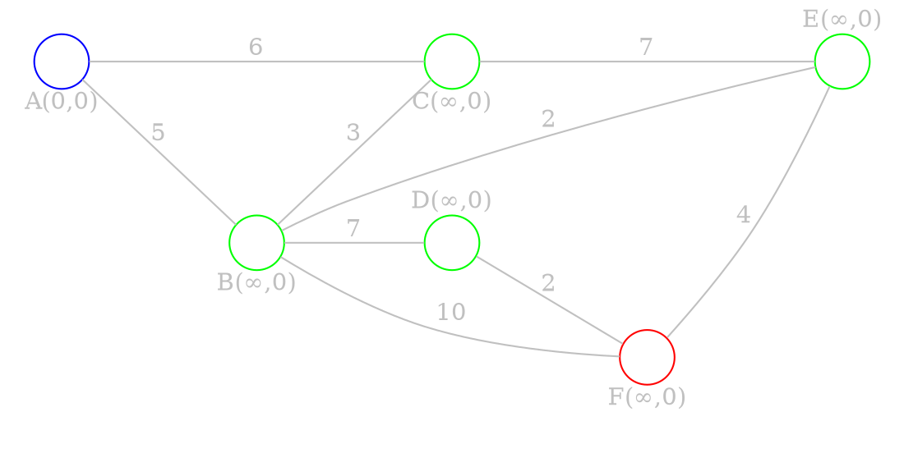
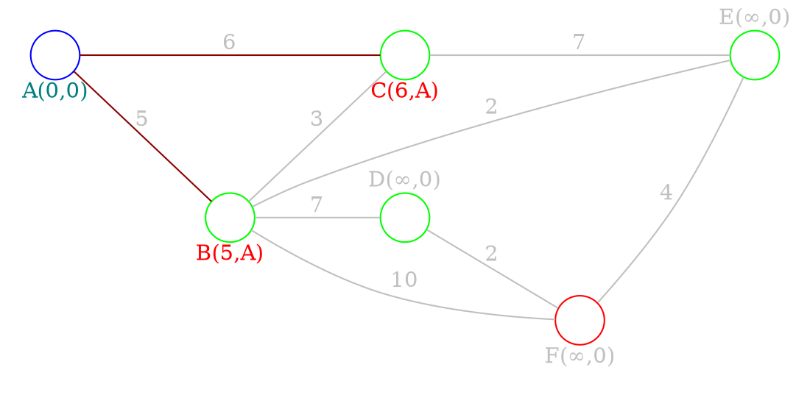
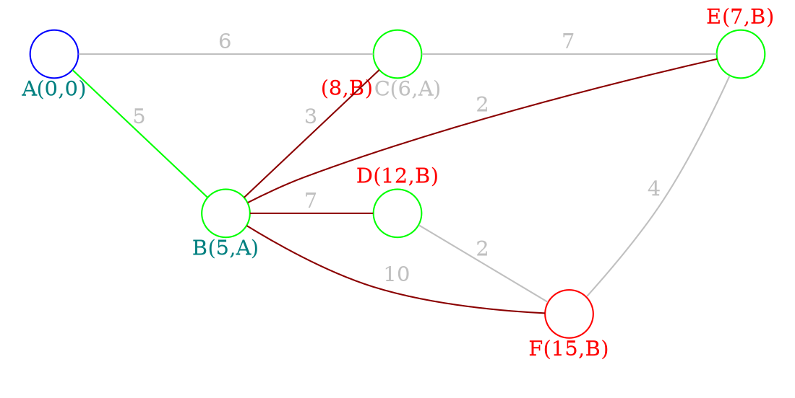
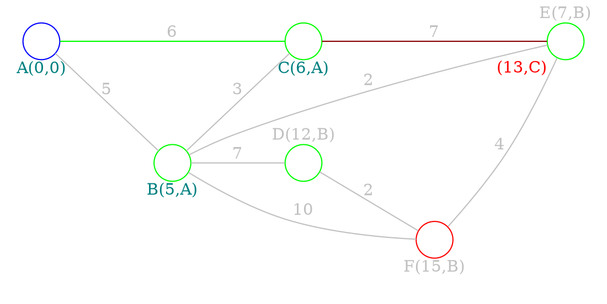
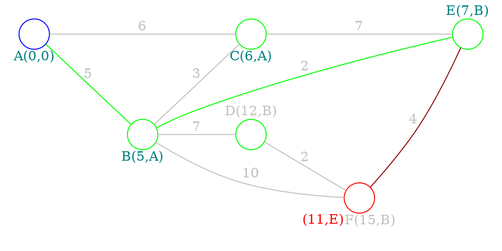
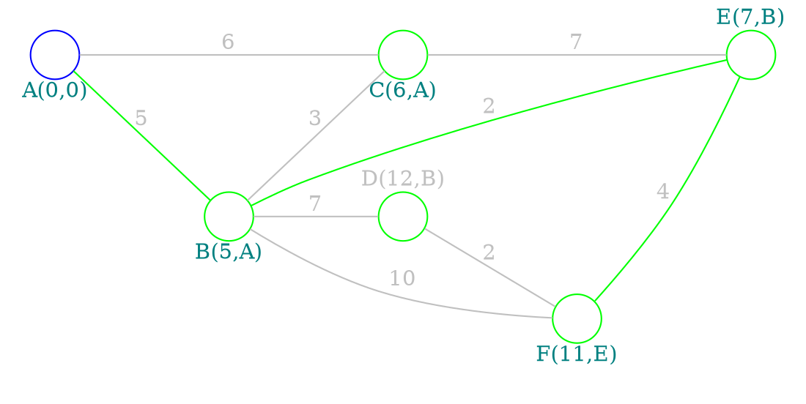

# Shortest path problem

> In graph theory, the *shortest path problem* is the problem of finding a path between two [[Graphs - basics#Directed graphs|vertices]] in a graph such that the <u>sum of the weights of its edges is minimized</u>

> [!note] 
> The problem of finding the shortest path between two *intersections* <u>on a road map</u> may be modeled as <u>a special case of the shortest path problem</u> in graphs, where the [[Graphs - basics#Directed graphs|vertices]] correspond to *intersections* and the [[Graphs - basics#Undirected graph|edges]] correspond to *road segments*, <u>each weighted by the length of the segment</u>

## Variations

### Single-source

- We have to find <u>shortest paths</u> from a *source* [[Graphs - basics#Directed graphs|vertex]] to *all other* [[Graphs - basics#Directed graphs|vertices]] in the graph

> [!note] 
> Applicable algorithms:
> 1. [[#Algorithms|Dijkstra's algorithm]]
> 2. [[#Algorithms|Bellman–Ford algorithm]]

### Single-destination

- We have to find <u>shortest paths</u> from *all vertices* in the [[Graphs - basics#Directed graphs|directed graphs]] graph to a *single destination* vertex. This can be reduced to the **single-source** shortest path problem by reversing the arcs in the directed graph

### All-pairs

- We have to find <u>shortest paths</u> between *every pair of vertices* in the graph

> [!note] 
> Applicable algorithms:
> 1. [[#Algorithms|Floyd–Warshall algorithm]]
> 2. [[#Algorithms|Johnson's algorithm]]
> 1. [[#Algorithms|A* search algorithm]] (single pair)

## Algorithms

1. **Dijkstra's algorithm** - solves the [[#Single-source|single-source]] problem with <u>non-negative edge weight</u>
2. **Bellman–Ford algorithm** - solves the [[#Single-source|single-source]] problem if edge <u>weights may be negative</u>
3. **A* search algorithm** - solves for [[#All-pairs|single-pair]] shortest path using heuristics to try to speed up the search
4. **Floyd–Warshall algorithm** - solves [[#All-pairs|all-pairs]] shortest paths
5. **Johnson's algorithm** - solves [[#All-pairs|all-pairs]] shortest paths, and may be faster than *Floyd–Warshall* on sparse graphs
6. **Viterbi algorithm** - the shortest stochastic path problem with an additional probabilistic weight on each node 
> [!note] 
>  - <u>The Stochastic Shortest Path problem</u> generalizes the classic deterministic shortest path problem

### Dijkstra's algorithm

1. Mark all nodes <u>unvisited</u>. Put them in a set, we will call it *the unvisited set*
2. Assign a tentative distance value to every node: 
	- Zero for our *initial(starting) node* and 
	- Infinity for all other nodes
	- Set the initial node as current

> [!note]  
> - The tentative distance of a node is the [[Graphs - connectivity#Length of the path|length]] of the shortest path discovered so far between the node and the starting node
> - Since initially no path is known to any other [[Graphs - basics#Directed graphs|vertex]] other than the source itself, all other tentative distances are set to infinity

3. For the current node, consider all of its <u>unvisited</u> [[Graphs - basics#Properties|neighbors]] and *calculate their tentative distances through the current node*. Compare the newly calculated tentative distance to the current assigned value and *assign the smallest one* 
4. Mark the current node as <u>visited</u> and remove it from the *unvisited set*. (A visited node will never be checked again)
5. If the *destination* node has been marked visited or if the smallest tentative distance among the nodes in the <u>unvisited set</u> is infinity (no connection between the initial node and remaining unvisited nodes), then stop. 
6. Otherwise, select the <u>unvisited</u> node that is marked with the smallest tentative distance, set it as the new current node, and go back to step 3.

#### Example

> Find shortest path between *A* and *F*

1. Assign a tentative distance value to every node

2. Consider neighbours of *A*. 
	- Assign **(5,A)** to *B*
	- Assign **(6,A)** to *C*
	- *B* has the smallest tentative distance, we will work with *B* next

3. Consider neighbors of *B*. 
	- Assign **(12,B)** to *D*
	- Assign **(7,B)** to *E*
	- *C* already has a smaller tentative weight, don't assign **(8,B)**. 
	- *C* has the smallest tentative distance, we will work with *C* next

4. Consider neighbors of *C*. 
	- We don't calculate tentative distance to *B*, because it is <u>visited</u>. 
	- *E* already has a smaller tentative weight, don't assign **(13,C)**. 
	- *E* has the smallest tentative distance, we will work with *E* next

5. Consider neighbors of *E*. 
	- We don't calculate tentative distance to *B* and *C*, because they are <u>visited</u>.
	- Assign **(11,E)** to *F* (smaller tentative distance)

6. We have reached our destination *F*, stop
	- First element shows *distance*, second - *directions*
	- So, final directions are: $A \to B \to E \to F$

### Floyd-Warshall algorithm

