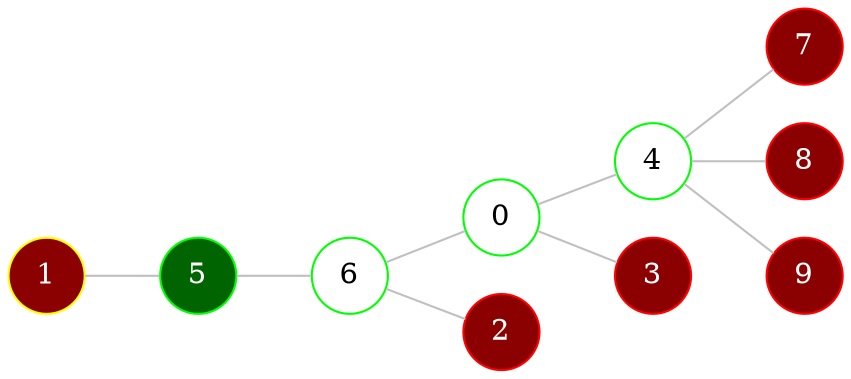

# Tree

> [!definition] 
> [[Graphs - connectivity#Connected graph|Connected]] and [[Graphs - connectivity#Cyclic graph|acyclic]] graph is called a **tree**

> [!example] 
> 
> ```dot 
> graph neato { 
> 
> rankdir="LR"
> 
> bgcolor="transparent" 
> 
> graph [layout = dot] 
> 
> node [shape = circle, 
>       style = filled, 
>       width=0.3, 
>       height=0.3, 
>       color=green, 
>       fillcolor = white] 
> 
> edge [color = grey] 
> 
> 1 -- 2
> 2 -- 3
> 3 -- {4 5}
> 5 -- {6 7}
> 7 -- {8 9 10}
> 
> } 
> ```
> 

> [!note] 
> 1. Any [[Graphs - basics#Directed graphs|vertex]] of a **tree** with a [[Graphs - basics#Order (degree) of vertices|degree]] $\geq 2$ is an [[Graphs - connectivity#Articulations|articulation]]
> 2. Any [[Graphs - basics#Undirected graph|edge]] of a **tree** is a [[Graphs - connectivity#Bridges|bridge]] 
> 3. Any **tree** with *$n$* [[Graphs - basics#Directed graphs|vertices]] has *$n-1$* [[Graphs - basics#Undirected graph|edges]] ([[#Forest (k-tree)|forest]] will have less)
> 4. Graph is a **tree** if and only if any 2 [[Graphs - basics#Directed graphs|vertices]] can be connected by *only* 1 [[Graphs - connectivity#Circuit|circuit]]

## Forest (k-tree)

> [!definition] 
> If [[Graphs - connectivity#Cyclic graph|acyclic]] graph has *k* [[Graphs - connectivity#Connected components|connected components]], it's called a **forest** or a **k-tree**

> [!example] 
> 
> ```dot 
> graph neato { 
> 
> rankdir="LR";
> 
> bgcolor="transparent" 
> 
> graph [layout = dot] 
> 
> node [shape = circle, 
>       style = filled, 
>       width=0.3, 
>       height=0.3, 
>       color=green, 
>       fillcolor = white] 
>       
> edge [color = grey] 
> 
> 1 -- 2
> 2 -- 3
> 3 -- 4
> 
> 5 -- 6
> 
> 7 -- 8
> 8 -- {9 10}
> 
> } 
> ```


## Spanning tree

> [!definition]
> *Tree* $T$ is *spanning* of graph $G$ it is a [[Graphs - connectivity#Subgraph ($G' subset G$)|subset]] of $G$ and has all vertices of $G$	

--- 
<br>

# Storing trees

> We can store a [[#Tree|tree]] with *n* [[Graphs - basics#Directed graphs|vertices]] in array of $n-2$ elements

## Tree to array

> Suppose we have a [[#Tree|tree]]:



1. Enumerate all vertices, get a list of [[Graphs - connectivity#Special vertices|rising]] vertices is: *1, 2, 3, 7, 8, 9* (marked <font color="#ff0000">red</font>)
2. Find a [[Graphs - connectivity#Special vertices|rising]] vertex with *smallest* index (in our case it's *1*). It is connected to [[Graphs - basics#Directed graphs|vertex]] *5*, so we add *5* to our array: (*Tree[0] = 5*) and remove vertex *1*
3. Repeat until *2* vertices are left
	- Remove vertex *2*, add *6* to array: *[5, 6]*
		```dot 
		graph neato { 
		rankdir="LR"
		bgcolor="transparent" 
		graph [layout = dot] 
		node [shape = circle, 
		      style = filled, 
		      width=0.3, 
		      height=0.3, 
		      color=green,
		      fillcolor = white] 
		0 4
		
		node [color=yellow,fillcolor=darkred,fontcolor=white]
		2
		
		node [color=red,fillcolor=darkred,fontcolor=white]
		3 7 8 9 5
		
		node [color=green,fillcolor=darkgreen,fontcolor=white]
		6
		
		edge [color = grey] 
		
		5 -- 6
		6 -- {2 0}
		0 -- {3 4}
		4 -- {7 8 9}
		
		} 
		```
	
	- Remove vertex *3*, add *0* to array: *[5, 6, 0]*
		```dot 
		graph neato { 
		rankdir="LR"
		bgcolor="transparent" 
		graph [layout = dot] 
		node [shape = circle, 
		      style = filled, 
		      width=0.3, 
		      height=0.3, 
		      color=green,
		      fillcolor = white] 
		4 6
		
		node [color=yellow,fillcolor=darkred,fontcolor=white]
		3
		
		node [color=red,fillcolor=darkred,fontcolor=white]
		7 8 9 5
		
		node [color=green,fillcolor=darkgreen,fontcolor=white]
		0
		
		edge [color = grey] 
		
		5 -- 6
		6 -- {0}
		0 -- {3 4}
		4 -- {7 8 9}
		
		} 
		```
	
	- Remove vertex *5*, add *6* to array: *[5, 6, 0, 6]*
		```dot 
		graph neato { 
		rankdir="LR"
		bgcolor="transparent" 
		graph [layout = dot] 
		node [shape = circle, 
		      style = filled, 
		      width=0.3, 
		      height=0.3, 
		      color=green,
		      fillcolor = white] 
		4 0
		
		node [color=yellow,fillcolor=darkred,fontcolor=white]
		5
		
		node [color=red,fillcolor=darkred,fontcolor=white]
		7 8 9
		
		node [color=green,fillcolor=darkgreen,fontcolor=white]
		6
		
		edge [color = grey] 
		
		5 -- 6
		6 -- {0}
		0 -- {4}
		4 -- {7 8 9}
		
		} 
		```
	
	- Remove vertex *6*, add *0* to array: *[5, 6, 0, 6, 0]*
		```dot 
		graph neato { 
		rankdir="LR"
		bgcolor="transparent" 
		graph [layout = dot] 
		node [shape = circle, 
		      style = filled, 
		      width=0.3, 
		      height=0.3, 
		      color=green,
		      fillcolor = white] 
		4
		
		node [color=yellow,fillcolor=darkred,fontcolor=white]
		6
		
		node [color=red,fillcolor=darkred,fontcolor=white]
		7 8 9
		
		node [color=green,fillcolor=darkgreen,fontcolor=white]
		0
		
		edge [color = grey] 
		
		6 -- {0}
		0 -- {4}
		4 -- {7 8 9}
		
		} 
		```
	
	- Remove vertex *0*, add *4* to array: *[5, 6, 0, 6, 0, 4]*
		```dot 
		graph neato { 
		rankdir="LR"
		bgcolor="transparent" 
		graph [layout = dot] 
		node [shape = circle, 
		      style = filled, 
		      width=0.3, 
		      height=0.3, 
		      color=green,
		      fillcolor = white] 
		
		node [color=yellow,fillcolor=darkred,fontcolor=white]
		0
		
		node [color=red,fillcolor=darkred,fontcolor=white]
		7 8 9
		
		node [color=green,fillcolor=darkgreen,fontcolor=white]
		4
		
		edge [color = grey] 
		
		0 -- {4}
		4 -- {7 8 9}
		
		} 
		```
	
	- Remove vertex *7*, add *4* to array: *[5, 6, 0, 6, 0, 4, 4]*
		```dot 
		graph neato { 
		rankdir="LR"
		bgcolor="transparent" 
		graph [layout = dot] 
		node [shape = circle, 
		      style = filled, 
		      width=0.3, 
		      height=0.3, 
		      color=green,
		      fillcolor = white] 
		
		node [color=yellow,fillcolor=darkred,fontcolor=white]
		7
		
		node [color=red,fillcolor=darkred,fontcolor=white]
		7 8 9
		
		node [color=green,fillcolor=darkgreen,fontcolor=white]
		4
		
		edge [color = grey] 
		
		4 -- {7 8 9}
		
		} 
		```
	
	- Remove vertex *8*, add *4* to array: *[5, 6, 0, 6, 0, 4, 4, 4]*
		```dot 
		graph neato { 
		rankdir="LR"
		bgcolor="transparent" 
		graph [layout = dot] 
		node [shape = circle, 
		      style = filled, 
		      width=0.3, 
		      height=0.3, 
		      color=green,
		      fillcolor = white] 
		
		node [color=yellow,fillcolor=darkred,fontcolor=white]
		8
		
		node [color=red,fillcolor=darkred,fontcolor=white]
		9
		
		node [color=green,fillcolor=darkgreen,fontcolor=white]
		4
		
		edge [color = grey] 
		
		4 -- {8 9}
		
		} 
		```
	
	- Stop conversion
		```dot 
		graph neato { 
		rankdir="LR"
		bgcolor="transparent" 
		graph [layout = dot] 
		node [shape = circle, 
		      style = filled, 
		      width=0.3, 
		      height=0.3, 
		      color=green,
		      fillcolor = white] 
		4 9
		
		edge [color = grey] 
		
		4 -- 9
		
		} 
		```
4. In our case the array will look like this: *[5, 6, 0, 6, 0, 4, 4, 4]*, and the [[#Tree|tree]] will have just *2* connected vertices: *4* and *9*


## Array to tree

> We will use an array that we got while [[#Tree to array|converting tree to an array]] 
> *[5, 6, 0, 6, 0, 4, 4, 4]*

1. Make a table, count how many times *each vertex* is in the array

| Vertex | 0   | 1   | 2   | 3   | 4   | 5   | 6   | 7   | 8   | 9   |
| ------ | --- | --- | --- | --- | --- | --- | --- | --- | --- | --- |
| Number | *2* | 0   | 0   | 0   | *3* | *1* | *2* | 0   | 0   | 0   |

2. Add one to every number
3. Take *first* element of the array (**5**)
4. Mark element in column for this array element (column **5**)
5. Search for the first *1* in the table (it's in the column **1**)
6. Subtract *1* from the selected elements

| Vertex       | 0   | #c/green **1** | 2   | 3   | 4   | #c/red **5** | 6   | 7   | 8   | 9   |
| ------------ | --- | -------------- | --- | --- | --- | ------------ | --- | --- | --- | --- |
| Number       | *2* | 0              | 0   | 0   | *3* | *1*          | *2* | 0   | 0   | 0   |
| #c/red **5** | 3   | #c/green **1** | 1   | 1   | 4   | #c/red **2** | 3   | 1   | 1   | 1   |
|              | 3   | #c/green *0*            | 1   | 1   | 4   | #c/red *1*           | 3   | 1   | 1   | 1   | 

6. Construct corresponding [[Graphs - basics#Undirected graph|edge]] $\{5, 1\}$
7. Repeat from step *3* for all elements

| Vertex | 0     | 1     | 2     | 3     | 4     | 5     | 6     | 7     | 8     | 9     | Edge      |
| ------ | ----- | ----- | ----- | ----- | ----- | ----- | ----- | ----- | ----- | ----- | --------- |
| Number | 2     | 0     | 0     | 0     | 3     | 1     | 2     | 0     | 0     | 0     |           |
| 5      | 3     | **1** | 1     | 1     | 4     | **2** | 3     | 1     | 1     | 1     | $\{1,5\}$ |
| 6      | 3     | 0     | **1** | 1     | 4     | 1     | **3** | 1     | 1     | 1     | $\{2,6\}$ |
| 0      | **3** | 0     | 0     | **1** | 4     | 1     | 2     | 1     | 1     | 1     | $\{0,3\}$ |
| 6      | 2     | 0     | 0     | 0     | 4     | **1** | **2** | 1     | 1     | 1     | $\{5,6\}$ |
| 0      | **2** | 0     | 0     | 0     | 4     | 0     | **1** | 1     | 1     | 1     | $\{0,6\}$ |
| 4      | **1** | 0     | 0     | 0     | **4** | 0     | 0     | 1     | 1     | 1     | $\{0,4\}$ |
| 4      | 0     | 0     | 0     | 0     | **3** | 0     | 0     | **1** | 1     | 1     | $\{4,7\}$ |
| 4      | 0     | 0     | 0     | 0     | **2** | 0     | 0     | 0     | **1** | 1     | $\{4,8\}$ |
|        | 0     | 0     | 0     | 0     | **1** | 0     | 0     | 0     | 0     | **1** | $\{4,9\}$ |
