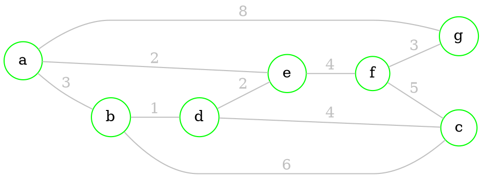
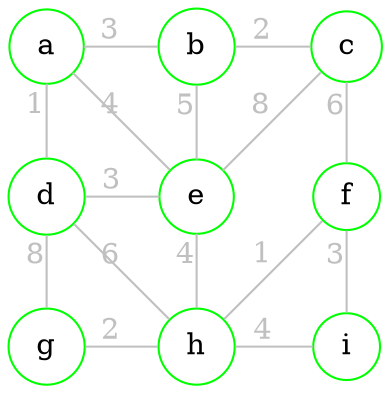
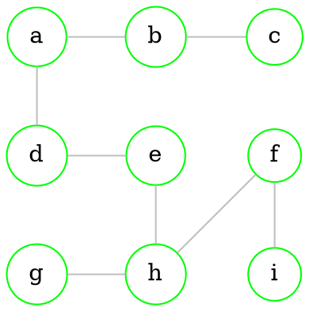
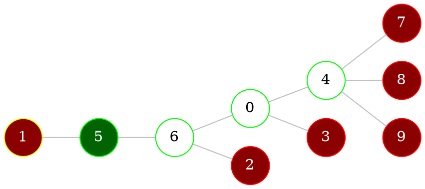

# Tree

> [!definition] 
> [[Graphs - connectivity#Connected graph|Connected]] and [[Graphs - connectivity#Cyclic graph|acyclic]] graph is called a **tree**

> [!example] 
> 
> ```dot 
> graph neato { 
> 
> rankdir="LR"
> 
> bgcolor="transparent" 
> 
> graph [layout = dot] 
> 
> node [shape = circle, 
>       style = filled, 
>       width=0.3, 
>       height=0.3, 
>       color=green, 
>       fillcolor = white] 
> 
> edge [color = grey] 
> 
> 1 -- 2
> 2 -- 3
> 3 -- {4 5}
> 5 -- {6 7}
> 7 -- {8 9 10}
> 
> } 
> ```
> 

> [!note] 
> 1. Any [[Graphs - basics#Directed graphs|vertex]] of a **tree** with a [[Graphs - basics#Order (degree) of vertices|degree]] $\geq 2$ is an [[Graphs - connectivity#Articulations|articulation]]
> 2. Any [[Graphs - basics#Undirected graph|edge]] of a **tree** is a [[Graphs - connectivity#Bridges|bridge]] 
> 3. Any **tree** with *$n$* [[Graphs - basics#Directed graphs|vertices]] has *$n-1$* [[Graphs - basics#Undirected graph|edges]] ([[#Forest (k-tree)|forest]] will have less)
> 4. Graph is a **tree** if and only if any 2 [[Graphs - basics#Directed graphs|vertices]] can be connected by *only* 1 [[Graphs - connectivity#Circuit|circuit]]

## Forest (k-tree)

> [!definition] 
> If [[Graphs - connectivity#Cyclic graph|acyclic]] graph has *k* [[Graphs - connectivity#Connected components|connected components]], it's called a **forest** or a **k-tree**

> [!example] 
> 
> ```dot 
> graph neato { 
> 
> rankdir="LR";
> 
> bgcolor="transparent" 
> 
> graph [layout = dot] 
> 
> node [shape = circle, 
>       style = filled, 
>       width=0.3, 
>       height=0.3, 
>       color=green, 
>       fillcolor = white] 
>       
> edge [color = grey] 
> 
> 1 -- 2
> 2 -- 3
> 3 -- 4
> 
> 5 -- 6
> 
> 7 -- 8
> 8 -- {9 10}
> 
> } 
> ```


## Spanning tree

> [!definition]
> *Tree* $T$ is *spanning* of graph $G$ it is a [[Graphs - connectivity#Subgraph ($G' subset G$)|subset]] of $G$ and has all vertices of $G$	

### Minimal spanning tree

> Suppose we have the following [[#Tree|tree]] with [[Graphs - basics#Undirected graph|edge]] weights



> [!definition] 
> 1. **Weight** of the [[#Tree|tree]]: sum of weights of it’s edges
> 2. **Minimal** [[#Tree|tree]]: tree with smallest possible **weight**

#### Kruskal’s algorithm

1. Choose an [[Graphs - basics#Undirected graph|edge]] of smallest *weight*, if it will not make a [[Graphs - connectivity#Cycle|cycle]]
2. Add this edge to the [[#Tree|tree]], delete it from initial graph
3. Repeat while possible

`````col 
````col-md 
flexGrow=1
===



```` 
````col-md 
flexGrow=1.2
===

- All [[Graphs - basics#Undirected graph|edges]] in ascending order

$$
\begin{matrix}
\color{LimeGreen}\{a,d\}-1 & \color{LimeGreen}\{h,f\}-1 & \color{LimeGreen}\{b,c\}-2 & \color{LimeGreen}\{g,h\}-2 \\
\color{LimeGreen}\{a,b\}-3 & \color{LimeGreen}\{d,e\}-3 & \color{LimeGreen}\{f,i\}-3 & \color{red}\{a,e\}-4 \\
\color{LimeGreen}\{e,h\}-4 & \{h,i\}-4 & \{b,e\}-5 & \{c,f\}-6 \\
\{d,h\}-6 & \{e,c\}-8 & \{d,g\}-8
\end{matrix}
$$

- Construct a new [[#Tree|tree]] (green edges)



```` 
`````

#### Prim's algorithm

1. Select [[Graphs - basics#Directed graphs|vertex]] $v_1$ and add it to set of selected vertices $S$ 
2. Find an [[Graphs - basics#Undirected graph|edge]] of *minimal weight* [[Graphs - basics#Properties|incident]] to $v_1$. Say, it is $v_2$
	- Add $v_2$ to $S$ and edge $\{v_1 ,v_2\}$ to [[#Tree|tree]] [[Graphs - basics#Undirected graph|edge]] set.
3. Find an [[Graphs - basics#Undirected graph|edge]] of *minimal weight* [[Graphs - basics#Properties|incident]] to *any* [[Graphs - basics#Directed graphs|vertex]] from set $S$. 
	- Add [[Graphs - basics#Undirected graph|edge]] to the [[#Tree|tree]] edge set and it’s [[Graphs - basics#Properties|incident]] vertex to $S$ if it *won't* make a [[Graphs - connectivity#Cycle|cycle]]
4. Repeat until all vertices are connected
	1. Select [[Graphs - basics#Directed graphs|vertex]] *a* | $S = \{a\}$
		- Incident [[Graphs - basics#Undirected graph|edges]]: $\{a,b\}-3,\ \{a,e\}-4,\ \color{LimeGreen}\{a,d\}-1$
		- @ $\{a,d\}$ has minimal *weight*, add it to the [[#Tree|tree]]
	2. $S = \{a,d\}$
		- Incident [[Graphs - basics#Undirected graph|edges]]: ${\color{LimeGreen}\{a,b\}-3},\ \{a,e\}-4,\ \{d,e\}-3,\ \{d,h\}-6,\ \{d,g\}-8$
		- @ $\{a,b\}$ has minimal *weight*, add it to the [[#Tree|tree]]
	3. $S = \{a,b,d\}$
		- Incident [[Graphs - basics#Undirected graph|edges]]: $\{a,e\}-4,\ \{d,e\}-3,\ \{d,h\}-6,\ \{d,g\}-8,\ {\color{LimeGreen}\{b,c\}-2},\ \{b,e\}-5$
		- @ $\{b,c\}$ has minimal *weight*, add it to the [[#Tree|tree]]
	4. $S = \{a,b,c,d\}$
		- Incident [[Graphs - basics#Undirected graph|edges]]: $\{a,e\}-4,\ {\color{LimeGreen}\{d,e\}-3},\ \{d,h\}-6,\ \{d,g\}-8,\ \{b,e\}-5,\ \{c,e\}-8,\ \{c,f\}-6$
		- @ $\{d,e\}$ has minimal *weight*, add it to the [[#Tree|tree]]
	5. $S = \{a,b,c,d,e\}$
		- Incident [[Graphs - basics#Undirected graph|edges]]: ${\color{red}\{a,e\}-4},\ \{d,h\}-6,\ \{d,g\}-8,\ \{b,e\}-5,\ \{c,e\}-8,\ \{c,f\}-6,\ \color{LimeGreen}\{e,h\}-4$
		- ! $\{a,e\}$ has minimal *weight* but will make a [[Graphs - connectivity#Cycle|cycle]], delete it
		- @ $\{e,h\}$ has minimal *weight*, add it to the [[#Tree|tree]]
	6. $S = \{a,b,c,d,e,h\}$
		- Incident [[Graphs - basics#Undirected graph|edges]]: $\{d,h\}-6,\ \{d,g\}-8,\ \{b,e\}-5,\ \{c,e\}-8,\ \{c,f\}-6,\ {\color{LimeGreen}\{h,f\}-1},\ \{h,g\}-2,\ \{h,i\}-4$
		- @ $\{h,f\}$ has minimal *weight*, add it to the [[#Tree|tree]]
	7. $S = \{a,b,c,d,e,f,h\}$
		- Incident [[Graphs - basics#Undirected graph|edges]]: $\{d,h\}-6,\ \{d,g\}-8,\ \{b,e\}-5,\ \{c,e\}-8,\ \{c,f\}-6,\ {\color{LimeGreen}\{h,g\}-2},\ \{h,i\}-4,\ {\color{lightgreen}\{f,i\}-3}$
		- @ $\{h,g\}$ has minimal *weight*, add it to the [[#Tree|tree]]
		- @ $\{h,i\}$ has minimal *weight*, add it to the [[#Tree|tree]]

#### Edge elimination from a cycle

1. Find any [[Graphs - connectivity#Cycle|cycle]]
3. Find an [[Graphs - basics#Undirected graph|edge]] in this [[Graphs - connectivity#Cycle|cycle]] having *biggest weight*
4. Eliminate this [[Graphs - basics#Undirected graph|edge]]
5. Continue until no more [[Graphs - connectivity#Cycle|cycles]] left

--- 
<br>

# Storing trees

> We can store a [[#Tree|tree]] with *n* [[Graphs - basics#Directed graphs|vertices]] in array of $n-2$ elements

## Tree to array

> Suppose we have a [[#Tree|tree]]:



1. Enumerate all vertices, get a list of [[Graphs - connectivity#Special vertices|rising]] vertices is: *[1, 2, 3, 7, 8, 9]* (marked <font color="#ff0000">red</font>)
2. Find a [[Graphs - connectivity#Special vertices|rising]] vertex with *smallest* index (in our case it's *1*). It is connected to [[Graphs - basics#Directed graphs|vertex]] *5*, so we add *5* to our array: (*Tree[0] = 5*) and remove vertex *1*
3. Repeat until *2* vertices are left
	- Remove vertex *2*, add *6* to array: *[5, 6]*
		```dot 
		graph neato { 
		rankdir="LR"
		bgcolor="transparent" 
		graph [layout = dot] 
		node [shape = circle, 
		      style = filled, 
		      width=0.3, 
		      height=0.3, 
		      color=green,
		      fillcolor = white] 
		0 4
		
		node [color=yellow,fillcolor=darkred,fontcolor=white]
		2
		
		node [color=red,fillcolor=darkred,fontcolor=white]
		3 7 8 9 5
		
		node [color=green,fillcolor=darkgreen,fontcolor=white]
		6
		
		edge [color = grey] 
		
		5 -- 6
		6 -- {2 0}
		0 -- {3 4}
		4 -- {7 8 9}
		
		} 
		```
	
	- Remove vertex *3*, add *0* to array: *[5, 6, 0]*
		```dot 
		graph neato { 
		rankdir="LR"
		bgcolor="transparent" 
		graph [layout = dot] 
		node [shape = circle, 
		      style = filled, 
		      width=0.3, 
		      height=0.3, 
		      color=green,
		      fillcolor = white] 
		4 6
		
		node [color=yellow,fillcolor=darkred,fontcolor=white]
		3
		
		node [color=red,fillcolor=darkred,fontcolor=white]
		7 8 9 5
		
		node [color=green,fillcolor=darkgreen,fontcolor=white]
		0
		
		edge [color = grey] 
		
		5 -- 6
		6 -- {0}
		0 -- {3 4}
		4 -- {7 8 9}
		
		} 
		```
	
	- Remove vertex *5*, add *6* to array: *[5, 6, 0, 6]*
		```dot 
		graph neato { 
		rankdir="LR"
		bgcolor="transparent" 
		graph [layout = dot] 
		node [shape = circle, 
		      style = filled, 
		      width=0.3, 
		      height=0.3, 
		      color=green,
		      fillcolor = white] 
		4 0
		
		node [color=yellow,fillcolor=darkred,fontcolor=white]
		5
		
		node [color=red,fillcolor=darkred,fontcolor=white]
		7 8 9
		
		node [color=green,fillcolor=darkgreen,fontcolor=white]
		6
		
		edge [color = grey] 
		
		5 -- 6
		6 -- {0}
		0 -- {4}
		4 -- {7 8 9}
		
		} 
		```
	
	- Remove vertex *6*, add *0* to array: *[5, 6, 0, 6, 0]*
		```dot 
		graph neato { 
		rankdir="LR"
		bgcolor="transparent" 
		graph [layout = dot] 
		node [shape = circle, 
		      style = filled, 
		      width=0.3, 
		      height=0.3, 
		      color=green,
		      fillcolor = white] 
		4
		
		node [color=yellow,fillcolor=darkred,fontcolor=white]
		6
		
		node [color=red,fillcolor=darkred,fontcolor=white]
		7 8 9
		
		node [color=green,fillcolor=darkgreen,fontcolor=white]
		0
		
		edge [color = grey] 
		
		6 -- {0}
		0 -- {4}
		4 -- {7 8 9}
		
		} 
		```
	
	- Remove vertex *0*, add *4* to array: *[5, 6, 0, 6, 0, 4]*
		```dot 
		graph neato { 
		rankdir="LR"
		bgcolor="transparent" 
		graph [layout = dot] 
		node [shape = circle, 
		      style = filled, 
		      width=0.3, 
		      height=0.3, 
		      color=green,
		      fillcolor = white] 
		
		node [color=yellow,fillcolor=darkred,fontcolor=white]
		0
		
		node [color=red,fillcolor=darkred,fontcolor=white]
		7 8 9
		
		node [color=green,fillcolor=darkgreen,fontcolor=white]
		4
		
		edge [color = grey] 
		
		0 -- {4}
		4 -- {7 8 9}
		
		} 
		```
	
	- Remove vertex *7*, add *4* to array: *[5, 6, 0, 6, 0, 4, 4]*
		```dot 
		graph neato { 
		rankdir="LR"
		bgcolor="transparent" 
		graph [layout = dot] 
		node [shape = circle, 
		      style = filled, 
		      width=0.3, 
		      height=0.3, 
		      color=green,
		      fillcolor = white] 
		
		node [color=yellow,fillcolor=darkred,fontcolor=white]
		7
		
		node [color=red,fillcolor=darkred,fontcolor=white]
		7 8 9
		
		node [color=green,fillcolor=darkgreen,fontcolor=white]
		4
		
		edge [color = grey] 
		
		4 -- {7 8 9}
		
		} 
		```
	
	- Remove vertex *8*, add *4* to array: *[5, 6, 0, 6, 0, 4, 4, 4]*
		```dot 
		graph neato { 
		rankdir="LR"
		bgcolor="transparent" 
		graph [layout = dot] 
		node [shape = circle, 
		      style = filled, 
		      width=0.3, 
		      height=0.3, 
		      color=green,
		      fillcolor = white] 
		
		node [color=yellow,fillcolor=darkred,fontcolor=white]
		8
		
		node [color=red,fillcolor=darkred,fontcolor=white]
		9
		
		node [color=green,fillcolor=darkgreen,fontcolor=white]
		4
		
		edge [color = grey] 
		
		4 -- {8 9}
		
		} 
		```
	
	- Stop conversion
		```dot 
		graph neato { 
		rankdir="LR"
		bgcolor="transparent" 
		graph [layout = dot] 
		node [shape = circle, 
		      style = filled, 
		      width=0.3, 
		      height=0.3, 
		      color=green,
		      fillcolor = white] 
		4 9
		
		edge [color = grey] 
		
		4 -- 9
		
		} 
		```

> In our case the array will look like this: *[5, 6, 0, 6, 0, 4, 4, 4]*, and the [[#Tree|tree]] will have just *2* connected vertices: *4* and *9*


## Array to tree

> We will use the array that we got while [[#Tree to array|converting tree to an array]] 
> *[5, 6, 0, 6, 0, 4, 4, 4]*

1. Make a table, count how many times *each vertex* is in the array

| Vertex | 0   | 1   | 2   | 3   | 4   | 5   | 6   | 7   | 8   | 9   |
| ------ | --- | --- | --- | --- | --- | --- | --- | --- | --- | --- |
| Number | *2* | 0   | 0   | 0   | *3* | *1* | *2* | 0   | 0   | 0   |

2. Add one to every number
3. Take *first* element of the array (**5**)
4. Mark element in column for this array element (column **5**)
5. Search for the first *1* in the table (it's in the column **1**)
6. Subtract *1* from the selected elements

| Vertex       | 0   | #c/green **1** | 2   | 3   | 4   | #c/red **5** | 6   | 7   | 8   | 9   |
| ------------ | --- | -------------- | --- | --- | --- | ------------ | --- | --- | --- | --- |
| Number       | *2* | 0              | 0   | 0   | *3* | *1*          | *2* | 0   | 0   | 0   |
| #c/red **5** | 3   | #c/green **1** | 1   | 1   | 4   | #c/red **2** | 3   | 1   | 1   | 1   |
|              | 3   | #c/green *0*            | 1   | 1   | 4   | #c/red *1*           | 3   | 1   | 1   | 1   | 

6. Construct corresponding [[Graphs - basics#Undirected graph|edge]] $\{5, 1\}$
7. Repeat from step *3* for all elements

| Vertex | 0     | 1     | 2     | 3     | 4     | 5     | 6     | 7     | 8     | 9     | Edge      |
| ------ | ----- | ----- | ----- | ----- | ----- | ----- | ----- | ----- | ----- | ----- | --------- |
| Number | 2     | 0     | 0     | 0     | 3     | 1     | 2     | 0     | 0     | 0     |           |
| 5      | 3     | **1** | 1     | 1     | 4     | **2** | 3     | 1     | 1     | 1     | $\{1,5\}$ |
| 6      | 3     | 0     | **1** | 1     | 4     | 1     | **3** | 1     | 1     | 1     | $\{2,6\}$ |
| 0      | **3** | 0     | 0     | **1** | 4     | 1     | 2     | 1     | 1     | 1     | $\{0,3\}$ |
| 6      | 2     | 0     | 0     | 0     | 4     | **1** | **2** | 1     | 1     | 1     | $\{5,6\}$ |
| 0      | **2** | 0     | 0     | 0     | 4     | 0     | **1** | 1     | 1     | 1     | $\{0,6\}$ |
| 4      | **1** | 0     | 0     | 0     | **4** | 0     | 0     | 1     | 1     | 1     | $\{0,4\}$ |
| 4      | 0     | 0     | 0     | 0     | **3** | 0     | 0     | **1** | 1     | 1     | $\{4,7\}$ |
| 4      | 0     | 0     | 0     | 0     | **2** | 0     | 0     | 0     | **1** | 1     | $\{4,8\}$ |
|        | 0     | 0     | 0     | 0     | **1** | 0     | 0     | 0     | 0     | **1** | $\{4,9\}$ |

--- 
<br>

# Steiner's point

> [!definition] 
> **Steiner's point** will exist if in the triangle there are no angles $\geq 120^o$ 

`````col 
````col-md 
flexGrow=1
===

1. Find length of [[Graphs - basics#Undirected graph|edges]] 
$|AB|=\sqrt{(x_2-x_1)^2+(y_2-y_1)^2}$

```tikz
\usepackage{tikz}

\begin{document}

\begin{tikzpicture}[very thick]
   % NODES
   \node at (0.0, 0.0) (a) {}; % a
   \node at (4.0, 0.0) (b) {}; % b
   \node at (0.0, 8.0) (c) {}; % c

   % WEIGHTS AND CONNECTIONS
   \draw (a) -- (b) node [midway, above] {\Huge 3};
   \draw (a) -- (c) node [midway, left] {\Huge 4};
   \draw (b) -- (c) node [midway, right] {\Huge 5};

   % DRAW NODES
   \draw[color=white, fill=black] (a) circle (0.4) node {\Huge a};
   \draw[color=white, fill=black] (b) circle (0.4) node {\Huge b};
   \draw[color=white, fill=black] (c) circle (0.4) node {\Huge c};

\end{tikzpicture}

\end{document}
```

```` 
````col-md 
flexGrow=1.5
===

2. Find *longest* [[Graphs - basics#Undirected graph|edge]] (BC)
3. Construct triangle $\Delta BCX$ such that $|BC|=|BX|=|CX|$

```tikz
\usepackage{tikz}

\definecolor{green_g}{HTML}{82851b}

\begin{document}

\begin{tikzpicture}[very thick]
   % NODES
   \node (a) at ( 0.0,  0.0) {}; % a
   \node (b) at ( 4.0,  0.0) {}; % b
   \node (c) at ( 0.0,  8.0) {}; % c
   \node (x) at ( 9.0,  7.5) {}; % x

   % DRAW AREAS
   \fill[fill=green_g]  (b.center)--(c.center)--(x.center);

   % WEIGHTS AND CONNECTIONS
   \draw (a) -- (b) node [midway, above] {\Huge 3};
   \draw (a) -- (c) node [midway, left]  {\Huge 4};
   \draw (b) -- (c) node [midway, right] {\Huge 5};
   \draw (b) -- (x) node [midway, left]  {\Huge 5};
   \draw (c) -- (x) node [midway, below] {\Huge 5};

   % DRAW NODES
   \draw[color=white, fill=black]  (a) circle (0.4) node {\Huge a};
   \draw[color=white, fill=black]  (b) circle (0.4) node {\Huge b};
   \draw[color=white, fill=black]  (c) circle (0.4) node {\Huge c};
   \draw[color=white, fill=black]  (x) circle (0.4) node {\Huge x};

\end{tikzpicture}

\end{document}
```

```` 
`````


`````col 
````col-md 
flexGrow=1
===

```tikz
\usepackage{tikz}

\definecolor{green_g}{HTML}{B8BB26}
\definecolor{orange_g}{HTML}{FE8019}
\definecolor{blue_g}{HTML}{83A598}

\begin{document}

\begin{tikzpicture}[very thick]
   % NODES
   \node (a) at ( 0.0,  0.0) {}; % a
   \node (b) at ( 4.0,  0.0) {}; % b
   \node (c) at ( 0.0,  8.0) {}; % c
   \node (x) at ( 9.0,  7.5) {}; % x

   \draw[orange_g, fill=blue_g] (4.4, 5.1) circle (5.1);

   % DRAW AREAS
   \fill[fill=green_g]  (b.center)--(c.center)--(x.center);
 
   % CONNECTIONS
   \draw (a) -- (b);
   \draw (a) -- (c);
   \draw (b) -- (c);
   \draw (b) -- (x);
   \draw (c) -- (x);

   % DRAW NODES
   \draw[color=white, fill=black] (a) circle (0.4) node {\Huge a};
   \draw[color=white, fill=black] (b) circle (0.4) node {\Huge b};
   \draw[color=white, fill=black] (c) circle (0.4) node {\Huge c};
   \draw[color=white, fill=black] (x) circle (0.4) node {\Huge x};

\end{tikzpicture}

\end{document}
```

```` 

````col-md 
flexGrow=1
===

4. Draw a *circle* that goes through points $B$, $C$, $X$
$(x-a)^2+(y-b)^2=R^2$

```` 
`````

`````col 
````col-md 
flexGrow=1
===

```tikz
\usepackage{tikz}

\definecolor{green_g}{HTML}{B8BB26}
\definecolor{orange_g}{HTML}{FE8019}
\definecolor{blue_g}{HTML}{83A598}

\begin{document}

\begin{tikzpicture}[very thick]
   % NODES
   \node (a) at ( 0.0,  0.0) {}; % a
   \node (b) at ( 4.0,  0.0) {}; % b
   \node (c) at ( 0.0,  8.0) {}; % c
   \node (x) at ( 9.0,  7.5) {}; % x
   \node (s) at ( 1.3,  1.1) {}; % s

   \draw[orange_g, fill=blue_g] (4.4, 5.1) circle (5.1);

   % DRAW AREAS
   \fill[fill=green_g]  (b.center)--(c.center)--(x.center);
 
   % CONNECTIONS
   \draw (a) -- (b);
   \draw (a) -- (c);
   \draw (b) -- (c);
   \draw (b) -- (x);
   \draw (c) -- (x);
   \draw (a) -- (x);

   % DRAW NODES
   \draw[color=white, fill=black] (a) circle (0.4) node {\Huge a};
   \draw[color=white, fill=black] (b) circle (0.4) node {\Huge b};
   \draw[color=white, fill=black] (c) circle (0.4) node {\Huge c};
   \draw[color=white, fill=black] (x) circle (0.4) node {\Huge x};
   \draw[color=red,   fill=black] (s) circle (0.4) node {\Huge s};

\end{tikzpicture}

\end{document}
```

```` 
````col-md 
flexGrow=1
===

5. Find a point where *circle intersects* with line $AX$
Line equation: $$\frac{x-x_{1}}{x_{2}-x_{1}}=\frac{y-y_{1}}{y_{2}-y_{1}}$$

```` 
`````

`````col 
````col-md 
flexGrow=1
===

## Before
Weight = $4+3+5=12$

```tikz
\usepackage{tikz}

\begin{document}

\begin{tikzpicture}[very thick]
   % NODES
   \node at (0.0, 0.0) (a) {}; % a
   \node at (4.0, 0.0) (b) {}; % b
   \node at (0.0, 8.0) (c) {}; % c

   % WEIGHTS AND CONNECTIONS
   \draw (a) -- (b) node [midway, above] {\Huge 3};
   \draw (a) -- (c) node [midway, left] {\Huge 4};
   \draw (b) -- (c) node [midway, right] {\Huge 5};

   % DRAW NODES
   \draw[color=white, fill=black] (a) circle (0.4) node {\Huge a};
   \draw[color=white, fill=black] (b) circle (0.4) node {\Huge b};
   \draw[color=white, fill=black] (c) circle (0.4) node {\Huge c};

\end{tikzpicture}

\end{document}
```

```` 
````col-md 
flexGrow=1
===

## After
$AS \approx 1.0239$ $BS \approx 2.3540$ $CS \approx 2.3540$
Weight = $6.7664$

```tikz
\usepackage{tikz}

\definecolor{green_g}{HTML}{B8BB26}
\definecolor{orange_g}{HTML}{FE8019}
\definecolor{blue_g}{HTML}{83A598}

\begin{document}

\begin{tikzpicture}[very thick]
   % NODES
   \node (a) at ( 0.0,  0.0) {}; % a
   \node (b) at ( 4.0,  0.0) {}; % b
   \node (c) at ( 0.0,  8.0) {}; % c
   \node (s) at ( 1.3,  1.1) {}; % s
 
   % CONNECTIONS
   \draw (a) -- (s);
   \draw (b) -- (s);
   \draw (c) -- (s);

   % DRAW NODES
   \draw[color=white, fill=black] (a) circle (0.4) node {\Huge a};
   \draw[color=white, fill=black] (b) circle (0.4) node {\Huge b};
   \draw[color=white, fill=black] (c) circle (0.4) node {\Huge c};
   \draw[color=white, fill=black] (s) circle (0.4) node {\Huge s};

\end{tikzpicture}

\end{document}
```

```` 
`````
