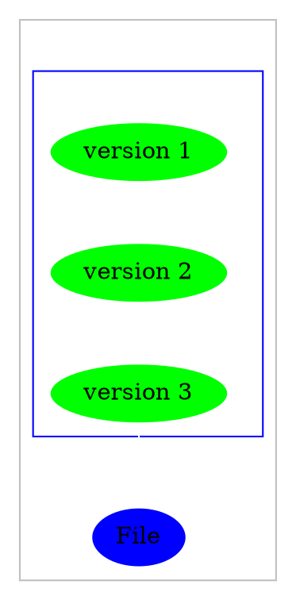
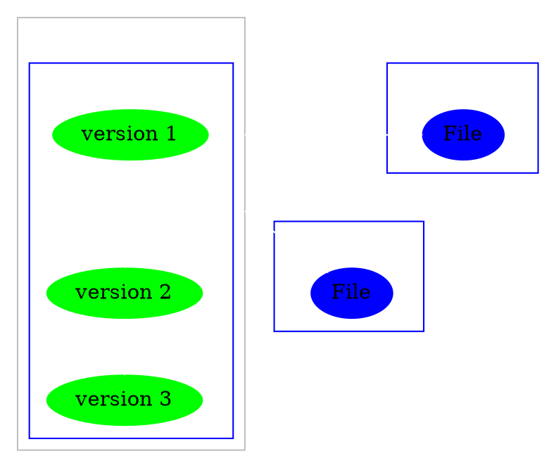
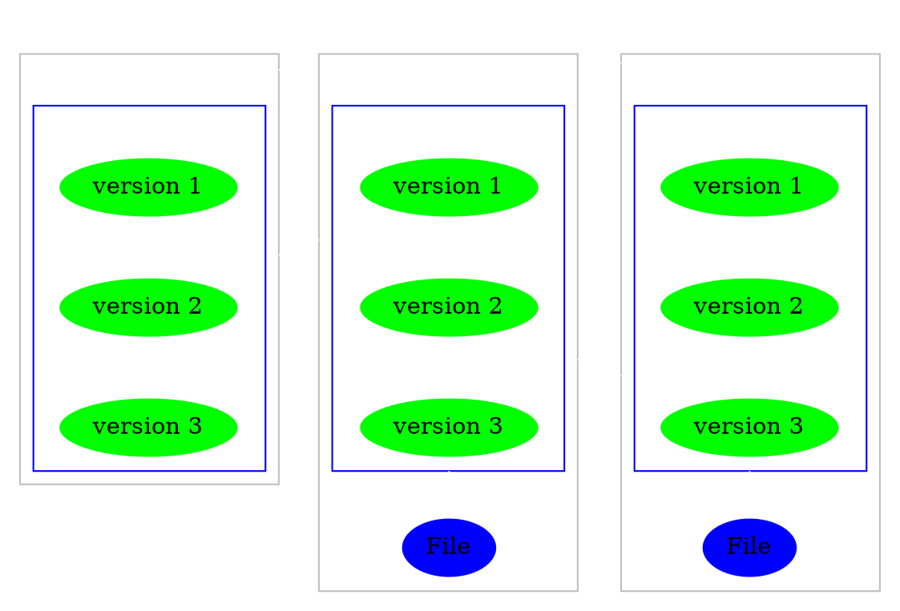

# GIT

![[Git_icon.svg|300]]

---

# What is git? 

## Is it <u>git</u>hub just without the hub?

  ![[git.png|300]]

---

# No! 

### It is a <u>version control</u> system

Here are some more examples of such systems

````col
```col-md
flexGrow=1
===

![[Git_icon.svg|150]]

```
```col-md
flexGrow=1
===

![[Mercurial-Logo.wine.svg|150]]

```
```col-md
flexGrow=1
===

![[Apache_Subversion_logo.svg|150]]

```
```col-md
flexGrow=1
===

![[Bazaar_logo_(software_product).svg|150]]

```
````

---

# Ok, but What is github then?

**Github.com** is a website that hosts *git* <u>repositories</u> on a remote server

> [!note] 
> It also provides a GUI to easily *fork* or *clone* repositories to a local machine

---

# Version control

### But what is a <u>version control</u> system?

<br>

#### Version control system features

- Easily *keep track* of file versions
- *Rollback* to previous file versions
- Ability to have *unlimited* number of developers working on the same code base

---

# More about version control

## 3 Main categories

`````col

````col-md
flexGrow=1
===

### Local VSC



````

````col-md
flexGrow=2.1
===

### Centralized VSC



````

````col-md
flexGrow=3
===

### Distributed VSC



````


`````


