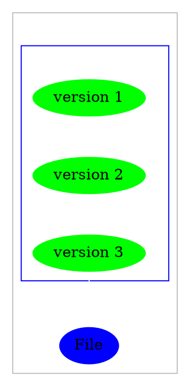
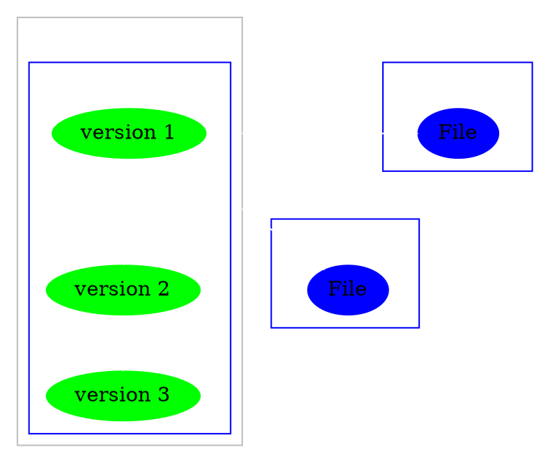
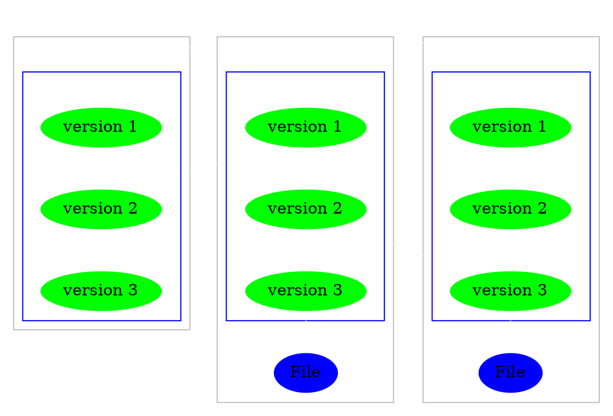
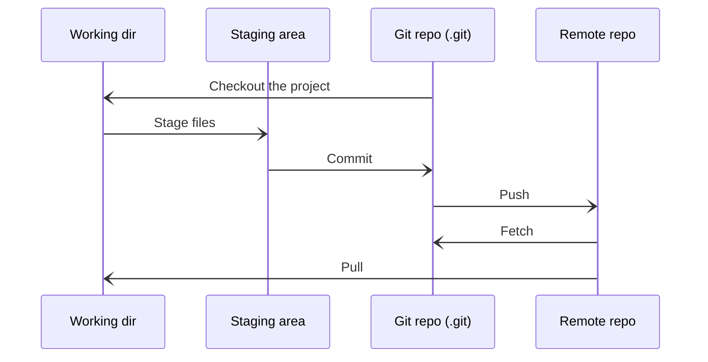
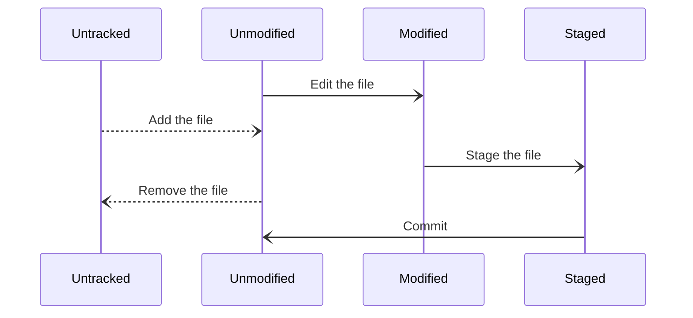
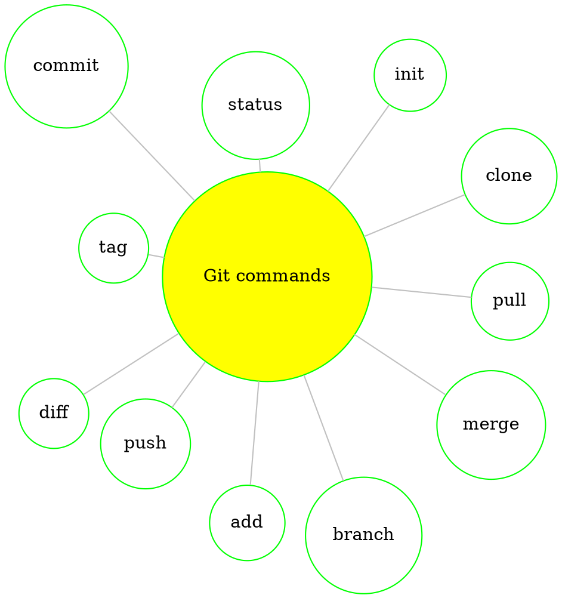
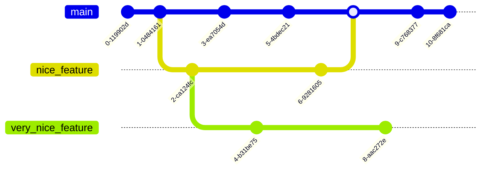

# GIT

![[Git_icon.svg|300]]

---

# What is git? 

## Is it <u>git</u>hub just without the hub?

  ![[git.png|300]]

---

# No! 

### It is a <u>version control</u> system

Here are some more examples of such systems

````col
```col-md
flexGrow=1
===

### Git

![[Git_icon.svg|150]]

```
```col-md
flexGrow=1
===

### Mercurial

![[Mercurial-Logo.wine.svg|150]]

```
```col-md
flexGrow=1
===

### Subversion

![[Apache_Subversion_logo.svg|150]]

```
```col-md
flexGrow=1
===

### Bazaar

![[Bazaar_logo_(software_product).svg|150]]

```
````

---

# Ok, but What is github then?

**Github.com** is a website that hosts *git* <u>repositories</u> on a remote server
- It also provides a GUI to easily *fork* or *clone* repositories to a local machine

> But **github** is not the only one, here are some more examples

````col
```col-md
flexGrow=1
===
### Bitbucket

![[bitbucket_logo_logos_icon.svg|150]]

```
```col-md
flexGrow=1
===
### GitLab

![[GitLab-2022-New-Logomark.svg|150]]

```
```col-md
flexGrow=1
===
### GitTea

![[Gitea_Logo.svg|150]]

```
```col-md
flexGrow=1
===
### Forgejo

![[Forgejo_logo.svg|150]]

```
````

> You can even self-host your own server of set up a local repo with users on the same file system

---

# Vilniustech gitlab instance

![[vt_git_instance.svg|500]]

---

# Version control

### But what is a <u>version control</u> system?

<br>

#### Version control system features

- Easily *keep track* of file versions
- *Rollback* to previous file versions
- Ability to have *unlimited* number of developers working on the same code base
- Losing work is *really* hard

---

# More about version control

## 3 Main categories

`````col

````col-md
flexGrow=1
===

### Local VCS



````

````col-md
flexGrow=2.1
===

### Centralized VCS



````

````col-md
flexGrow=3
===

### Distributed VCS



````


`````

---

# More about categories

## Local VCS

![[Screenshot_20230402_143505.png|100%]]

---

# More about categories

## Centralized VCS

`````col 
````col-md 
flexGrow=1.2
===

- A central server repository (repo) holds the "official copy" of the code
	- The server maintains the *sole* version of the repo

- You make *checkouts* of it to your local copy
	- You make *local modifications*
	- Your changes are *not versioned*

- When you're done, you "*check in*" back to the server
	- Your checkin increments the repo's version

```` 
````col-md 
flexGrow=1
===


```` 
`````

---

# More about categories

## Distributed VCS

`````col 
````col-md 
flexGrow=1
===

- You don't "checkout" from a central repo
	- You "*clone*" and "*pull*" changes from it

- Your local repo is a complete copy of everything on the remote server
	- Yours is "*just as good*" as theirs

- Many operations are local
	- Check in/out from *local* repo
	- Commit changes to *local* repo
	- Local repo keeps version hostory

- When you are ready, you can "*push*" changes back to the server

```` 
````col-md 
flexGrow=1
===


```` 
`````

---

# Git areas

### In your local copy files can be:

- Checked out, *Modified*, but not yet committed (*working copy*)
- *Staged*, but not yet committed - Staged files are ready to be committed
- *Committed* - A commit saves a *snapshot* of all *staged* state



---

# Git workflow

- **Modify** files in your working directory
- **Stage** files, adding snapshots of them to your *staging* area
- **Commit**, which takes the files in the *staging* area and stores that snapshot permanently to your *Git* directory



---

# Git commands



---

# Command usages

---

# Git branching



`````col
````col-md
flexGrow=1
===

- To create a new *local* branch:

```bash
git branch "name"
```

````
````col-md
flexGrow=1
===

- To list all branches:

```bash
git branch
```

````
`````

`````col 
````col-md
flexGrow=1
===

- To switch to a given *local* branch

```bash
git checkout "branch_name"
```

````
````col-md
flexGrow=1
===

- To *merge* changes from a branch into the *local* **master** branch

```bash
git checkout master
git merge "branch_name"
```

````
`````

---

# Thanks for your attention!

![[static-assets-upload2926279536208541530.webp|500]]